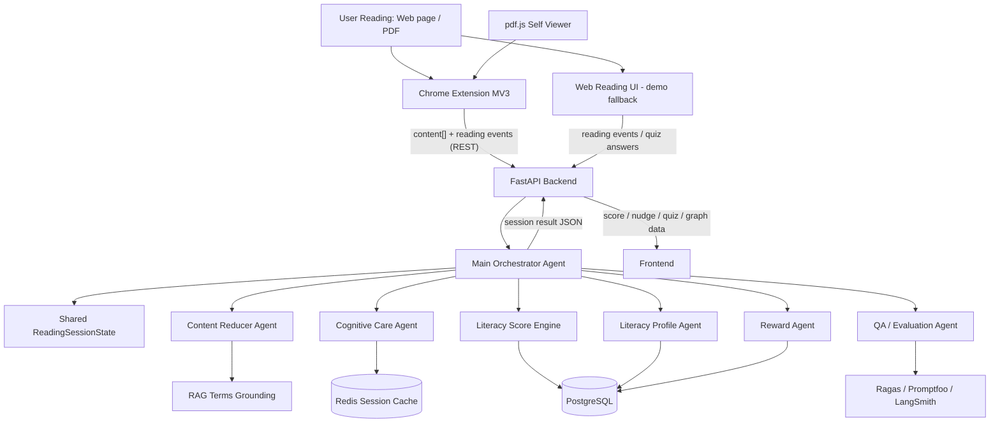
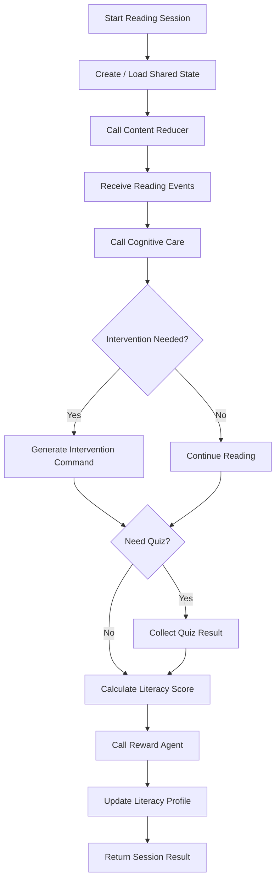

# AI 리터러시 케어 에이전트 아키텍처 문서

문서 목적: 이 문서는 2026 AI/SW 경진대회 프로젝트에서 **1번 역할: 에이전트 코어 / 오케스트레이션 기술리드**가 무엇을 설계하고 구현해야 하는지 명확히 정의한다.

1번 역할은 앱 전체를 혼자 만드는 역할이 아니다. 1번은 팀원들이 만든 서브 에이전트와 백엔드/프론트 기능이 하나의 폐루프 시스템으로 동작하도록 **중앙 제어 흐름, 공통 상태, 에이전트 입출력 계약, Literacy Score 합성 로직**을 책임진다.

---

## 1. 시스템 개요 (System Overview)

### 프로젝트명

AI 리터러시 케어 에이전트

### 한 줄 정의

사용자의 읽기 행동과 이해도를 측정하고, 실시간 개입과 장기 추적을 통해 문해력 성장을 관리하는 폐루프 멀티 에이전트 시스템.

### 해결하고자 하는 문제

기존 ChatGPT, Gemini, Claude 같은 일반 AI 도구는 텍스트를 요약하거나 설명할 수는 있지만, 사용자가 실제로 글을 읽었는지, 이해했는지, 시간이 지나며 문해력이 향상되고 있는지는 추적하지 않는다.

이 프로젝트는 단순 요약기가 아니라 다음 과정을 반복하는 성장 관리 시스템을 목표로 한다.

```text
측정(Measure)
→ 개입(Intervene)
→ 추적(Track)
→ 개인화(Profile Update)
→ 다시 측정/개입에 반영
```

### 서비스 목적

사용자가 뉴스, 논문, 기사, 보고서 같은 긴 글을 읽을 때 다음을 지원한다.

- 읽기 행동 데이터 수집: 스크롤 속도, 체류 시간, 이탈 여부, 진행률
- 이해도 검증: 문맥 기반 퀴즈, 정답률, 난이도 보정
- 실시간 개입: 하이라이트, 쉬운 설명, 넛지, 즉석 퀴즈
- 문해력 점수화: 이해도, 집중도, 난이도 보정을 합성한 Literacy Score
- 장기 추적: 세션별 점수 누적, 성장 추세, 개인화 프로필 업데이트

### 1번 역할의 핵심 목표

1번 역할은 아래 질문에 답할 수 있는 코어 시스템을 만든다.

- 어떤 순서로 에이전트가 실행되는가?
- 각 에이전트는 어떤 데이터를 입력받고 어떤 데이터를 출력하는가?
- 사용자 상태가 바뀌면 다음 에이전트를 어떻게 선택하는가?
- 집중도, 이해도, 난이도는 어떻게 합쳐져 Literacy Score가 되는가?
- 프론트엔드와 백엔드는 어떤 JSON 계약으로 연결되는가?
- 더미 에이전트로 먼저 E2E 흐름을 만들고, 이후 팀원이 만든 실제 모듈로 어떻게 교체하는가?

---

## 2. 기술 스택 및 선정 이유 (Tech Stack & Rationale)

아래 표는 전체 프로젝트 기준 기술 스택이다. 단, 1번 역할이 직접 책임지는 범위는 `Agent Orchestration`, `Shared State`, `Score Engine`, `Integration Contract`가 중심이다.

| 레이어 (Layer) | 선택한 기술 (Tech) | 선정 이유 (Rationale) | 1번 역할의 책임 |
| --- | --- | --- | --- |
| Frontend | React 또는 Next.js, TypeScript | 읽기 화면, Floating Panel, 성장 그래프, 퀴즈 UI를 빠르게 구현하기 좋음 | 직접 구현 담당 아님. 단, 프론트가 받을 응답 JSON 형식 정의 |
| Backend API | FastAPI, Python 3.11 | 비동기 API, WebSocket, 에이전트 호출 서버를 구현하기 적합함 | 오케스트레이터 엔드포인트 설계 협의 및 호출 계약 정의 |
| Realtime | REST (event-driven), WebSocket(후속) | 개입이 모두 행동 반응형이라 서버 push가 불필요하고, 이벤트 발생 시 배치 flush POST로 개입을 동기 반환하면 충분함 (ADR-001) | 행동 이벤트가 어떤 state 필드로 들어오는지 정의, 전송 방식 결정 |
| Extension | Chrome Manifest V3, declarativeNetRequest, Shadow DOM | 파일 업로드 없이 크롬에서 읽는 모든 글(웹·PDF)에 개입하려면 확장이 필요함. 페이지 CSS 충돌 방지를 위해 오버레이는 Shadow DOM 격리 | 확장↔백엔드 계약, 세션 수명, page-ingestion 계약 정의 |
| PDF Rendering | pdf.js (Mozilla, Apache-2.0 번들) | 크롬 기본 PDF뷰어(PDFium)는 글자·좌표 접근이 불가하므로, pdf.js로 DOM(canvas+textLayer)으로 되돌려 웹과 동일 측정 | PDF 추출 content[]를 기존 세션 계약에 연결 |
| Agent Orchestration | LangGraph, StateGraph | 여러 에이전트의 상태 기반 전이를 명확하게 표현할 수 있음 | 직접 책임. 그래프 노드, 엣지, 조건부 라우팅 구현 |
| LLM Routing | Claude / GPT 계열 / 경량 모델 | 고난도 재구성은 고성능 모델, 단순 처리와 점수 계산은 경량 로직으로 분리 | 어떤 작업이 LLM 호출 대상인지, 어떤 작업이 룰 기반인지 기준 정의 |
| State Schema | Python TypedDict 또는 Pydantic | 에이전트 간 입출력 구조를 명확히 고정하고 검증 가능 | 직접 책임. Shared State 스키마 작성 |
| Score Engine | Python Scoring Logic | Literacy Score는 재현 가능한 계산식이어야 하므로 LLM이 아닌 코드 기반 산출 필요 | 직접 책임. 이해도, 집중도, 난이도 보정, 교차검증 계산 |
| Database | PostgreSQL | 사용자, 문서, 세션, 점수, 프로필 같은 관계형 데이터 저장에 적합 | 직접 구현 담당 아님. 저장해야 할 데이터 구조 협의 |
| Cache / Session | Redis | 실시간 세션 상태, 임시 행동 로그, 경험치 처리에 적합 | 세션 state가 Redis에 저장될 수 있도록 구조 정의 |
| RAG | LangChain, Vector DB, 신뢰 출처 문서 | 전문용어 풀이와 쉬운 설명에서 환각을 줄이기 위해 사용 | 직접 구현 담당 아님. Content Reducer의 출력 필드 계약 정의 |
| Evaluation | Ragas, Promptfoo, LangSmith | 생성 결과 품질, 회귀 테스트, 추적 로그를 검증하기 위함 | QA 담당과 연동할 trace/log 필드 정의 |
| Testing | pytest | score 계산, state 전이, 조건부 라우팅은 자동 테스트가 필요함 | 직접 책임. 코어 로직 단위 테스트 작성 |

> **입력원 독립 원칙 (핵심):** 오케스트레이터는 이벤트의 출처(웹앱/크롬 확장/PDF 뷰어)를 가리지 않는다.
> 입력은 `reading_events`(scroll/pause/blur/focus) + 글 텍스트, 출력은 개입 명령과 세션 결과뿐이다.
> 따라서 크롬 확장 추가는 **코어 교체가 아니라 "새 입력원 추가"** 이며, 기존 계약·어댑터를 그대로 재사용한다. (상세 §12)

---

## 3. 시스템 아키텍처 다이어그램 (Architecture Diagram)

### 전체 구조



### 1번 역할 중심 구조



### 핵심 폐루프

```text
1. Content Reducer가 원문을 읽기 좋은 단위로 나눔
2. Cognitive Care가 사용자의 읽기 행동을 분석함
3. Orchestrator가 집중 저하 여부를 판단해 개입을 호출함
4. 퀴즈 결과와 행동 데이터를 합쳐 Literacy Score를 계산함
5. Reward Agent가 보상/피드백을 생성함
6. Literacy Profile Agent가 장기 프로필을 갱신함
7. 갱신된 프로필이 다음 세션의 난이도 조정과 개입 기준에 반영됨
```

---

## 4. 디렉토리 구조 및 역할 (Directory Structure)

1번 역할은 먼저 아래 구조를 만들면 된다. 처음부터 모든 파일을 완성할 필요는 없고, 더미 함수 기반으로 전체 흐름이 먼저 돌아가게 만든 뒤 실제 팀원 모듈을 교체한다.

```text
ai-literacy-care-agent/
  ARCHITECTURE.md
  README.md
  backend/
    app/
      main.py
      api/
        reading_session.py
      orchestrator/
        __init__.py
        state.py
        graph.py
        routing.py
        score.py
        contracts.py
        errors.py
      agents/
        __init__.py
        content_reducer_client.py
        cognitive_care_client.py
        reward_client.py
        literacy_profile_client.py
        qa_eval_client.py
        stubs/
          content_reducer_stub.py
          cognitive_care_stub.py
          reward_stub.py
          literacy_profile_stub.py
      tests/
        test_state_schema.py
        test_score.py
        test_orchestrator_flow.py
        test_routing.py
  docs/
    API_CONTRACT.md
    SHARED_STATE.md
    SCORE_FORMULA.md
    INTEGRATION_CHECKLIST.md
    EXTENSION_DESIGN.md            # 확장 설계 정본
    EXTENSION_INTEGRATION_FIXES.md # 확장↔백엔드 정합 + ADR 정본
  extension/                        # 크롬 확장 (Manifest V3)
    manifest.json                   # declarativeNetRequest + web_accessible_resources
    popup/                          # on/off 토글 · 온보딩(동의) · 파일 열기
    background/service_worker.js    # 세션 수명 · PDF 리다이렉트 동적 규칙
    content/content_script.js       # 웹페이지 주입(shared 어댑터)
    pdf/                            # pdf.js 자체 뷰어 (viewer.html/js/css)
    vendor/pdfjs/                   # pdf.mjs · pdf.worker.mjs (Apache-2.0 번들)
    shared/                         # 웹·PDF 공용
      tracker.js                    # 읽기행동 이벤트 캡처(정규화 스키마)
      overlay.js                    # Shadow DOM 오버레이(넛지·퀴즈·툴팁)
      session_client.js             # 세션 수명 + REST 배치 flush 전송
```

> 확장 백엔드 인입은 기존 오케스트레이터를 재사용하는 **alias 엔드포인트**로 처리한다:
> `backend/app/api/extension_session.py` — `POST /api/session/start`(content[]) · `POST /api/session/{id}/events`(REST 개입) · `GET /api/session/{id}/result`.

### `backend/app/main.py`

FastAPI 앱 시작점이다.

1번이 직접 전체 서버를 완성할 필요는 없지만, 오케스트레이터를 호출하는 최소 API는 필요하다.

예시 엔드포인트:

- `POST /api/reading-sessions/start`
- `POST /api/reading-sessions/{session_id}/events`
- `POST /api/reading-sessions/{session_id}/quiz`
- `POST /api/reading-sessions/{session_id}/finish`
- `GET /api/reading-sessions/{session_id}/result`

### `backend/app/api/reading_session.py`

프론트엔드와 오케스트레이터 사이의 API 계층이다.

역할:

- 프론트에서 받은 원문, 행동 이벤트, 퀴즈 결과를 검증
- `ReadingSessionState`로 변환
- `orchestrator.graph`를 호출
- 프론트가 사용할 응답 JSON 반환

### `backend/app/orchestrator/state.py`

1번 역할에서 가장 먼저 작성해야 하는 파일이다.

모든 에이전트가 공유하는 공통 상태를 정의한다. 팀원들은 이 state의 입력 필드와 출력 필드를 기준으로 자기 모듈을 구현해야 한다.

권장 구조:

```python
from typing import TypedDict, NotRequired, Literal

class ReadingEvent(TypedDict):
    type: Literal["scroll", "pause", "blur", "focus", "click"]
    timestamp_ms: int
    position: NotRequired[float]
    duration_ms: NotRequired[int]
    metadata: NotRequired[dict]

class QuizResult(TypedDict):
    quiz_id: str
    correct_count: int
    total_count: int
    answers: list[dict]

class ReadingSessionState(TypedDict):
    session_id: str
    user_id: str
    document_id: str
    raw_text: str

    profile: dict
    chunks: NotRequired[list[dict]]
    simplified_text: NotRequired[str]
    terms: NotRequired[list[dict]]
    difficulty_score: NotRequired[float]

    reading_events: list[ReadingEvent]
    focus_score: NotRequired[float]
    engagement_score: NotRequired[float]
    intervention_needed: NotRequired[bool]
    intervention_level: NotRequired[Literal["none", "soft", "medium", "hard"]]
    intervention_message: NotRequired[str]

    quiz_result: NotRequired[QuizResult]
    comprehension_score: NotRequired[float]
    literacy_score: NotRequired[float]
    score_breakdown: NotRequired[dict]

    reward: NotRequired[dict]
    updated_profile: NotRequired[dict]
    trace: list[dict]
    errors: list[dict]
```

### `backend/app/orchestrator/graph.py`

LangGraph 또는 간단한 Python flow로 전체 실행 순서를 정의한다.

초기 버전에서는 LangGraph를 바로 쓰지 않아도 된다. 중요한 것은 에이전트 호출 순서와 state 변경이 명확해야 한다는 점이다.

최소 흐름:

```text
create_state
→ content_reducer
→ cognitive_care
→ routing_decision
→ score_engine
→ reward
→ profile_update
→ final_result
```

이후 LangGraph로 확장할 때 노드는 다음처럼 잡는다.

```text
Node 1: content_reducer_node
Node 2: cognitive_care_node
Node 3: intervention_router_node
Node 4: score_node
Node 5: reward_node
Node 6: profile_node
Node 7: qa_eval_node
```

### `backend/app/orchestrator/routing.py`

사용자 상태에 따라 다음 행동을 결정한다.

예시 규칙:

```text
focus_score >= 75:
  intervention_level = "none"

50 <= focus_score < 75:
  intervention_level = "soft"
  action = "highlight_key_sentence"

30 <= focus_score < 50:
  intervention_level = "medium"
  action = "show_nudge_message"

focus_score < 30:
  intervention_level = "hard"
  action = "show_quiz_card"
```

1번은 이 기준을 코드로 만들고, 프론트엔드가 이해할 수 있는 명령 형태로 내려줘야 한다.

프론트 전달 예시:

```json
{
  "intervention": {
    "level": "medium",
    "type": "nudge",
    "message": "잠시 멈춰서 방금 읽은 문단의 핵심 문장을 다시 확인해보세요.",
    "target_chunk_id": "chunk_03"
  }
}
```

### `backend/app/orchestrator/score.py`

Literacy Score 계산을 담당한다.

이 파일은 1번 역할의 핵심 산출물이다. 점수는 LLM에게 맡기지 말고 재현 가능한 코드로 계산한다.

초기 계산식 예시:

```text
comprehension_score = quiz_correct_rate * difficulty_normalizer
engagement_score = focus_score
cross_validation_penalty = abnormal_reading_penalty

literacy_score =
  comprehension_score * 0.50
  + engagement_score * 0.35
  + difficulty_score * 0.15
  - cross_validation_penalty
```

권장 범위:

- 모든 점수는 0~100으로 정규화
- 최종 점수도 0~100으로 clamp
- 찍기 의심, 비정상 속독, 페이지 이탈이 많으면 감점
- 점수 계산 근거를 `score_breakdown`에 남김

출력 예시:

```json
{
  "literacy_score": 76.4,
  "score_breakdown": {
    "comprehension_score": 82.0,
    "engagement_score": 71.0,
    "difficulty_score": 68.0,
    "cross_validation_penalty": 4.5,
    "reason": "퀴즈 정답률은 높지만 일부 문단 체류 시간이 짧아 교차검증 감점이 적용됨"
  }
}
```

### `backend/app/orchestrator/contracts.py`

팀원별 입력/출력 계약을 정의한다.

이 파일 또는 `docs/API_CONTRACT.md`에 아래 내용을 명확히 적어야 한다.

#### 2번 Content Reducer 계약

입력:

```json
{
  "raw_text": "원문 텍스트",
  "profile": {
    "reading_level": "intermediate",
    "weaknesses": ["long_sentence", "technical_terms"]
  }
}
```

출력:

```json
{
  "chunks": [
    {
      "chunk_id": "chunk_01",
      "text": "원문 문단",
      "summary": "핵심 요약",
      "difficulty": 72
    }
  ],
  "simplified_text": "쉬운 설명 버전",
  "terms": [
    {
      "term": "인지부하",
      "definition": "정보를 이해할 때 머릿속에서 처리해야 하는 부담",
      "source": "trusted_dictionary_or_domain_source"
    }
  ],
  "difficulty_score": 72.0
}
```

#### 3번 Cognitive Care 계약

입력:

```json
{
  "session_id": "s1",
  "reading_events": [
    {
      "type": "scroll",
      "timestamp_ms": 1000,
      "position": 0.35
    }
  ],
  "chunks": []
}
```

출력:

```json
{
  "focus_score": 63.0,
  "engagement_score": 67.5,
  "intervention_needed": true,
  "intervention_level": "soft",
  "evidence": {
    "fast_scroll_count": 3,
    "blur_count": 1,
    "low_dwell_chunks": ["chunk_02"]
  }
}
```

#### 4번 Reward 계약

입력:

```json
{
  "literacy_score": 76.4,
  "focus_score": 71.0,
  "quiz_result": {
    "correct_count": 4,
    "total_count": 5
  }
}
```

출력:

```json
{
  "reward": {
    "xp": 120,
    "badge": "집중 리더",
    "message": "이번 세션에서는 집중도와 이해도가 모두 안정적으로 유지되었습니다."
  }
}
```

#### 5번 Literacy Profile 계약

입력:

```json
{
  "user_id": "u1",
  "document_id": "doc1",
  "literacy_score": 76.4,
  "score_breakdown": {},
  "reading_events": [],
  "quiz_result": {}
}
```

출력:

```json
{
  "updated_profile": {
    "reading_level": "intermediate",
    "trend": "improving",
    "weaknesses": ["technical_terms"],
    "recommended_next_action": "전문용어 툴팁을 켠 상태로 다음 글을 읽기"
  }
}
```

#### 6번 QA / Evaluation 계약

입력:

```json
{
  "trace": [],
  "generated_outputs": {
    "simplified_text": "...",
    "quiz": [],
    "terms": []
  }
}
```

출력:

```json
{
  "qa_result": {
    "passed": true,
    "faithfulness": 0.91,
    "answer_relevance": 0.87,
    "warnings": []
  }
}
```

### `backend/app/orchestrator/errors.py`

에이전트 실패 시 전체 흐름이 멈추지 않도록 fallback을 정의한다.

예시:

```text
Content Reducer 실패:
  원문을 그대로 chunks로 분할하고 difficulty_score 기본값 50 적용

Cognitive Care 실패:
  focus_score 기본값 60 적용, intervention_level = "none"

Reward 실패:
  reward 없이 score 결과만 반환

Profile 실패:
  updated_profile 없이 세션 결과 저장

QA 실패:
  사용자 흐름은 유지하고 trace에 warning 기록
```

### `backend/app/agents/stubs/`

더미 에이전트 폴더다.

1번은 실제 팀원 코드가 나오기 전에 stub을 먼저 만들어야 한다. 그래야 프론트, 백엔드, 점수 계산, 데모 흐름을 병렬로 테스트할 수 있다.

Stub 예시:

```python
def content_reducer_stub(state):
    state["chunks"] = [
        {"chunk_id": "chunk_01", "text": state["raw_text"][:300], "difficulty": 60}
    ]
    state["difficulty_score"] = 60.0
    return state
```

---

## 5. 핵심 데이터 흐름 및 보안 (Data Flow & Security)

### 5.1 읽기 세션 시작 흐름

```text
1. 사용자가 글을 열고 읽기 시작
2. 프론트가 원문 텍스트와 사용자 ID를 백엔드로 전송
3. 백엔드가 reading_session_id 생성
4. Orchestrator가 ReadingSessionState 초기화
5. Content Reducer 호출
6. chunks, simplified_text, terms, difficulty_score 저장
7. 프론트에 읽기 화면 구성 데이터 반환
```

API 예시:

```http
POST /api/reading-sessions/start
```

요청:

```json
{
  "user_id": "u1",
  "document_id": "doc1",
  "raw_text": "긴 원문 텍스트..."
}
```

응답:

```json
{
  "session_id": "s1",
  "chunks": [],
  "simplified_text": "...",
  "terms": [],
  "difficulty_score": 72.0
}
```

### 5.2 실시간 행동 데이터 흐름

```text
1. 사용자가 스크롤, 멈춤, 탭 이탈, 클릭 등의 행동을 함
2. 프론트가 WebSocket 또는 REST로 reading_events 전송
3. 백엔드가 Redis 또는 메모리 state에 이벤트 누적
4. Orchestrator가 Cognitive Care 호출
5. focus_score와 intervention_needed 계산
6. intervention command를 프론트에 반환
7. 프론트가 하이라이트, 넛지, 퀴즈 카드 표시
```

행동 이벤트 예시:

```json
{
  "session_id": "s1",
  "events": [
    {
      "type": "scroll",
      "timestamp_ms": 12000,
      "position": 0.42,
      "metadata": {
        "viewport_height": 900
      }
    },
    {
      "type": "blur",
      "timestamp_ms": 18000,
      "duration_ms": 5000
    }
  ]
}
```

### 5.3 퀴즈 및 점수 산출 흐름

```text
1. 사용자가 퀴즈에 답함
2. 프론트가 quiz_result 전송
3. Orchestrator가 quiz_result, focus_score, difficulty_score를 합침
4. Score Engine이 Literacy Score 계산
5. Reward Agent 호출
6. Literacy Profile Agent 호출
7. 최종 결과를 프론트에 반환
```

최종 결과 예시:

```json
{
  "session_id": "s1",
  "literacy_score": 76.4,
  "score_breakdown": {
    "comprehension_score": 82.0,
    "engagement_score": 71.0,
    "difficulty_score": 68.0,
    "cross_validation_penalty": 4.5
  },
  "reward": {
    "xp": 120,
    "badge": "집중 리더",
    "message": "집중도와 이해도가 안정적으로 유지되었습니다."
  },
  "updated_profile": {
    "trend": "improving",
    "weaknesses": ["technical_terms"]
  }
}
```

### 5.4 보안 및 개인정보

이 프로젝트는 사용자의 읽기 행동 데이터를 다루므로 최소한 아래 원칙을 지켜야 한다.

- 원문 텍스트와 사용자 행동 로그는 세션 ID 기준으로 분리한다.
- 사용자의 실제 이름, 학번, 이메일 같은 개인정보는 score 계산 state에 직접 넣지 않는다.
- `user_id`는 내부 식별자 형태로 사용한다.
- 행동 로그는 필요한 필드만 저장한다.
- LLM 호출 시 불필요한 사용자 식별 정보를 프롬프트에 포함하지 않는다.
- 데모용 데이터는 실제 개인정보가 없는 샘플 데이터만 사용한다.
- 추후 DB를 붙일 경우 사용자별 row 접근 권한을 분리한다.

### 5.5 로깅 원칙

1번은 디버깅을 위해 trace를 남겨야 한다.

trace 예시:

```json
{
  "trace": [
    {
      "step": "content_reducer",
      "status": "success",
      "latency_ms": 1230
    },
    {
      "step": "cognitive_care",
      "status": "success",
      "focus_score": 63.0
    },
    {
      "step": "score_engine",
      "status": "success",
      "literacy_score": 76.4
    }
  ]
}
```

trace는 다음 목적에 사용된다.

- 어떤 에이전트가 실패했는지 확인
- 점수가 왜 그렇게 나왔는지 설명
- QA 담당자가 회귀 테스트에 활용
- 발표 시 "검증 가능한 시스템"이라는 근거 제시

---

## 6. 1번 역할 상세 책임 범위

### 6.1 1번이 반드시 해야 하는 일

#### 1. Shared State 스키마 확정

가장 먼저 해야 한다. 팀원들은 이 스키마를 보고 자기 모듈을 만든다.

완료 기준:

- `state.py`에 `ReadingSessionState` 정의
- 필수 필드와 선택 필드 구분
- 각 에이전트가 읽는 필드와 쓰는 필드 명시
- 프론트/백엔드/에이전트가 공통으로 이해할 수 있는 JSON 예시 작성

#### 2. 에이전트 입출력 계약 정의

팀원별로 아래를 명확히 정한다.

```text
2번: raw_text와 profile을 받아 chunks, simplified_text, terms, difficulty_score 반환
3번: reading_events를 받아 focus_score, engagement_score, intervention_needed 반환
4번: score와 quiz_result를 받아 xp, badge, feedback_message 반환
5번: 세션 결과를 받아 updated_profile, trend, weaknesses 반환
6번: trace와 생성 결과를 받아 qa_result 반환
```

완료 기준:

- `docs/API_CONTRACT.md` 작성
- 각 팀원에게 필요한 요청/응답 JSON 전달
- 더미 데이터로 요청/응답 검증

#### 3. 더미 에이전트 기반 E2E 흐름 구현

실제 AI가 없어도 흐름이 돌아가야 한다.

완료 기준:

```text
원문 입력
→ 더미 chunk 생성
→ 더미 focus_score 생성
→ 더미 quiz_result 입력
→ Literacy Score 계산
→ 더미 reward 생성
→ 더미 profile 업데이트
→ 최종 JSON 반환
```

이 흐름이 먼저 완성되어야 2번~5번 팀원의 실제 모듈을 나중에 교체할 수 있다.

#### 4. Orchestrator 실행 흐름 구현

초기에는 단순 Python 함수로 만들어도 된다.

예시:

```python
def run_reading_session(state):
    state = run_content_reducer(state)
    state = run_cognitive_care(state)
    state = decide_intervention(state)
    state = calculate_literacy_score(state)
    state = run_reward_agent(state)
    state = run_profile_agent(state)
    return state
```

이후 시간이 되면 LangGraph `StateGraph`로 전환한다.

완료 기준:

- 세션 시작부터 결과 반환까지 하나의 함수 또는 graph로 실행 가능
- 각 단계의 입력/출력 state가 trace에 기록됨
- 특정 에이전트가 실패해도 fallback으로 결과 반환 가능

#### 5. Literacy Score 합성 로직 구현

프로젝트 차별점의 핵심이다.

최소 구현:

```text
quiz_correct_rate = correct_count / total_count
comprehension_score = quiz_correct_rate * 100
engagement_score = focus_score
difficulty_adjustment = difficulty_score * 0.15
penalty = abnormal_reading_penalty

literacy_score =
  comprehension_score * 0.50
  + engagement_score * 0.35
  + difficulty_adjustment
  - penalty
```

보정 로직:

- 퀴즈 정답률이 높아도 읽기 시간이 너무 짧으면 감점
- 탭 이탈이 많으면 감점
- 특정 chunk 체류 시간이 0에 가까우면 감점
- 난이도가 높은 글에서 높은 이해도를 보이면 가산 또는 보정

완료 기준:

- `score.py`에 순수 함수로 구현
- 같은 입력이면 항상 같은 출력
- `score_breakdown`으로 계산 근거 제공
- `test_score.py` 작성

#### 6. 조건부 라우팅 구현

사용자 상태에 따라 어떤 개입을 할지 결정한다.

예시:

```text
focus_score 80 이상:
  개입 없음

focus_score 60~79:
  핵심 문장 하이라이트

focus_score 40~59:
  짧은 넛지 메시지

focus_score 40 미만:
  즉석 퀴즈 카드 표시
```

완료 기준:

- `routing.py` 구현
- 프론트가 바로 사용할 수 있는 intervention command 반환
- `test_routing.py` 작성

#### 7. 통합 디버깅 및 팀 연결

1번은 단순히 자기 코드만 끝내는 역할이 아니다. 다른 팀원이 만든 기능이 붙을 수 있게 연결 지점을 계속 관리해야 한다.

완료 기준:

- 2번~5번 모듈을 stub에서 실제 구현으로 교체 가능
- 교체 시 필요한 adapter/client 파일 존재
- 실제 모듈 실패 시 fallback 동작
- 통합 데모에서 `측정 → 개입 → 점수 → 프로필` 흐름이 끊기지 않음

### 6.2 1번이 직접 안 해도 되는 일

아래는 다른 팀원의 주 담당이다. 단, 1번은 연결 계약을 정의해야 한다.

| 작업 | 주 담당 | 1번의 관여 |
| --- | --- | --- |
| 쉬운 문장 변환, 청킹, RAG 용어풀이 | 2번 | 입력/출력 계약 정의, 결과를 state에 병합 |
| WebSocket 행동 데이터 수집 | 3번 | event schema 정의, focus 계산 결과 수신 |
| PostgreSQL/Redis 스키마 상세 구현 | 3번 | 저장해야 할 state 필드 협의 |
| 프론트 읽기 화면, 그래프, 퀴즈 카드 | 4번 | 프론트가 받을 JSON 응답 정의 |
| 배지 UI, Floating Panel | 4번 | reward JSON 구조 정의 |
| Ragas/Promptfoo 평가 파이프라인 | 5번 | trace와 generated_outputs 제공 |
| 전체 발표 자료 디자인 | 팀 전체 | 코어 흐름 설명 자료 제공 |

### 6.3 1번이 최종적으로 제출해야 할 개인 산출물

```text
1. Shared State 문서
2. 에이전트 입출력 계약 문서
3. Orchestrator 실행 코드
4. Literacy Score 계산 코드
5. 조건부 라우팅 코드
6. Stub 기반 E2E 데모
7. 핵심 단위 테스트
8. 통합 체크리스트
```

---

## 7. 팀원별 연결 방식

### 7.1 2번 Content & RAG 담당과 연결

1번이 2번에게 줘야 하는 것:

- `raw_text`
- `user profile`
- 기대 출력 JSON
- chunk ID 규칙

2번이 1번에게 줘야 하는 것:

- `chunks`
- `simplified_text`
- `terms`
- `difficulty_score`

주의할 점:

- `chunk_id`는 프론트 하이라이트와 행동 로그 연결에 필요하므로 반드시 안정적으로 생성해야 한다.
- 용어풀이에는 출처 `source`가 있어야 QA에서 faithfulness를 평가할 수 있다.
- difficulty_score는 0~100 범위로 통일한다.

### 7.2 3번 Backend & Realtime 담당과 연결

1번이 3번에게 줘야 하는 것:

- reading event schema
- session state에 필요한 필드
- focus_score 출력 형식

3번이 1번에게 줘야 하는 것:

- 누적 reading_events
- focus_score
- engagement_score
- intervention 판단에 필요한 evidence

주의할 점:

- 이벤트 timestamp 기준을 통일해야 한다.
- 스크롤 position은 0.0~1.0 비율로 통일한다.
- blur/focus 이벤트는 집중도 감점에 중요하다.

### 7.3 4번 Frontend & Visualization 담당과 연결

1번이 4번에게 줘야 하는 것:

- 읽기 화면용 chunks
- terms tooltip 데이터
- intervention command
- score result
- graph용 trend 데이터

4번이 1번에게 줘야 하는 것:

- 사용자가 읽는 중 발생한 행동 이벤트
- 퀴즈 답변
- 세션 종료 신호

주의할 점:

- 프론트는 오케스트레이터 내부를 몰라도 된다.
- 프론트는 `intervention.type`만 보고 UI를 그릴 수 있어야 한다.
- 점수 그래프는 `literacy_score`, `previous_scores`, `trend`만 있어도 초기 구현 가능하다.

### 7.4 5번 QA / Evaluation 담당과 연결

1번이 5번에게 줘야 하는 것:

- trace 로그
- generated output
- score breakdown
- 세션별 입력/출력 샘플

5번이 1번에게 줘야 하는 것:

- qa_result
- failed cases
- regression report
- prompt 품질 경고

주의할 점:

- QA는 사용자 런타임 흐름을 막는 역할이 아니라 개발/검증 단계에서 품질을 확인하는 층이다.
- 단, 데모에서는 QA 결과를 관리자 화면 또는 로그로 보여주면 완성도가 올라간다.

---

## 8. 개발 일정 기준 1번 할 일

### 6/20 토요일: 레포 / 프로젝트 골격

해야 할 일:

- 프로젝트 폴더 생성
- `backend/app/orchestrator/` 구조 생성
- `state.py`, `graph.py`, `score.py`, `routing.py` 빈 파일 생성
- `docs/API_CONTRACT.md` 초안 작성

완료 기준:

- 팀원이 폴더 구조를 보고 자기 모듈 위치를 이해할 수 있음
- "우리 프로젝트는 state를 중심으로 연결된다"는 기준 공유 완료

### 6/21 일요일: Shared State 1차 설계

해야 할 일:

- `ReadingSessionState` 정의
- `ReadingEvent`, `QuizResult`, `ScoreBreakdown` 타입 정의
- 각 에이전트가 읽고 쓰는 필드 표 작성
- 팀원들에게 입력/출력 계약 공유

완료 기준:

- 2번~5번이 "내가 어떤 JSON을 주고받아야 하는지" 이해함

### 6/22 월요일: M0 더미 E2E 연결

해야 할 일:

- stub agent 작성
- 더미 원문 입력 시 전체 흐름 실행
- 최종 JSON 결과 반환
- 최소 테스트 작성

완료 기준:

```text
raw_text 입력
→ chunks 생성
→ focus_score 생성
→ literacy_score 생성
→ reward 생성
→ updated_profile 생성
```

### 6/23 화요일: 상태 전이 로직

해야 할 일:

- `Content Reducer → Cognitive Care → Reward → Profile` 순서 구현
- 각 단계별 trace 기록
- 에이전트 실패 fallback 정의

완료 기준:

- 어느 단계에서 실패했는지 trace로 확인 가능
- 실패해도 데모가 완전히 중단되지 않음

### 6/24 수요일: 집중도 기반 개입 라우팅

해야 할 일:

- focus_score 기준 개입 단계 정의
- `routing.py` 구현
- soft/medium/hard intervention command 작성

완료 기준:

- 프론트가 intervention JSON만 보고 하이라이트/넛지/퀴즈를 띄울 수 있음

### 6/25 목요일: 퀴즈 결과 연결

해야 할 일:

- quiz_result schema 확정
- 퀴즈 결과를 state에 반영
- comprehension_score 계산

완료 기준:

- 퀴즈 정답률이 score 계산에 반영됨

### 6/26 금요일: Literacy Score v1

해야 할 일:

- `score.py`에 점수 계산 함수 구현
- 난이도 보정, 집중도 반영, 교차검증 감점 구현
- `score_breakdown` 반환

완료 기준:

- 점수 계산 근거가 JSON으로 설명 가능
- `test_score.py` 통과

### 6/27~6/28 토~일요일: 폐루프 E2E 점검

해야 할 일:

- 시작부터 종료까지 한 세션 테스트
- 프론트/백엔드 담당과 요청/응답 맞추기
- mock data로 데모 시나리오 고정

완료 기준:

- M1 데모 흐름이 안정적으로 반복 실행됨

### 6/29 월요일: M1 데모 완주 확인

해야 할 일:

- 차별화 데모 흐름 최종 점검
- 발표용 핵심 흐름 정리
- 장애 발생 시 fallback 시나리오 준비

완료 기준:

```text
글 1편
→ 실시간 집중도 측정
→ 넛지 또는 퀴즈 개입
→ Literacy Score 산출
→ 전후 비교 그래프 데이터 제공
```

### 6/30~7/1: Profile 연동 / 점수 보정

해야 할 일:

- 이전 세션 점수와 현재 점수 비교
- 시계열 trend 계산
- profile 기반 난이도/개입 기준 조정
- Self-Correction loop 초안 작성

완료 기준:

- "이번 세션만의 점수"가 아니라 "성장 추세"를 보여줄 수 있음

### 7/2~7/4: 최소 작업일

해야 할 일:

- 코드 리뷰
- 시계열 설계 메모 정리
- 아키텍처 문서 업데이트
- API 계약 변경사항 반영

완료 기준:

- 무거운 구현 없이도 팀 통합에 필요한 문서와 기준 유지

### 7/5~7/6: M2 통합 준비

해야 할 일:

- stub을 실제 팀원 모듈로 교체
- 통합 오류 수정
- score/profile/reward 흐름 연결

완료 기준:

- 전 기능 통합 데모 가능

### 7/7~7/10: 통합 디버깅 / 기능 동결

해야 할 일:

- 라우팅 튜닝
- 비용/레이턴시 확인
- 실패 케이스 fallback 보강
- QA 결과 반영

완료 기준:

- 7/10 기능 동결 이후에는 구조 변경 없이 버그 수정만 진행

### 7/11~7/15: 리허설 / 제출

해야 할 일:

- 시연 흐름 리허설
- 코어 흐름 설명 준비
- 제출본 동작 확인

완료 기준:

- 발표자가 "GPT 요약과 무엇이 다른가" 질문에 폐루프 구조로 답할 수 있음

---

## 9. 구현 우선순위

### 최우선

1. Shared State
2. Agent Contract
3. Stub E2E
4. Score Engine
5. Intervention Routing

### 그 다음

1. LangGraph 전환
2. Profile Trend
3. Self-Correction Loop
4. QA Trace 연동

### 시간이 부족하면 미뤄도 되는 것

1. 완전한 Hybrid LLM Routing
2. 복잡한 LangGraph 분기
3. 관리자용 QA 대시보드
4. 고급 시계열 분석
5. 세밀한 개인화 추천

---

## 10. 최소 데모 시나리오

1번 역할 기준 최소 데모는 아래만 성공하면 된다.

```text
1. 사용자가 글을 입력하거나 샘플 글을 선택한다.
2. Orchestrator가 Content Reducer를 호출해 chunk와 difficulty_score를 만든다.
3. 사용자가 읽는 동안 reading_events가 들어온다.
4. Cognitive Care가 focus_score를 만든다.
5. focus_score가 낮으면 Orchestrator가 intervention을 반환한다.
6. 사용자가 퀴즈를 푼다.
7. Score Engine이 Literacy Score를 계산한다.
8. Reward와 Profile이 결과를 반환한다.
9. 프론트가 점수와 성장 그래프를 보여준다.
```

이 시나리오가 바로 프로젝트의 핵심 차별화다.

```text
ChatGPT는 텍스트를 처리한다.
우리 시스템은 사용자의 읽기 과정과 성장을 관리한다.
```

---

## 11. 체크리스트

### 설계 체크리스트

- [ ] Shared State 필드가 정의되어 있는가?
- [ ] 각 에이전트의 입력/출력 JSON이 문서화되어 있는가?
- [ ] 프론트가 받을 최종 응답 형식이 정해져 있는가?
- [ ] 행동 이벤트 schema가 정해져 있는가?
- [ ] 퀴즈 결과 schema가 정해져 있는가?
- [ ] score_breakdown이 점수 근거를 설명하는가?

### 구현 체크리스트

- [ ] stub agent로 E2E가 도는가?
- [ ] Score Engine이 순수 함수로 분리되어 있는가?
- [ ] Routing 기준이 코드로 구현되어 있는가?
- [ ] 에이전트 실패 시 fallback이 있는가?
- [ ] trace 로그가 남는가?
- [ ] 단위 테스트가 있는가?

### 통합 체크리스트

- [ ] 2번 Content Reducer 실제 모듈을 붙일 수 있는가?
- [ ] 3번 행동 데이터 API와 연결되는가?
- [ ] 4번 프론트가 intervention/score JSON을 사용할 수 있는가?
- [ ] 5번 QA가 trace와 generated output을 받을 수 있는가?
- [ ] M1 데모 흐름이 반복 실행되는가?

### 확장 체크리스트 (Chrome Extension / PDF)

- [ ] 확장 인입 alias(`/api/session/start`·`/events`·`/result`)가 코어를 재사용하는가?
- [ ] 웹·PDF가 동일 `content[]` + 동일 tracker/overlay로 처리되는가?
- [ ] PDF 링크가 pdf.js 뷰어로 리다이렉트되고 텍스트가 추출되는가?
- [ ] 익명 `userId`(로그인 없음)와 `consent` 상태가 계약에 정합하는가?
- [ ] 전송이 REST(event-driven, ADR-001)로 동작하는가?
- [ ] 확장을 크롬에 로드해 웹/PDF 왕복 수동 E2E가 통과하는가?

---

## 12. 확장 아키텍처 — 크롬 확장 & PDF(pdf.js)

> 계획 외 **추가하기로 한 기능**의 상세 설계. 정본은 `docs/EXTENSION_DESIGN.md`,
> 계약/ADR 정본은 `docs/EXTENSION_INTEGRATION_FIXES.md`. 이 절은 1번 역할 관점에서
> "코어에 어떻게 붙는가"를 아키텍처 문서에 통합한 것이다.

### 12.1 왜 확장인가 — 코어는 거의 안 바뀐다

기존 데모는 "원문을 붙여넣거나 업로드"하는 방식이었다. 이는 ChatGPT에 텍스트를 넣는 것과
사용 경험이 비슷해 차별화가 약하다. **크롬 확장**은 파일 업로드 없이 사용자가 **평소 읽던 웹/PDF**
위에서 그대로 측정·개입한다. on/off 토글로 켜두면 백그라운드에서 상시 동작한다.

핵심은 §2의 **입력원 독립 원칙**이다. 오케스트레이터 입장에서 이벤트가 웹앱에서 오든 확장에서
오든 PDF 뷰어에서 오든 **동일한 `reading_events` + 글 텍스트**다. 따라서 이번 확장은:

- **코어(state/graph/routing/score) 변경 없음.**
- 신규 작업은 "새 입력원(확장) + 공용 트래커/오버레이 + 뷰어 UI + 인입 alias 엔드포인트"뿐.

### 12.2 컴포넌트 관계

| 컴포넌트 | 위치 | 역할 |
| --- | --- | --- |
| 크롬 확장 | `extension/` | **주력** — 실제 읽기 측정 + 라이브 넛지 오버레이 (웹 + PDF) |
| 웹 대시보드 | 프론트(4번) | **공용** — 점수/성장/배지 확인 (성장 그래프 = 데모 핵심 화면) |
| 웹 읽기 화면 | 프론트(4번) | **무설치 폴백** — 심사위원이 확장 미설치 시 시연용 |

읽기 UX를 양쪽에서 중복 유지하지 않는다: **확장=주력 / 웹읽기=데모 폴백 / 대시보드=공용.**

### 12.3 확장 MV3 아키텍처

```text
[크롬 확장 (Manifest V3)]
  ├─ popup/          on/off 토글 · 온보딩(개인정보 동의) · 로컬 문서 열기
  ├─ background/     service worker: 세션 수명 · PDF 리다이렉트 동적 규칙
  ├─ content/        웹페이지 주입 (shared 어댑터, 얇은 래퍼)
  ├─ pdf/            pdf.js 자체 뷰어 (viewer.html/js/css)
  ├─ vendor/pdfjs/   pdf.mjs · pdf.worker.mjs (Apache-2.0 번들, 외부 CDN 불필요)
  └─ shared/         웹·PDF 공용(중복 제거)
       ├─ tracker.js        읽기행동 이벤트 캡처(전송·추출 무관, 정규화 스키마 방출)
       ├─ overlay.js        Shadow DOM 오버레이(넛지·배지·퀴즈·툴팁)
       └─ session_client.js 세션 수명 + REST 배치 flush 전송(ADR-001)
```

**MV3 현실:** service worker는 상시 떠 있는 데몬이 아니라 **이벤트로 자고 깬다.** 탭/네비게이션
이벤트마다 깨어나 모니터링하면 체감은 "항상 켜짐"이며, 상태는 `chrome.storage`에 두므로 진짜
24/7 프로세스는 불필요하다. 오버레이는 Shadow DOM으로 격리해 페이지 CSS와 충돌하지 않는다.

### 12.4 확장 ↔ 백엔드 계약 (기존 계약 재사용)

전송 방식은 **REST(event-driven)로 확정**(ADR-001). WebSocket이 아니라, 이벤트가 발생할 때마다
배치로 flush POST하고 **응답에 실린 개입을 렌더**한다(고정 주기 폴링이 아님). 신규 계약을
만들지 않고, 오케스트레이터를 재사용하는 alias 엔드포인트로 처리한다.

```text
POST /api/session/start          content[] 로 세션 시작 (웹=Readability / PDF=pdf.js)
                                 → 2번 Content Reducer → create_initial_state → session_id
POST /api/session/{id}/events    읽기행동 배치 → to_intervention_command → 응답 개입 렌더
GET  /api/session/{id}/result    전체 오케스트레이터 실행 → to_session_result (score/배지/시계열)
```

세션 시작 요청 예시(확장):

```jsonc
// POST /api/session/start
{
  "userId": "u_anon_uuid",                         // 익명 기기 UUID (로그인 없음)
  "source": { "url": "https://...", "title": "...", "type": "web" }, // 또는 type: "pdf"
  "content": ["문단1", "문단2", "..."]              // Readability 또는 pdf.js 추출 본문
}
// 응답(camelCase): { sessionId, article, ... }
```

> 백엔드 관점에선 **"웹이든 PDF든 `content[]` 받으면 끝"** — 신규 계약 불필요.
> 응답 어댑터 `to_intervention_command`(개입)·`to_session_result`(결과)는 전송 방식과 무관하므로,
> 후속에 WebSocket으로 전환하더라도 저비용이다.

### 12.5 PDF 지원 — pdf.js 자체 뷰어

**문제:** 크롬 기본 PDF뷰어는 PDFium(네이티브 플러그인)이 페이지를 "그림처럼" 그려서
확장이 **글자·좌표·스크롤에 접근할 수 없다** = 스크롤 속도·퀴즈·단어 뜻 전부 불가.

**해결:** pdf.js(Mozilla)로 PDF를 **JavaScript로 다시 그려 DOM으로 되돌린다.** 페이지를
`<canvas>`로 그리고 그 위에 **단어마다 `<span>` 텍스트 레이어**를 좌표 맞춰 깐다 → PDF가
"일반 웹페이지"가 되어 웹과 **똑같은** 트래커/오버레이를 재사용한다. 사용자 경험은 기본 뷰어와
동일하다(링크 클릭 → 열림, 업로드 없음). 바뀌는 건 "누가 렌더하느냐"뿐이다.

```text
PDF 링크 클릭 (https://….pdf 또는 로컬 파일)
  └ declarativeNetRequest 규칙이 main_frame 요청을 우리 뷰어로 redirect
      → chrome-extension://<id>/pdf/viewer.html?file=<원본 URL>
          ├ pdf.js가 원본을 fetch → 페이지별 canvas + textLayer(<span>) 렌더
          ├ getTextContent()로 본문 추출 → content[] 로 POST /session/start
          ├ tracker(공용): 스크롤 속도·체류·blur/focus → 백엔드
          ├ overlay(공용): 넛지·퀴즈·단어뜻 툴팁
          └ 단어 hover → textLayer span에서 단어 추출 → 용어풀이 요청 → 툴팁
```

- **텍스트 추출:** pdf.js `page.getTextContent()` → y좌표로 줄→문단 재구성, 하이픈 줄바꿈(`-\n`)
  병합, 머리말/꼬리말(반복 라인) 제거 후 `content[]`로 정규화(2번 담당).
- **집중 신호:** 뷰어 스크롤 컨테이너가 우리 DOM이므로 `scroll` 이벤트가 정상 발생 → 속도 = Δ위치/Δ시간.
  진행률 = 현재 페이지/총 페이지. blur/focus/문단 체류(`IntersectionObserver`)는 웹과 동일 tracker 재사용.
- **로컬 PDF:** 파일 피커 → `ArrayBuffer` → pdf.js 렌더. **서버 업로드·저장 없음.**
- **한계:** 스캔(이미지) PDF는 글자 레이어가 없어 MVP 제외. OCR(Tesseract.js·무료)은 후속.

### 12.6 세션 수명 (on/off + 백그라운드)

```text
[확장 off] → 아무 동작 안 함
[확장 on]  → chrome.storage.local.enabled = true
   페이지 로드 → content script 주입 → Readability "읽을 만한 글" 판정?
      └ 예 → 사용자 N초 이상 체류/스크롤 → 세션 시작(POST start) + 이벤트 스트리밍
              실시간 focus 하락 → 넛지 오버레이
              탭 이탈/닫기/visibility hidden 지속 → 세션 종료 → GET result → 대시보드 기록
```

### 12.7 온보딩 & 사용자 식별 (비용 0 · PII 0)

| 항목 | 결정 |
| --- | --- |
| 사용자 식별 | 설치 시 **익명 UUID**(`crypto.randomUUID()` → `chrome.storage.local.userId`). **로그인·회원가입 없음.** 백엔드 `userId`로 사용(기본값 `anonymous`) |
| 문서 열기 | 로컬 PDF를 파일 피커 → pdf.js 뷰어. **서버 저장 없음**(ArrayBuffer 로컬 처리) |
| 온보딩 | 확장 팝업 최초 1회: 개인정보 동의 + ON/OFF(기본 OFF). 동의 전에는 **아무 것도 수집 안 함** |
| 정직 고지 | "안 하는 것" 명시 — 화면 상시 감시 아님(ON+읽을만한 글일 때만) · EEG/카메라 없음 · **크롬 밖 앱 안 봄** |

이 "안 하는 것" 고지는 심사 방어(과장 금지 원칙)와 직결된다. `consent`/`userId` 상태 스키마와
백엔드 `userId` 계약 정합은 **1번 담당**, 동의 화면·토글·파일 피커 UI는 4번 담당이다.

### 12.8 설계 결정 기록 (ADR)

- **ADR-001 (REST 전송 확정):** 확장↔백엔드 이벤트/개입 왕복은 REST(event-driven). 개입이 전부
  행동 반응형이라 서버 push 불요 + 백엔드 REST가 이미 구현·테스트 완료 → 신규작업 0, 비용 0.
  WebSocket은 후속(계약이 전송 무관이라 저비용 전환).
- **ADR-002 (익명 UUID·로컬 문서·팝업 온보딩):** 마찰 0·비용 0·PII 없음. 익명 ID로도 프로필 누적
  성립. 구글 OAuth는 기기간 동기화 필요 시 후속(이메일/비번 자체구현·서버 업로드 보관은 기각).

### 12.9 비용 0 원칙 & 라이선스

**새로 과금되는 요소를 추가하지 않는다.** 외부 유료 서비스·유료 호스팅·유료 API 키 불가.

| 요소 | 무엇 | 라이선스/비용 |
| --- | --- | --- |
| PDF 렌더 | pdf.js (Mozilla) | Apache-2.0 · **무료** · 확장에 번들(자체 호스팅) |
| 가로채기·트래킹·오버레이 | 브라우저 내장 API(declarativeNetRequest 등) | 비용 0 |
| 단어 뜻·퀴즈 생성 | 기존 백엔드 에이전트 경로 재사용 | 데모는 stub로 무과금. 유료 사전/API 신규 도입 금지 |
| 스캔 PDF OCR (후속) | Tesseract.js | Apache-2.0 · 브라우저 로컬 실행 · **무료** · MVP 제외 |

LLM 호출이 유료라면 그건 기존 오케스트레이터 이슈이지 이번 확장이 새로 만든 비용이 아니다.
데모/개발은 stub 경로로 과금 없이 돌린다.

### 12.10 확장에서의 1번 역할 경계

| 작업 | 담당 | 1번 관여 |
| --- | --- | --- |
| 오케스트레이터/세션 수명/score | **1번** | 직접 |
| 확장↔백엔드 계약, page-ingestion 계약, 인입 alias 엔드포인트 | **1번** | 직접 구현 |
| 웹·PDF 공용 tracker/overlay/session_client 계약 | **1번** | 공용화 리드 |
| `consent`/`userId` 상태 스키마 + 백엔드 userId 정합 | **1번** | 직접 정의 |
| 본문 추출(Readability/pdf.js → content[] 정규화) | 2번 | 계약 제공·검증 |
| CORS(chrome-extension 오리진) | 3번 | 요구사항 전달 |
| 확장 UI(팝업 온보딩·오버레이·툴팁·대시보드) | 4번 | 이벤트·개입 JSON 계약 제공 |
| 확장 수동 브라우저 E2E | 5번 | 시나리오·검증 조율 |

요약: **1번은 "확장이 붙을 수 있는 계약·세션 수명·백엔드 글루"까지.** 확장 UI 완성은 4번,
본문 추출은 2번, 실브라우저 E2E는 5번과 협업한다.

---

## 13. 결론

1번 역할은 최종 앱 전체를 혼자 만드는 역할이 아니다.

1번 역할은 다음을 책임진다.

```text
팀원들의 기능을 하나의 폐루프 시스템으로 연결하는 중앙 엔진
```

따라서 가장 중요한 산출물은 화면이 아니라 다음 네 가지다.

```text
1. Shared State
2. Orchestrator Flow
3. Literacy Score Engine
4. Agent Integration Contract
```

이 네 가지가 완성되면 팀 전체 산출물인 AI 리터러시 케어 앱은 각 담당자의 기능을 끼워 넣는 방식으로 완성할 수 있다.
