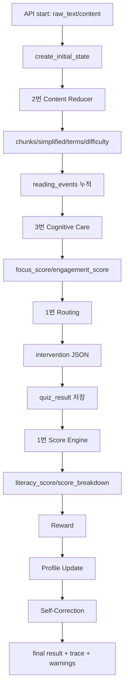

# 1번 Orchestrator 마스터 가이드

> 목적: 이 문서는 1번 담당자가 교수님 앞에서 **오케스트레이터가 무엇을 하고, 어떤 모델/모듈을 쓰고, 어떤 데이터를 주고받으며, 왜 이 구조가 ChatGPT 요약과 다른지**를 설명할 수 있게 만든 발표/방어용 정리 문서다.

참고한 기준 문서와 코드:
- `1_ARCHITECTURE.md`
- `1_DELIVERY_PLAN.md`
- `backend/app/orchestrator/*`
- `backend/app/agents/*`
- `backend/app/api/*`
- `docs/API_CONTRACT.md`
- `docs/SHARED_STATE.md`
- `docs/SCORE_FORMULA.md`
- `docs/INTEGRATION_STATUS_TEAM.md`
- `최종제출_기획서.md`

---

## 0. 한 문장으로 설명하기

**1번 Orchestrator는 사용자의 읽기 세션 전체를 하나의 Shared State로 관리하면서, 2번 콘텐츠 처리, 3번 집중도 분석, 4번 화면 표시, 5번 품질 검증이 끊기지 않게 연결하고, 최종적으로 재현 가능한 Literacy Score를 계산하는 중앙 제어 엔진이다.**

발표에서 가장 중요한 문장:

```text
GPT는 글을 요약하지만, 우리 시스템은 사용자가 글을 읽는 과정 자체를 측정하고,
집중이 흔들리면 개입하고, 퀴즈와 행동 데이터를 합쳐 점수화하고,
그 결과를 다음 세션의 개인화에 다시 반영합니다.
```

---

## 1. 1번은 "외부 LLM 모델"인가?

정확히 말하면 **1번은 Claude/Gemini/GPT 같은 외부 LLM이 아니다.**

1번은 Python/FastAPI 기반의 **오케스트레이터 에이전트**다. 여기서 "에이전트"라는 말은 외부 LLM 하나를 뜻하는 것이 아니라, 상태를 보고 다음 단계를 실행하고 결과를 조합하는 **자율 흐름 제어 모듈**이라는 뜻이다.

### 1번에서 실제로 쓰는 것

| 구분 | 사용 여부 | 설명 |
|---|---:|---|
| Claude | 직접 사용 안 함 | 설계상 2번 Content Reducer의 고난도 문장 재구성 후보 |
| Gemini | 직접 사용 안 함 | 현재 코드에서는 2번 임시 브릿지가 Gemini API를 사용 |
| GPT/OpenAI | 직접 사용 안 함 | 5번 QA가 Ragas judge를 실제로 쓰면 필요할 수 있음 |
| LangGraph | 설계상 후보 | 현재 구현은 단순 Python 함수 플로우로 충분히 동작 |
| FastAPI | 사용 | 세션 시작, 이벤트 수신, 퀴즈 제출, 결과 반환 API |
| Python 순수 함수 | 사용 | routing, score, self-correction, fallback |
| TypedDict Shared State | 사용 | 모든 역할이 읽고 쓰는 공통 세션 상태 |

### 발표용 표현

```text
1번은 생성형 LLM을 호출해서 판단을 맡기는 구조가 아닙니다.
LLM이 필요한 부분은 2번의 쉬운 문장 재구성 같은 생성 작업이고,
1번의 핵심 판단인 흐름 제어, 개입 라우팅, 점수 계산은 재현 가능한 코드로 처리합니다.
그래서 같은 입력이면 같은 점수와 같은 trace가 나옵니다.
```

---

## 2. 전체 역할 속에서 1번의 위치

프로젝트는 역할별로 나뉘지만, 실제 실행에서는 1번이 중심이다.

```text
사용자/확장/프론트
  → FastAPI API
  → 1번 Orchestrator
      → 2번 Content Reducer
      → 3번 Cognitive Care
      → 1번 Routing
      → 1번 Score Engine
      → Reward/Profile
      → 1번 Self-Correction
  → 프론트/확장에 결과 반환
```

### 역할별로 1번이 알아야 하는 범위

| 역할 | 핵심 책임 | 1번이 알아야 하는 것 |
|---|---|---|
| 1번 Orchestrator | 상태, 흐름, 라우팅, 점수, fallback, trace | 직접 마스터해야 함 |
| 2번 Content Reducer & RAG | 원문을 청크로 나누고, 쉬운 문장, 용어, 난이도 생성 | `chunks`, `simplified_text`, `terms`, `difficulty_score`를 받음 |
| 3번 Cognitive Care | 읽기 행동을 분석해 집중도 계산 | `reading_events`를 주고 `focus_score`, `engagement_score`를 받음 |
| 4번 Frontend/Extension | 읽기 이벤트 수집, 오버레이, 대시보드 표시 | 1번이 만든 JSON을 화면에 표시 |
| 5번 QA/Evaluation | 품질, faithfulness, 회귀 검증 | 1번의 `trace`, `warnings`, 생성 산출물을 검증 |

---

## 3. 1번의 핵심 산출물 5개

### 1. Shared State

파일:

```text
backend/app/orchestrator/state.py
```

모든 에이전트가 공유하는 단일 세션 상태다. 이 프로젝트의 SSOT, 즉 Single Source of Truth다.

핵심 필드:

| 필드 | 의미 | 누가 채우나 |
|---|---|---|
| `session_id` | 읽기 세션 ID | API/1번 |
| `user_id` | 사용자 또는 익명 UUID | API/확장 |
| `document_id` | 문서 ID 또는 URL | API/확장 |
| `raw_text` | 원문 텍스트 | API/확장 |
| `profile` | 이전 점수, 사용자 수준 등 | API/Profile |
| `chunks` | 문단/청크 단위 | 2번 |
| `simplified_text` | 쉬운 설명 텍스트 | 2번 |
| `terms` | 용어 풀이 목록 | 2번 |
| `difficulty_score` | 문서 난이도 0~100 | 2번 |
| `reading_events` | scroll/pause/blur/focus/click | 4번/확장/API |
| `focus_score` | 집중도 0~100 | 3번 |
| `engagement_score` | 참여도 0~100 | 3번 |
| `intervention` | 프론트가 표시할 개입 명령 | 1번 routing |
| `quiz_result` | 퀴즈 정답 결과 | 4번/API |
| `literacy_score` | 최종 리터러시 점수 | 1번 score |
| `score_breakdown` | 점수 근거 | 1번 score |
| `reward` | XP, badge, message | Reward |
| `updated_profile` | 성장 추세, 약점, 추천 | Profile |
| `trace` | 단계별 실행 로그 | 1번 graph |
| `errors` | 실패 기록 | 1번 graph/fallback |
| `warnings` | 자가검증 경고 | 1번 self-correction |

### 2. Orchestrator Flow

파일:

```text
backend/app/orchestrator/graph.py
```

현재 실제 실행 순서:

```python
DEFAULT_STEPS = (
    ("content_reducer", run_content_reducer),
    ("cognitive_care", run_cognitive_care),
    ("routing_decision", decide_intervention),
    ("score_engine", calculate_literacy_score),
    ("reward", run_reward_agent),
    ("profile_update", run_literacy_profile_agent),
    ("self_correction", review_session),
)
```

이 순서가 1번의 중심이다.

```text
원문 처리
  → 읽기 행동 분석
  → 개입 판단
  → 점수 계산
  → 보상 생성
  → 프로필 업데이트
  → 결과 자가검증
```

각 단계는 성공하면 `trace.status = "success"`로 기록된다. 실패하면 전체 세션을 죽이지 않고 fallback을 적용한 뒤 `trace.status = "fallback"`으로 남긴다.

### 3. Agent Contract

파일:

```text
backend/app/orchestrator/contracts.py
backend/app/agents/config.py
```

1번은 다른 역할의 실제 구현이 들어와도, 반드시 약속된 필드를 채우는지 검사한다.

예를 들어 2번 Content Reducer는 반드시 다음을 내야 한다.

```text
chunks
simplified_text
terms
difficulty_score
```

3번 Cognitive Care는 반드시 다음을 내야 한다.

```text
focus_score
engagement_score
intervention_needed
```

계약을 어기면 `ContractError`가 발생하고, graph가 fallback으로 바꿔 데모 흐름을 유지한다.

### 4. Routing

파일:

```text
backend/app/orchestrator/routing.py
```

집중도 `focus_score`를 보고 개입 수준을 결정한다.

| focus_score | intervention level | type | 의미 |
|---:|---|---|---|
| 75 이상 | `none` | `none` | 잘 읽고 있으므로 개입 없음 |
| 50 이상 75 미만 | `soft` | `highlight` | 핵심 문장 하이라이트 |
| 30 이상 50 미만 | `medium` | `nudge` | 잠깐 멈추고 다시 읽으라는 넛지 |
| 30 미만 | `hard` | `quiz` | 즉석 이해도 퀴즈 |

발표용 설명:

```text
개입은 LLM이 즉흥적으로 만드는 것이 아니라 focus_score 기준으로 결정됩니다.
그래서 과잉 개입을 줄이고, 프론트는 intervention JSON만 보고 동일하게 렌더링할 수 있습니다.
```

### 5. Literacy Score Engine

파일:

```text
backend/app/orchestrator/score.py
docs/SCORE_FORMULA.md
```

공식:

```text
comprehension_score = quiz_correct_rate * 100
engagement_score    = focus_score
difficulty_score    = document difficulty

literacy_score =
  comprehension_score * 0.50
  + engagement_score  * 0.35
  + difficulty_score  * 0.15
  - cross_validation_penalty
```

특징:

- LLM이 채점하지 않는다.
- 같은 입력이면 같은 점수가 나온다.
- 점수는 0~100으로 clamp된다.
- NaN, 누락값, total_count=0을 방어한다.
- `score_breakdown.reason`에 계산 근거가 남는다.

교차검증 감점:

| 행동 | 감점 |
|---|---:|
| 탭 이탈 `blur` | 1회당 2.0 |
| 빠른 스크롤 | 1회당 1.5 |
| 체류 시간 0 | 1회당 2.5 |
| 긴 idle | 1회당 3.0 |

최대 감점은 20점이다.

---

## 4. 실제 API 흐름

1번이 프론트/확장과 연결되는 API는 두 계열이 있다.

### A. 일반 읽기 세션 API

파일:

```text
backend/app/api/reading_session.py
```

경로:

```text
POST /api/reading-sessions/start
POST /api/reading-sessions/{session_id}/events
POST /api/reading-sessions/{session_id}/quiz
POST /api/reading-sessions/{session_id}/finish
GET  /api/reading-sessions/{session_id}/result
```

흐름:

```text
1. /start
   raw_text를 받아 initial state 생성
   2번 content_reducer 실행
   chunks, simplified_text, terms, difficulty_score 반환

2. /events
   scroll/pause/blur/focus/click 이벤트 누적
   3번 cognitive_care 실행
   1번 routing 실행
   focus_score와 intervention 반환

3. /quiz
   사용자의 퀴즈 결과를 state.quiz_result에 저장

4. /finish
   전체 orchestrator flow 실행
   score, reward, profile, warnings, trace 반환

5. /result
   저장된 최신 결과 조회
```

### B. Chrome 확장용 alias API

파일:

```text
backend/app/api/extension_session.py
backend/app/api/frontend_contract.py
```

경로:

```text
POST /api/session/start
POST /api/session/{session_id}/events
GET  /api/session/{session_id}/result
```

확장은 snake_case가 아니라 camelCase와 `content[]`를 사용한다.

예:

```json
{
  "userId": "anonymous-device-uuid",
  "source": { "url": "https://example.com", "title": "article", "type": "web" },
  "content": ["문단1", "문단2"]
}
```

1번 adapter가 내부 state로 바꾼다.

```text
userId      → user_id
source.url  → document_id
content[]   → raw_text = 문단들을 "\n\n"로 join
```

확장 결과는 프론트 친화적인 camelCase로 다시 변환된다.

```text
to_intervention_command(state)
to_session_result(state)
```

---

## 5. 모델과 데이터가 오가는 방식

여기서 "모델"은 외부 LLM만 뜻하지 않고, 프로젝트 안의 역할별 에이전트/모듈까지 포함해서 설명한다.

### 1번 → 2번 Content Reducer

보내는 것:

```json
{
  "raw_text": "사용자가 읽는 원문",
  "profile": {
    "previous_literacy_score": 60
  }
}
```

받는 것:

```json
{
  "chunks": [],
  "simplified_text": "쉬운 문장 재구성 결과",
  "terms": [],
  "difficulty_score": 60.0
}
```

현재 코드 상태:

- `backend/app/agents/content_reducer_client.py`가 adapter다.
- `LITERACY_CONTENT_REDUCER_IMPL=real`이면 임시 real bridge를 탄다.
- 실제 bridge는 `backend/app/agents/real/content_reducer_bridge.py`다.
- 이 bridge는 `GEMINI_API_KEY`가 있으면 Gemini로 `simplified_text`를 만들고, 실패하면 원문 passthrough를 한다.
- chunks, terms, difficulty는 비용 없는 로직/사전 기반으로 처리한다.

발표용 주의점:

```text
설계 문서에는 Claude Sonnet/Haiku 라우팅이 적혀 있지만,
현재 통합본에서는 비용 0과 데모 안정성을 위해 Gemini 무료 경로와 fallback을 쓰는 임시 bridge가 붙어 있습니다.
중요한 점은 1번은 특정 LLM에 종속되지 않고, 2번이 계약 필드만 채우면 Claude든 Gemini든 교체 가능하다는 것입니다.
```

### 1번 → 3번 Cognitive Care

보내는 것:

```json
{
  "reading_events": [
    { "type": "scroll", "timestamp_ms": 1200, "position": 0.3, "duration_ms": 180 },
    { "type": "blur", "timestamp_ms": 3000, "duration_ms": 1000 }
  ],
  "chunks": []
}
```

받는 것:

```json
{
  "focus_score": 63.0,
  "engagement_score": 63.0,
  "intervention_needed": true
}
```

현재 코드 상태:

- `backend/app/agents/cognitive_care_client.py`가 adapter다.
- real 구현은 `backend/app/agents/real/cognitive_care_service.py`에 들어와 있다.
- focus 계산은 blur, 빠른 스크롤 등을 감점하는 deterministic logic이다.

### 1번 내부 Routing

입력:

```json
{ "focus_score": 45.0, "chunks": [...] }
```

출력:

```json
{
  "intervention": {
    "level": "medium",
    "type": "nudge",
    "message": "...",
    "target_chunk_id": "chunk_01",
    "reason": "focus_score=45.0"
  }
}
```

### 1번 내부 Score Engine

입력:

```json
{
  "quiz_result": { "correct_count": 4, "total_count": 5 },
  "focus_score": 70.0,
  "difficulty_score": 60.0,
  "reading_events": []
}
```

출력:

```json
{
  "comprehension_score": 80.0,
  "literacy_score": 73.5,
  "score_breakdown": {
    "comprehension_score": 80.0,
    "engagement_score": 70.0,
    "difficulty_score": 60.0,
    "cross_validation_penalty": 0.0,
    "reason": "..."
  }
}
```

### 1번 → Reward/Profile

Reward가 받는 것:

```json
{
  "literacy_score": 73.5
}
```

Reward가 주는 것:

```json
{
  "reward": {
    "xp": 110,
    "badge": "steady_reader",
    "message": "Session completed. Keep reading with steady focus."
  }
}
```

Profile이 받는 것:

```json
{
  "literacy_score": 73.5,
  "score_breakdown": {},
  "profile": { "previous_literacy_score": 60 }
}
```

Profile이 주는 것:

```json
{
  "updated_profile": {
    "reading_level": "intermediate",
    "trend": "improving",
    "weaknesses": [],
    "recommended_next_action": "Read one more short passage and answer a quick check quiz."
  }
}
```

### 1번 → 5번 QA

현재 코드상 5번 QA는 no-op adapter다.

```text
backend/app/agents/qa_eval_client.py
```

하지만 1번은 QA가 볼 수 있는 근거를 이미 남긴다.

```text
trace
errors
warnings
score_breakdown
generated outputs: simplified_text, terms, chunks, quiz_result
```

발표용 표현:

```text
QA가 완전히 붙지 않아도 1번은 모든 단계의 trace와 warning을 남기기 때문에,
어느 단계에서 fallback이 났는지, 점수의 근거가 무엇인지 검증할 수 있습니다.
```

---

## 6. Stub과 Real 전환 구조

파일:

```text
backend/app/agents/config.py
```

전환 방식:

```text
LITERACY_<AGENT>_IMPL=real
LITERACY_AGENT_IMPL=real
```

예:

```text
LITERACY_CONTENT_REDUCER_IMPL=real
```

설명:

- 기본은 `stub`이다.
- 실제 구현이 있으면 `real`로 교체한다.
- real 구현은 계약 검증을 통과해야 한다.
- real이 실패하면 오케스트레이터 fallback이 흐름을 살린다.

발표에서 좋은 포인트:

```text
팀원이 만든 모듈이 아직 완성되지 않아도, 1번은 stub으로 전체 흐름을 먼저 보장했습니다.
이후 실제 모듈이 준비되면 adapter 한 줄과 환경변수만으로 real 경로로 바꿀 수 있습니다.
이 구조 때문에 병렬 개발과 안정적인 데모가 가능했습니다.
```

---

## 7. Fallback과 Trace

파일:

```text
backend/app/orchestrator/errors.py
backend/app/orchestrator/graph.py
```

1번의 중요한 안정성 설계는 **한 단계가 실패해도 세션 전체를 죽이지 않는 것**이다.

| 실패 단계 | fallback |
|---|---|
| content_reducer 실패 | 원문 하나를 fallback chunk로 만들고 난이도 50 |
| cognitive_care 실패 | focus 60, engagement 60, 개입 없음 |
| routing 실패 | 개입 없음 |
| score 실패 | 중립 점수 60 |
| reward 실패 | reward 제거하고 점수 유지 |
| profile 실패 | updated_profile 제거하고 점수 유지 |
| self_correction 실패 | warning만 남기고 결과 유지 |

trace 예:

```json
[
  { "step": "content_reducer", "status": "success", "latency_ms": 12 },
  { "step": "cognitive_care", "status": "success", "latency_ms": 0 },
  { "step": "score_engine", "status": "success", "latency_ms": 1 }
]
```

fallback이 나면:

```json
{
  "step": "content_reducer",
  "status": "fallback",
  "latency_ms": 3,
  "detail": {
    "error": "...",
    "error_type": "ContractError"
  }
}
```

---

## 8. Self-Correction이 하는 일

파일:

```text
backend/app/orchestrator/self_correction.py
```

역할:

```text
최종 state를 읽고 이상한 결과가 있으면 warnings에 기록한다.
```

감지하는 것:

| code | 의미 |
|---|---|
| `empty_chunks` | 2번이 청크를 못 만들었음 |
| `empty_simplified_text` | 쉬운 설명이 비어 있음 |
| `missing_focus_score` | 집중도 점수가 없음 |
| `missing_literacy_score` | 최종 점수가 없음 |
| `score_out_of_range` | 점수가 0~100 범위를 벗어남 |
| `quiz_missing` | 퀴즈 없이 기본 이해도 값으로 계산됨 |
| `high_abnormal_penalty` | 비정상 읽기 감점이 큼 |
| `agent_fallback` | 어떤 단계가 fallback으로 처리됨 |

발표용 표현:

```text
Self-Correction은 사용자를 막는 기능이 아니라, 결과가 신뢰 가능한지 확인하는 검증 레이어입니다.
비어 있는 출력이나 비정상 점수를 숨기지 않고 warnings에 남깁니다.
```

---

## 9. 교수님 질문 대비 핵심 Q&A

### Q1. 1번은 무슨 AI 모델을 썼나요?

```text
1번 자체는 Claude나 Gemini 같은 외부 LLM이 아니라 Python 기반 오케스트레이터입니다.
상태 전이, 라우팅, 점수 계산은 deterministic logic으로 구현했습니다.
외부 LLM은 2번 Content Reducer가 쉬운 문장 재구성에 선택적으로 사용합니다.
현재 통합본에서는 Gemini bridge가 붙어 있고, 실패 시 원문 passthrough로 fallback됩니다.
```

### Q2. 그럼 Agent라고 부를 수 있나요?

```text
네. 이 프로젝트에서 Agent는 단순 LLM 호출이 아니라 상태를 보고 다음 행동을 결정하는 역할 단위입니다.
1번은 Shared State를 기준으로 콘텐츠 처리, 집중도 분석, 개입 판단, 점수 계산, 보상, 프로필 갱신을 순서대로 실행합니다.
특히 focus_score에 따라 개입 수준을 자율적으로 결정하므로 오케스트레이션 에이전트라고 볼 수 있습니다.
```

### Q3. ChatGPT 요약과 뭐가 다른가요?

```text
ChatGPT는 텍스트를 넣으면 요약이나 설명을 줍니다.
우리 시스템은 사용자가 실제로 읽는 동안 스크롤, 체류, 이탈, 퀴즈 결과를 측정합니다.
그리고 집중도가 떨어지면 하이라이트, 넛지, 퀴즈로 개입하고,
마지막에는 이해도, 집중도, 난이도를 합쳐 성장 점수를 만듭니다.
즉 텍스트 처리 도구가 아니라 읽기 과정과 성장을 관리하는 폐루프 시스템입니다.
```

### Q4. 점수는 LLM이 매기나요?

```text
아니요. 점수는 LLM이 아니라 score.py의 순수 함수가 계산합니다.
퀴즈 정답률 50%, 집중도 35%, 난이도 15%를 반영하고,
탭 이탈이나 빠른 스크롤 같은 비정상 읽기 행동은 최대 20점까지 감점합니다.
그래서 같은 입력이면 항상 같은 점수가 나오고, score_breakdown으로 근거도 설명됩니다.
```

### Q5. 2번이 실패하면 전체가 멈추나요?

```text
멈추지 않습니다.
graph.py는 각 단계를 try/except로 실행하고, 실패하면 errors.py의 fallback을 적용합니다.
예를 들어 Content Reducer가 실패하면 원문을 fallback chunk로 만들고 난이도 50으로 계속 진행합니다.
이후 trace에 fallback 상태를 남기기 때문에 데모 안정성과 검증 가능성을 동시에 확보합니다.
```

### Q6. 왜 Shared State가 중요한가요?

```text
여러 역할이 병렬로 개발되면 각자 데이터 형식이 달라져 통합이 깨지기 쉽습니다.
그래서 1번이 ReadingSessionState를 단일 기준으로 만들었습니다.
2번은 chunks와 difficulty_score를 채우고, 3번은 focus_score를 채우고,
1번은 그 state를 바탕으로 routing과 score를 수행합니다.
이 구조 덕분에 팀원이 만든 모듈을 adapter로 교체할 수 있습니다.
```

### Q7. Chrome 확장과 PDF는 1번과 어떻게 연결되나요?

```text
확장과 PDF는 새로운 코어가 아니라 새로운 입력 경로입니다.
웹페이지나 pdf.js에서 본문을 content[] 배열로 추출해서 /api/session/start로 보냅니다.
1번 adapter가 content[]를 raw_text로 합치고 기존 오케스트레이터 흐름에 태웁니다.
즉 웹과 PDF가 같은 Shared State와 같은 Score Engine을 재사용합니다.
```

### Q8. Ragas나 QA는 지금 동작하나요?

```text
현재 통합본에서 QA agent는 no-op입니다.
다만 1번은 trace, warnings, score_breakdown, generated outputs를 남기므로 QA가 붙을 준비는 되어 있습니다.
Ragas를 실제 LLM judge로 쓰면 OpenAI 같은 외부 API가 필요할 수 있지만,
데모에서는 비용 0 원칙에 맞춰 오프라인 휴리스틱 평가로도 대체 가능합니다.
```

---

## 10. 발표할 때 따라가면 좋은 90초 설명 흐름

```text
1. 이 서비스는 단순 요약기가 아니라 읽기 과정을 관리하는 폐루프 시스템입니다.

2. 1번 Orchestrator는 모든 역할이 공유하는 ReadingSessionState를 만들고,
   이 state를 기준으로 각 에이전트를 순서대로 실행합니다.

3. 먼저 2번 Content Reducer가 원문을 chunks, simplified_text, terms, difficulty_score로 바꿉니다.
   현재 통합본에서는 Gemini bridge가 붙어 있지만, 1번은 특정 LLM에 종속되지 않습니다.

4. 사용자가 읽는 동안 4번 확장/프론트가 scroll, pause, blur 같은 reading_events를 보냅니다.
   3번 Cognitive Care는 이 이벤트로 focus_score를 계산합니다.

5. 1번 routing.py는 focus_score 기준으로 none, soft, medium, hard 개입을 결정합니다.
   soft는 highlight, medium은 nudge, hard는 quiz입니다.

6. 세션이 끝나면 1번 score.py가 퀴즈 정답률, 집중도, 난이도, 비정상 읽기 감점을 합쳐
   Literacy Score를 계산합니다. 이 점수는 LLM이 아니라 순수 함수라 재현 가능합니다.

7. 마지막으로 reward와 profile을 갱신하고, self_correction이 빈 출력이나 fallback 여부를 warnings로 기록합니다.
   그래서 결과는 사용자에게 보여줄 수 있고, QA도 trace로 검증할 수 있습니다.
```

---

## 11. 내가 반드시 외워야 할 파일 맵

| 파일 | 발표에서 설명할 내용 |
|---|---|
| `backend/app/orchestrator/state.py` | Shared State, 모든 역할의 공통 데이터 구조 |
| `backend/app/orchestrator/graph.py` | 실행 순서, trace, fallback 진입점 |
| `backend/app/orchestrator/routing.py` | focus_score → intervention 변환 |
| `backend/app/orchestrator/score.py` | Literacy Score 공식 |
| `backend/app/orchestrator/contracts.py` | 다른 역할 산출물 계약 검증 |
| `backend/app/orchestrator/errors.py` | 실패해도 세션 유지하는 fallback |
| `backend/app/orchestrator/self_correction.py` | 결과 이상 감지 warnings |
| `backend/app/agents/config.py` | stub/real 전환 구조 |
| `backend/app/agents/content_reducer_client.py` | 2번 연결 adapter |
| `backend/app/agents/real/content_reducer_bridge.py` | 현재 Gemini bridge |
| `backend/app/api/reading_session.py` | 기본 REST 세션 API |
| `backend/app/api/extension_session.py` | Chrome 확장/PDF용 alias API |
| `backend/app/api/frontend_contract.py` | 내부 state를 프론트 JSON으로 변환 |
| `docs/SCORE_FORMULA.md` | 점수 공식 설명 근거 |
| `docs/API_CONTRACT.md` | 역할 간 입출력 계약 |
| `docs/SHARED_STATE.md` | 필드별 소유권 |

---

## 12. 1번 관점의 현재 구현 상태

| 항목 | 상태 | 설명 |
|---|---|---|
| Shared State | 구현됨 | `ReadingSessionState` |
| Orchestrator Flow | 구현됨 | `run_reading_session` |
| Routing | 구현됨 | 75/50/30 기준 |
| Score Engine | 구현됨 | 순수 함수, breakdown 포함 |
| Trace/Fallback | 구현됨 | 단계별 success/fallback 기록 |
| Contract Validation | 구현됨 | real 모듈 출력 검증 |
| Self-Correction | 구현됨 | warnings 생성 |
| 2번 연결 | 부분 real | Gemini bridge + fallback |
| 3번 연결 | real adapter 있음 | focus_score 계산 |
| 4번 연결 | API 변환 있음 | frontend_contract, extension_session |
| 5번 QA | no-op | trace/warnings 준비됨 |

---

## 13. 발표에서 절대 헷갈리면 안 되는 구분

### 설계 문서 기준

```text
2번 콘텐츠 재구성: Claude Sonnet/Haiku 라우팅
5번 QA: Ragas/Promptfoo/LangSmith 가능
LangGraph/StateGraph 사용 가능
Redis/PostgreSQL 확장 가능
```

### 현재 통합 코드 기준

```text
1번 오케스트레이터: Python 함수 플로우
2번 콘텐츠 재구성: Gemini bridge, 실패 시 원문 fallback
3번 집중도: deterministic focus logic
점수 계산: score.py 순수 함수
QA: no-op, trace/warnings 준비
세션 저장: 현재는 메모리 SESSION_STORE
```

교수님이 "문서에는 Claude인데 지금은 Gemini냐"고 물으면:

```text
설계상 핵심은 특정 벤더가 아니라 난이도 기반 LLM 라우팅입니다.
현재 통합본은 비용과 데모 안정성을 위해 Gemini 무료 bridge를 붙였고,
1번 오케스트레이터는 content_reducer 계약만 지키면 Claude, Gemini, 로컬 모델로 모두 교체 가능합니다.
```

---

## 14. 핵심 다이어그램

### 1번 중심 실행 흐름



### 데이터 계약 흐름

```mermaid
flowchart LR
    FE[4번 Front/Extension] -->|raw_text or content[]| API[FastAPI API]
    API --> STATE[ReadingSessionState]
    STATE -->|raw_text/profile| CR[2번 Content Reducer]
    CR -->|chunks/simplified/terms/difficulty| STATE
    FE -->|reading_events| STATE
    STATE -->|events/chunks| CC[3번 Cognitive Care]
    CC -->|focus/engagement| STATE
    STATE --> ROUTE[1번 Routing]
    ROUTE -->|intervention| FE
    STATE --> SCORE[1번 Score Engine]
    SCORE -->|literacy_score/breakdown| STATE
    STATE --> QA[5번 QA]
```

---

## 15. 마지막 압축 요약

1번을 마스터한다는 것은 다음 5개를 설명할 수 있다는 뜻이다.

```text
1. Shared State
   모든 역할이 같은 세션 상태를 읽고 쓴다.

2. Orchestrator Flow
   content → care → routing → score → reward → profile → self-correction 순서로 돈다.

3. Contract
   다른 역할이 어떤 필드를 채워야 하는지 1번이 정의하고 검증한다.

4. Score
   LLM이 아니라 퀴즈 정답률, 집중도, 난이도, 행동 감점으로 재현 가능하게 계산한다.

5. Stability
   실패해도 fallback으로 흐름을 유지하고 trace/warnings로 검증 가능하게 남긴다.
```

발표에서 가장 강하게 밀 문장:

```text
1번 Orchestrator의 핵심 가치는 "AI가 그럴듯하게 답하는 것"이 아니라,
여러 에이전트의 산출물을 하나의 상태로 묶고,
읽기 과정 전체를 측정 가능한 폐루프로 만든다는 점입니다.
```
