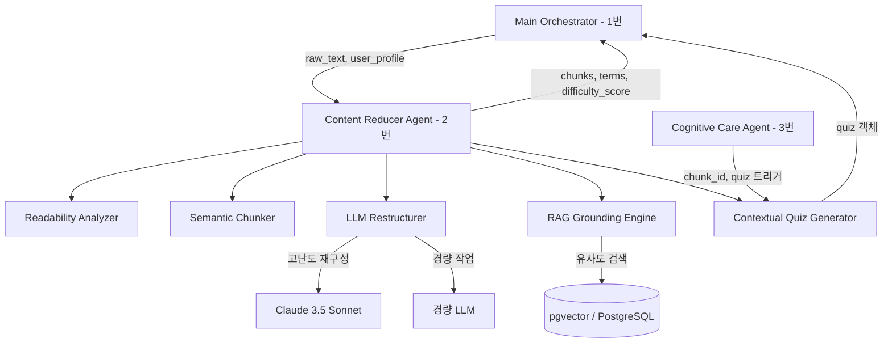
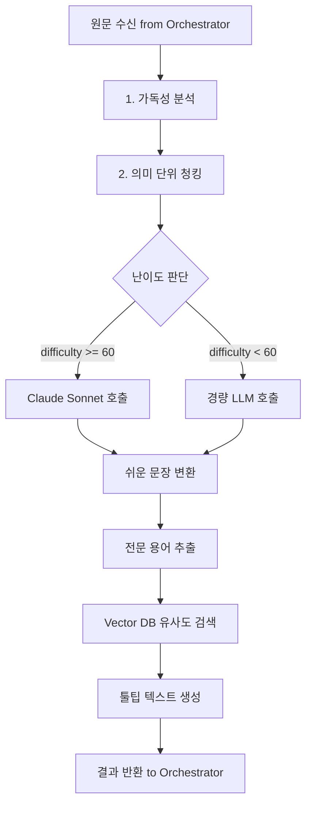
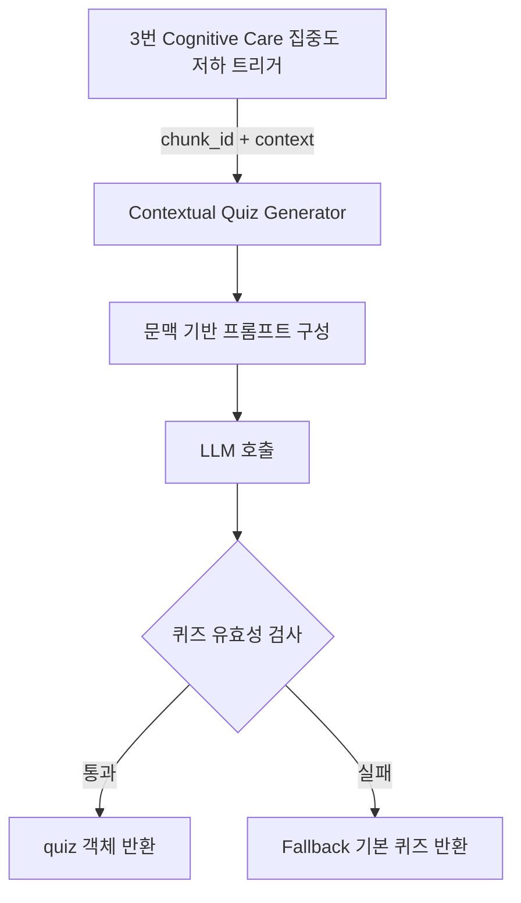

# AI 리터러시 케어 에이전트 아키텍처 문서

## 문서 목적

이 문서는 2026 AI/SW 경진대회 프로젝트에서 **2번 역할: 콘텐츠 처리 / RAG 기술리드**가 무엇을 설계하고 구현해야 하는지 명확히 정의한다.

2번 역할은 앱 전체를 혼자 만드는 역할이 아니다. 2번은 Orchestrator(1번)로부터 원문 텍스트를 받아, 사용자의 수준에 맞게 재구성하고, 신뢰 출처 기반 RAG 용어풀이를 제공하며, 문맥 맞춤형 퀴즈를 생성하여 **읽기 과정의 인지 부담을 줄이고 이해도를 높이는 핵심 엔진**을 책임진다.

---

## 1. 시스템 개요 (System Overview)

### 프로젝트명

AI 리터러시 케어 에이전트 — Content & RAG Agent (2번 역할)

### 한 줄 정의

사용자의 인지 수준과 읽기 맥락에 따라 원문 텍스트를 실시간으로 재구성하고, 환각 없는 신뢰 기반 용어풀이와 동적 퀴즈를 제공하여 자기주도적 독해를 지원하는 콘텐츠 처리 엔진.

### 해결하고자 하는 문제

기존 AI 요약 도구는 원문을 단순히 짧게 줄여주지만, 사용자가 실제로 이해할 수 있는 수준인지, 어려운 용어가 무엇인지, 어느 부분에서 인지 부하가 걸리는지를 고려하지 않는다.

이 역할은 다음 문제를 해결한다:

```text
문제 1: 전문 용어가 많은 뉴스/논문은 일반 사용자가 읽다가 포기한다
문제 2: AI가 용어를 "지어내서" 설명하면 오히려 잘못된 이해를 심어준다
문제 3: 읽기 집중도가 떨어진 시점에 맞는 퀴즈가 없어 개입 효과가 낮다
```

2번 역할의 핵심 가치:

```text
재구성(Restructure): 원문 → 수준별 쉬운 문장
신뢰(RAG Grounding): 환각 없이 사전 출처 기반 풀이
개입(Contextual Quiz): 집중도 저하 시점에 맞는 퀴즈 생성
```

### 서비스 목적

사용자가 뉴스, 논문, 기사, 보고서 같은 긴 글을 읽을 때 다음을 지원한다:

- 가독성 분석: 원문의 한국어 가독성 지수를 측정해 난이도를 산출
- 의미 단위 청킹: 단순 문장 분리가 아닌 의미 연결 기준의 문단 분할
- 수준별 재구성: 사용자의 리터러시 프로필에 따라 쉬운 문장으로 변환
- 신뢰 기반 용어풀이: 검증된 외부 사전/용어집 데이터 기반의 툴팁 제공
- 문맥 맞춤 퀴즈: 3번(Cognitive Care)의 트리거에 맞춰 해당 chunk의 핵심 내용을 퀴즈로 생성

### 2번 역할의 핵심 목표

2번 역할은 아래 질문에 답할 수 있는 콘텐츠 처리 시스템을 만든다:

- 원문의 난이도를 어떻게 측정하고 수치화하는가?
- 의미 단위 청킹은 어떤 기준으로 수행하는가?
- 쉬운 문장으로의 변환 시 LLM을 어떻게 제어하는가?
- 용어풀이에서 환각을 어떻게 차단하는가?
- 퀴즈가 문맥에 맞게 생성되었는지 어떻게 보장하는가?
- Orchestrator(1번)와 어떤 JSON 계약으로 연결되는가?
- stub 기반으로 먼저 흐름을 만들고, 이후 실제 모듈로 교체하는 방식은 무엇인가?

---

## 2. 기술 스택 및 선정 이유 (Tech Stack & Rationale)

아래 표는 2번 역할이 직접 책임지는 기술 스택이다.

| 레이어 (Layer) | 선택한 기술 (Tech) | 선정 이유 (Rationale) | 2번 역할의 책임 |
| --- | --- | --- | --- |
| LLM (고난도) | Claude 3.5 Sonnet / Opus | 문장 재구성과 고난도 추론에서 한국어 품질이 가장 높음 | 쉬운 문장 변환 프롬프트 설계 및 호출 관리 |
| LLM (경량) | Claude Haiku / GPT-4o-mini | 단순 청킹 보조, 비용 절감 라우팅 | 작업 난이도에 따른 모델 라우팅 기준 정의 |
| Framework | LangChain (SemanticChunker) | 의미론적 문단 분할을 안정적으로 수행 | SemanticChunker 파이프라인 구성 |
| Vector DB | PostgreSQL (pgvector) | 기존 팀 인프라(PostgreSQL)에 pgvector 확장으로 통합 가능 | 용어집 임베딩 저장 및 유사도 검색 쿼리 |
| Evaluation | Ragas (Faithfulness, Answer Relevance) | 생성 결과의 신뢰성과 관련성을 정량 평가 가능 | faithfulness 지표 기반 용어풀이 품질 검증 |
| Language | Python 3.11 | 팀 공통 기술 스택, LangChain/Ragas 호환 | 전체 2번 모듈 구현 언어 |
| Testing | pytest | 단위 테스트 및 파이프라인 통합 테스트 | chunk/term/quiz 생성 품질 테스트 작성 |

---

## 3. 시스템 아키텍처 다이어그램 (Architecture Diagram)

### 전체 구조 내 2번 위치



### 2번 내부 처리 흐름



### 퀴즈 생성 흐름



### 핵심 폐루프에서 2번의 역할

```text
1. Orchestrator가 원문(raw_text)과 사용자 프로필(profile)을 2번에 전달
2. 2번이 가독성 분석 → 청킹 → 재구성 → RAG 용어풀이를 수행
3. 결과(chunks, simplified_text, terms, difficulty_score)를 Orchestrator에 반환
4. 사용자가 읽는 중 3번(Cognitive Care)이 집중도 저하를 감지하면
5. 3번이 2번에 퀴즈 생성 트리거를 전달
6. 2번이 해당 chunk 문맥 기반 퀴즈를 생성해 Orchestrator에 반환
7. 퀴즈 결과(quiz_result)가 1번의 Literacy Score 계산에 반영됨
```

---

## 4. 디렉토리 구조 및 역할 (Directory Structure)

2번 역할은 아래 구조를 기반으로 구현한다. 처음부터 모든 파일을 완성할 필요는 없고, stub 기반 흐름을 먼저 만든 후 실제 기능을 교체한다.

```text
ai-literacy-care-agent/
  backend/
    app/
      agents/
        content_reducer/
          __init__.py
          agent.py              # Content Reducer 메인 에이전트 진입점
          readability.py        # 가독성 분석기
          chunker.py            # 의미 단위 청킹
          restructurer.py       # LLM 기반 문장 재구성
          rag_engine.py         # RAG 용어풀이 엔진
          quiz_generator.py     # 문맥 맞춤형 퀴즈 생성
          router.py             # LLM 난이도 기반 라우팅
          prompts.py            # 프롬프트 템플릿 모음
          contracts.py          # 입출력 타입 정의 (TypedDict)
          fallbacks.py          # 에이전트 실패 시 기본값 처리
        stubs/
          content_reducer_stub.py  # 실제 LLM 없이 동작하는 더미 구현
      tests/
        test_readability.py     # 가독성 점수 계산 테스트
        test_chunker.py         # 청킹 결과 단위 테스트
        test_rag_engine.py      # RAG 검색 및 용어풀이 테스트
        test_quiz_generator.py  # 퀴즈 구조 및 문맥 관련성 테스트
        test_content_e2e.py     # 원문 입력 → 결과 반환 E2E 테스트
  docs/
    CONTENT_AGENT_CONTRACT.md   # 2번 에이전트 입출력 계약 문서
    RAG_ARCHITECTURE.md         # RAG 파이프라인 상세 설계
    QUIZ_DESIGN.md              # 퀴즈 생성 규칙 및 템플릿 정의
    READABILITY_FORMULA.md      # 한국어 가독성 지수 계산식 설명
```

### `backend/app/agents/content_reducer/agent.py`

Content Reducer 에이전트의 메인 진입점이다. Orchestrator로부터 요청을 받아 내부 서브모듈을 순서대로 호출하고 결과를 반환한다.

역할:
- 입력 유효성 검사
- 각 서브모듈 순서 제어 (Readability → Chunker → Restructurer → RAG → 결과 조합)
- 실패 시 fallback 처리
- trace 기록

```python
def run_content_reducer(state: ReadingSessionState) -> ReadingSessionState:
    try:
        difficulty_score = analyze_readability(state["raw_text"])
        chunks = semantic_chunk(state["raw_text"])
        restructured_chunks = restructure_text(chunks, state["profile"], difficulty_score)
        chunks_with_terms = inject_rag_terms(restructured_chunks)

        state["difficulty_score"] = difficulty_score
        state["chunks"] = chunks_with_terms
        state["simplified_text"] = build_simplified_text(chunks_with_terms)
        state["terms"] = collect_all_terms(chunks_with_terms)
        state["trace"].append({"step": "content_reducer", "status": "success"})
    except Exception as e:
        state = apply_content_reducer_fallback(state, error=e)
    return state
```

### `backend/app/agents/content_reducer/readability.py`

한국어 가독성 지수를 계산하는 모듈이다.

계산 기준:

```text
가독성 지수 = 100
  - (평균 어절 수 per 문장 × 1.015)
  - (한자어/전문용어 비율 × 84.6)
  - (평균 음절 수 per 어절 × 0.5)

결과: 0~100 범위로 정규화
  - 70 이상: 쉬운 문장 (초중등 수준)
  - 50~69:   보통 (일반 성인 수준)
  - 50 미만:  어려운 문장 (전문/학술 수준)
```

완료 기준:
- `analyze_readability(text: str) -> float` 함수 구현
- 같은 텍스트 입력 시 항상 같은 점수 반환 (재현 가능)
- 결과가 0~100 범위로 clamp됨
- `test_readability.py` 작성

### `backend/app/agents/content_reducer/chunker.py`

원문을 의미 단위로 분할하는 모듈이다.

LangChain SemanticChunker를 기반으로 하되, chunk_id 규칙을 팀 전체에서 통일한다.

chunk_id 규칙:
```text
형식: chunk_{document_id}_{순번(2자리)}
예시: chunk_doc001_01, chunk_doc001_02
```

왜 chunk_id가 중요한가:
- 3번(Cognitive Care)이 행동 이벤트와 chunk_id를 연결해 어느 문단에서 집중도가 떨어졌는지 파악한다
- 4번(Frontend)이 특정 chunk를 하이라이트하거나 퀴즈 카드를 연결하기 위해 chunk_id를 사용한다
- 2번이 생성하는 퀴즈도 chunk_id를 기준으로 문맥을 참조한다

완료 기준:
- `semantic_chunk(text: str, document_id: str) -> list[ChunkDict]` 구현
- 각 chunk에 `chunk_id`, `original_text`, `char_start`, `char_end` 포함
- 단락 수 기준 최소/최대 chunk 크기 적용
- `test_chunker.py` 작성

### `backend/app/agents/content_reducer/restructurer.py`

LLM을 호출해 chunk를 사용자 수준에 맞는 쉬운 문장으로 변환하는 모듈이다.

LLM 라우팅 기준:

```text
difficulty_score >= 60 또는 chunk에 전문 용어 3개 이상:
  → Claude 3.5 Sonnet 호출

difficulty_score < 60 그리고 전문 용어 2개 이하:
  → 경량 LLM(Claude Haiku 또는 GPT-4o-mini) 호출
```

프롬프트 원칙:
- 원문의 의미를 바꾸지 않는다
- 문장을 짧게 쪼갠다 (1문장 = 1개념)
- 전문 용어를 쉬운 단어로 대체한다 (단, 용어풀이 tooltips는 RAG로 따로 제공)
- 사용자 프로필의 `reading_level`에 맞춰 어조를 조정한다

완료 기준:
- `restructure_text(chunks, profile, difficulty_score) -> list[RestructuredChunkDict]` 구현
- 재구성된 각 chunk에 `restructured_text` 필드 추가
- 프롬프트 실패 시 원문 그대로 반환 (fallback)

### `backend/app/agents/content_reducer/rag_engine.py`

RAG 기반 용어풀이를 담당하는 모듈이다.

**중요: RAG 적용 범위 제한**

이 프로젝트에서 RAG는 **오직 용어풀이에만** 적용한다. 요약이나 재구성에 RAG를 확장하면 복잡도가 증가하고 faithfulness 검증이 어려워진다.

신뢰 출처 (Grounding Sources):
- 표준국어대사전 (국립국어원)
- 도메인별 전문 용어집 (IT, 의학, 법률, 경제)
- 검증된 Wikipedia 한국어 항목 (카테고리 제한)

RAG 파이프라인:

```text
1. 재구성된 chunk에서 전문 용어 / 어려운 어휘 추출
2. 용어 임베딩 생성 (text-embedding-3-small 또는 동급)
3. pgvector에서 코사인 유사도 검색 (top-k=3)
4. 검색된 사전 정의를 LLM 프롬프트에 컨텍스트로 바인딩
5. LLM이 사전 정의만을 기반으로 툴팁 텍스트 생성
6. Ragas Faithfulness 점수로 생성 결과 검증
```

출력 예시 (terms 배열):

```json
[
  {
    "term": "레이턴시",
    "definition": "시스템이 요청을 받은 후 응답을 보낼 때까지 걸리는 대기 시간 또는 지연 시간.",
    "source": "도메인 용어집 IT 편",
    "faithfulness_score": 0.94,
    "chunk_id": "chunk_doc001_02"
  }
]
```

완료 기준:
- `inject_rag_terms(chunks) -> list[ChunkWithTermsDict]` 구현
- 각 chunk의 terms에 `term`, `definition`, `source` 포함
- Vector DB 검색 실패 시 `source: "fallback_definition"` 명시 후 기본값 반환
- `test_rag_engine.py` 작성

### `backend/app/agents/content_reducer/quiz_generator.py`

3번(Cognitive Care)의 집중도 저하 트리거를 받아, 해당 chunk 문맥에 맞는 퀴즈를 생성하는 모듈이다.

퀴즈 생성 원칙:
- 반드시 해당 chunk의 재구성 텍스트(`restructured_text`)를 근거로 생성
- 정답 외 3개의 오답을 포함하는 사지선다형
- 오답은 그럴듯하지만 명확히 틀린 선택지 (distractors)
- `explanation`은 왜 정답이 정답인지 chunk 내용 근거로 설명

퀴즈 유효성 검증:
```text
- question이 chunk 내용과 관련 있는가?
- correct_option이 1~4 범위인가?
- 오답 4개가 모두 구별되는가?
- explanation이 비어 있지 않은가?
```

완료 기준:
- `generate_quiz(chunk_id: str, context: str) -> QuizDict` 구현
- 유효성 검사 실패 시 fallback 퀴즈 반환
- `test_quiz_generator.py` 작성

### `backend/app/agents/content_reducer/contracts.py`

2번 에이전트의 입출력 타입을 Python TypedDict로 정의하는 파일이다.

팀원들은 이 파일의 타입 정의를 기준으로 연결 작업을 한다.

```python
from typing import TypedDict, NotRequired

class TermDict(TypedDict):
    term: str
    definition: str
    source: str
    faithfulness_score: NotRequired[float]
    chunk_id: str

class QuizDict(TypedDict):
    chunk_id: str
    question: str
    options: list[str]        # 4개 선택지
    correct_option: int       # 1~4 (1-indexed)
    explanation: str

class ChunkDict(TypedDict):
    chunk_id: str
    original_text: str
    restructured_text: NotRequired[str]
    difficulty: float         # 0~100
    terms: NotRequired[list[TermDict]]
    char_start: int
    char_end: int

class ContentReducerRequest(TypedDict):
    session_id: str
    raw_text: str
    user_literacy_level: int  # 1(초급) ~ 5(전문가)
    target_domain: NotRequired[str]
    profile: NotRequired[dict]

class ContentReducerResponse(TypedDict):
    session_id: str
    readability_score: float
    difficulty_score: float
    chunks: list[ChunkDict]
    simplified_text: str
    terms: list[TermDict]
```

### `backend/app/agents/content_reducer/fallbacks.py`

에이전트 내부 서브모듈이 실패해도 전체 흐름이 멈추지 않도록 기본값을 정의한다.

```text
가독성 분석 실패:
  → difficulty_score = 50 (중간 난이도 기본값)

Semantic Chunker 실패:
  → 원문을 단락('\n\n') 기준으로 단순 분할
  → 각 chunk difficulty = 50

LLM 재구성 실패:
  → restructured_text = original_text (원문 그대로)

RAG 검색 실패:
  → terms = [] (빈 배열 반환, 툴팁 없음)

퀴즈 생성 실패:
  → fallback 퀴즈 반환 (사전 준비된 chunk별 기본 퀴즈)
  → 또는 quiz = None으로 반환 후 Orchestrator에서 처리
```

### `backend/app/agents/stubs/content_reducer_stub.py`

실제 LLM 없이도 Orchestrator E2E 흐름을 테스트할 수 있는 더미 구현이다.

1번(Orchestrator)이 stub 기반으로 전체 흐름을 먼저 만들고, 2번 실제 구현이 완성되면 여기를 교체한다.

```python
def content_reducer_stub(state: dict) -> dict:
    """
    실제 LLM/RAG 없이 동작하는 더미 Content Reducer.
    Orchestrator stub E2E 테스트에 사용.
    """
    raw_text = state.get("raw_text", "")
    
    state["difficulty_score"] = 65.0
    state["chunks"] = [
        {
            "chunk_id": "chunk_stub_01",
            "original_text": raw_text[:300],
            "restructured_text": f"[쉬운 버전] {raw_text[:200]}",
            "difficulty": 65.0,
            "terms": [
                {
                    "term": "예시 용어",
                    "definition": "이것은 stub 데모용 용어풀이입니다.",
                    "source": "stub_source",
                    "chunk_id": "chunk_stub_01"
                }
            ],
            "char_start": 0,
            "char_end": 300
        }
    ]
    state["simplified_text"] = f"[쉬운 버전 전체] {raw_text[:500]}"
    state["terms"] = state["chunks"][0]["terms"]
    state["trace"].append({
        "step": "content_reducer",
        "status": "stub",
        "note": "Using stub implementation"
    })
    return state
```

---

## 5. 핵심 데이터 흐름 (Data Flow)

### 5.1 읽기 세션 시작 시 Content Reducer 호출 흐름

```text
1. 사용자가 읽을 글을 선택하거나 텍스트를 붙여넣음
2. 프론트가 raw_text, user_id를 백엔드(3번)로 전송
3. Orchestrator(1번)가 ReadingSessionState 초기화
4. Orchestrator가 run_content_reducer(state) 호출
5. 2번 에이전트가 내부 파이프라인 실행
   - 가독성 분석 → difficulty_score 산출
   - SemanticChunker로 청킹
   - LLM 라우팅 결정 후 재구성
   - RAG 용어풀이 주입
6. 결과를 state에 병합: chunks, simplified_text, terms, difficulty_score
7. Orchestrator가 결과를 프론트에 반환
8. 프론트가 재구성된 청크와 툴팁 데이터를 읽기 화면에 렌더링
```

API 예시 (Orchestrator ↔ 2번 에이전트):

요청 (Orchestrator → 2번):

```json
{
  "session_id": "s_2026_001",
  "raw_text": "인공지능의 LLM 레이턴시 최적화 기법 중 하나인 하이브리드 라우팅은 복잡한 추론 작업과 단순 처리를 분리하여...",
  "user_literacy_level": 2,
  "target_domain": "IT/Software",
  "profile": {
    "reading_level": "intermediate",
    "weaknesses": ["long_sentence", "technical_terms"]
  }
}
```

응답 (2번 → Orchestrator):

```json
{
  "session_id": "s_2026_001",
  "readability_score": 42.3,
  "difficulty_score": 68.5,
  "chunks": [
    {
      "chunk_id": "chunk_doc001_01",
      "original_text": "인공지능의 LLM 레이턴시 최적화 기법 중 하나인 하이브리드 라우팅은...",
      "restructured_text": "AI 답변 속도를 높이기 위해 어려운 작업과 쉬운 작업을 나눠서 처리하는 방법이 있습니다. 이를 '하이브리드 라우팅'이라고 합니다.",
      "difficulty": 68.5,
      "terms": [
        {
          "term": "레이턴시",
          "definition": "시스템이 요청을 받은 후 응답을 보낼 때까지 걸리는 대기 시간.",
          "source": "도메인 용어집 IT 편",
          "chunk_id": "chunk_doc001_01"
        }
      ],
      "char_start": 0,
      "char_end": 180
    }
  ],
  "simplified_text": "AI 답변 속도를 높이기 위해 어려운 작업과 쉬운 작업을 나눠서 처리하는 방법이 있습니다...",
  "terms": [
    {
      "term": "레이턴시",
      "definition": "시스템이 요청을 받은 후 응답을 보낼 때까지 걸리는 대기 시간.",
      "source": "도메인 용어집 IT 편",
      "chunk_id": "chunk_doc001_01"
    }
  ]
}
```

### 5.2 실시간 퀴즈 생성 흐름

```text
1. 사용자가 chunk_doc001_02를 읽는 중
2. 3번(Cognitive Care)이 해당 chunk에서 스크롤 속도 이상 감지
3. 3번이 Orchestrator에 intervention_level = "hard" 반환
4. Orchestrator가 2번에 퀴즈 생성 요청
5. 2번이 chunk_doc001_02의 restructured_text를 참조
6. LLM으로 문맥 맞춤형 퀴즈 생성
7. 퀴즈 유효성 검사 통과
8. quiz 객체를 Orchestrator에 반환
9. Orchestrator가 quiz를 프론트에 전달
10. 프론트가 퀴즈 카드를 표시
```

퀴즈 요청:

```json
{
  "chunk_id": "chunk_doc001_02",
  "context": "AI 답변 속도를 높이기 위해 어려운 작업과 쉬운 작업을 나눠서 처리하는 방법이 있습니다. 이를 '하이브리드 라우팅'이라고 합니다."
}
```

퀴즈 응답:

```json
{
  "chunk_id": "chunk_doc001_02",
  "question": "하이브리드 라우팅의 주요 목적은 무엇인가요?",
  "options": [
    "1. AI 모델의 학습 데이터를 늘리기 위해",
    "2. 어려운 작업과 쉬운 작업을 나눠 AI 답변 속도를 높이기 위해",
    "3. 사용자의 개인정보를 보호하기 위해",
    "4. 텍스트의 글자 수를 줄이기 위해"
  ],
  "correct_option": 2,
  "explanation": "본문에서 하이브리드 라우팅은 AI 답변 속도(레이턴시)를 높이기 위해 복잡한 작업과 단순한 작업을 분리 처리하는 방법이라고 설명합니다."
}
```

### 5.3 보안 및 데이터 처리 원칙

2번 역할은 원문 텍스트와 사용자 프로필을 처리하므로 다음 원칙을 준수한다:

- 원문 텍스트는 세션 ID 기준으로 분리 처리하며, 처리 완료 후 메모리에서 제거한다
- LLM 프롬프트에 사용자의 실제 개인정보(이름, 학번 등)를 포함하지 않는다
- RAG 검색 시 사용자 식별 정보를 쿼리에 포함하지 않는다
- 생성된 용어풀이는 `source`와 `faithfulness_score`를 함께 저장하여 감사(audit) 가능하게 한다

### 5.4 로깅 원칙

2번은 디버깅과 QA 연동을 위해 trace를 기록한다.

trace 예시:

```json
[
  {
    "step": "readability_analyzer",
    "status": "success",
    "difficulty_score": 68.5,
    "latency_ms": 45
  },
  {
    "step": "semantic_chunker",
    "status": "success",
    "chunk_count": 4,
    "latency_ms": 310
  },
  {
    "step": "llm_restructurer",
    "status": "success",
    "model_used": "claude-3-5-sonnet",
    "latency_ms": 2840
  },
  {
    "step": "rag_engine",
    "status": "success",
    "terms_found": 3,
    "avg_faithfulness": 0.92,
    "latency_ms": 620
  }
]
```

---

## 6. 2번 역할 상세 책임 범위

### 6.1 2번이 반드시 해야 하는 일

#### 1. 가독성 지수 계산 모듈

한국어 텍스트의 난이도를 수치화하는 알고리즘을 구현한다.

완료 기준:

- `readability.py`에 `analyze_readability(text: str) -> float` 구현
- 평균 문장 길이, 어휘 난이도, 한자어 비율을 종합 반영
- 결과가 0~100 범위로 정규화
- `difficulty_score`가 Orchestrator의 Literacy Score 계산에 사용 가능

#### 2. 의미 단위 청킹 구현

LangChain SemanticChunker를 활용해 의미 연결성 기반으로 문단을 분할한다.

완료 기준:

- `chunker.py`에 `semantic_chunk(text, document_id) -> list[ChunkDict]` 구현
- chunk_id 규칙 준수: `chunk_{document_id}_{순번}`
- 각 chunk에 `char_start`, `char_end` 포함 (프론트 하이라이트 연결 필요)
- chunk 최소/최대 크기 제한 적용

#### 3. LLM 기반 문장 재구성

사용자 프로필의 `reading_level`에 맞춰 원문을 쉬운 문장으로 변환한다.

완료 기준:

- `restructurer.py`에 `restructure_text(chunks, profile, difficulty_score)` 구현
- LLM 라우팅 기준 코드로 명시 (고난도 ↔ 경량 모델)
- `prompts.py`에 재구성 프롬프트 템플릿 분리
- LLM 실패 시 원문 그대로 반환

#### 4. RAG 용어풀이 엔진

신뢰 출처 기반 Vector DB를 연동해 환각 없는 용어풀이를 제공한다.

완료 기준:

- `rag_engine.py`에 전체 파이프라인 구현
- pgvector 유사도 검색 동작
- 각 term에 `source` 필드 포함
- faithfulness 검증 로직 포함
- `test_rag_engine.py` 작성

#### 5. 문맥 맞춤형 퀴즈 생성

3번(Cognitive Care)의 트리거를 받아 해당 chunk 기반의 퀴즈를 생성한다.

완료 기준:

- `quiz_generator.py`에 `generate_quiz(chunk_id, context)` 구현
- 사지선다형 + 해설 포함 구조
- 퀴즈 유효성 검사 통과
- fallback 퀴즈 준비
- `test_quiz_generator.py` 작성

#### 6. 입출력 계약 문서화

팀원들이 2번 에이전트와 연결할 때 필요한 모든 스키마를 문서화한다.

완료 기준:

- `docs/CONTENT_AGENT_CONTRACT.md` 작성
- 요청/응답 JSON 예시 포함
- `contracts.py`에 Python 타입 정의
- 필수 필드 / 선택 필드 구분

### 6.2 2번이 직접 안 해도 되는 일

아래는 다른 팀원의 주 담당이다. 단, 2번은 연결 계약을 지켜야 한다.

| 작업 | 주 담당 | 2번의 관여 |
| --- | --- | --- |
| 읽기 행동 이벤트 수집 (WebSocket) | 3번 | chunk_id 규칙 공유 |
| 집중도 점수 계산 (focus_score) | 3번 | 퀴즈 트리거 수신 계약 준수 |
| PostgreSQL DB 스키마 설계 | 3번 | terms, chunks 저장 필드 협의 |
| 프론트 읽기 화면 구현 | 4번 | chunks, terms JSON 형식 전달 |
| 툴팁 UI 컴포넌트 구현 | 4번 | term 구조(term, definition, source) 정의 |
| Orchestrator flow 제어 | 1번 | 입출력 계약 준수 |
| Literacy Score 계산 | 1번 | difficulty_score 형식(0~100) 준수 |
| Ragas 평가 파이프라인 구성 | 5번 | faithfulness_score, source 데이터 제공 |
| 배포 인프라 | 3번 | 환경 변수 및 Vector DB 연결 정보 공유 |

### 6.3 2번이 최종적으로 제출해야 할 개인 산출물

```text
1. 가독성 분석 모듈 (readability.py)
2. 의미 단위 청킹 모듈 (chunker.py)
3. LLM 재구성 모듈 (restructurer.py)
4. RAG 용어풀이 엔진 (rag_engine.py)
5. 문맥 맞춤형 퀴즈 생성기 (quiz_generator.py)
6. Stub 구현 (content_reducer_stub.py)
7. 입출력 타입 정의 (contracts.py)
8. 에이전트 진입점 (agent.py)
9. 단위 테스트 (test_readability, test_chunker, test_rag_engine, test_quiz_generator)
10. E2E 통합 테스트 (test_content_e2e.py)
11. 입출력 계약 문서 (CONTENT_AGENT_CONTRACT.md)
12. RAG 아키텍처 문서 (RAG_ARCHITECTURE.md)
```

---

## 7. 팀원별 연결 방식

### 7.1 1번 Orchestrator 담당과 연결

2번이 1번에게 줘야 하는 것:

- `ContentReducerResponse` 전체 객체
- `difficulty_score` (0~100, Literacy Score 계산에 사용)
- `chunks` 배열 (chunk_id 포함)
- `terms` 배열 (source, faithfulness_score 포함)
- `simplified_text` (프론트 전체 보기용)
- trace 로그 (step별 status, latency_ms)

1번이 2번에게 줘야 하는 것:

- `raw_text`
- `user_id`, `session_id`
- `profile` (reading_level, weaknesses)
- `user_literacy_level` (1~5)
- `target_domain` (선택)

주의할 점:

- 2번은 Orchestrator의 `run_content_reducer(state)` 인터페이스를 반드시 준수한다
- difficulty_score는 0~100으로 정규화 (클램프 적용)
- chunk_id는 안정적으로 생성되어야 한다 (같은 문서는 같은 청킹 결과가 나와야 함)

### 7.2 3번 Backend & Realtime 담당과 연결

2번이 3번에게 줘야 하는 것:

- chunk_id 규칙 및 형식
- 각 chunk의 `char_start`, `char_end` (행동 이벤트와 매핑 필요)
- 퀴즈 요청 수신 API 형식

3번이 2번에게 줘야 하는 것:

- 퀴즈 생성 트리거: `{chunk_id, context}`
- 사용자 프로필 `reading_level` (DB에서 로드)

주의할 점:

- 3번이 집중도 저하를 감지한 chunk_id와 2번이 생성한 chunk_id가 일치해야 한다
- pgvector 접속 정보는 3번 인프라 팀과 협의

### 7.3 4번 Frontend & Visualization 담당과 연결

2번이 4번에게 줘야 하는 것:

- `chunks` 배열: 프론트 읽기 화면 렌더링에 사용
- `terms` 배열: 툴팁 컴포넌트에 사용 (`term`, `definition`, `source`)
- `simplified_text`: 전체 보기 토글 화면에 사용

4번이 2번에게 직접 주는 것:

- 없음 (4번은 Orchestrator를 통해 데이터를 받음)

주의할 점:

- chunk 하이라이트는 `char_start`, `char_end` 기반으로 프론트가 구현
- 툴팁은 `term` 텍스트를 key로 연결하는 방식으로 합의

### 7.4 5번 QA / Evaluation 담당과 연결

2번이 5번에게 줘야 하는 것:

- trace 로그 (step별 status, latency_ms)
- `terms` 배열 (faithfulness_score 포함)
- 재구성된 `restructured_text` (원문과 비교 평가용)
- 생성된 퀴즈 객체 (Answer Relevance 평가용)

5번이 2번에게 줘야 하는 것:

- Ragas Faithfulness 평가 결과
- Answer Relevance 평가 결과
- 품질 미달 케이스 피드백 (프롬프트 개선에 활용)

주의할 점:

- faithfulness_score가 0.8 미만인 용어풀이는 5번에서 경고를 발행하면 2번이 프롬프트를 수정
- 퀴즈의 answer_relevance가 낮으면 quiz 생성 프롬프트를 개선

---

## 8. 개발 일정 기준 2번 할 일

### 6/20~6/21: 문서 / 계약 확정

해야 할 일:

- `contracts.py` 타입 정의 초안 작성
- `CONTENT_AGENT_CONTRACT.md` 초안 작성 (1번과 협의)
- chunk_id 규칙 확정 후 팀 전체 공유
- `content_reducer_stub.py` 작성

완료 기준:

- 1번이 stub을 사용해 E2E 흐름을 돌릴 수 있음
- chunk_id 규칙이 팀 전체에 공유됨

### 6/22: stub 기반 E2E 연결

해야 할 일:

- stub이 Orchestrator E2E 흐름에 정상 연결되는지 확인
- stub 출력 형식이 contracts.py와 일치하는지 검증

완료 기준:

- 1번 Orchestrator가 stub 기반으로 전체 흐름 실행 가능

### 6/23~6/25: 가독성 분석 + 청킹 구현

해야 할 일:

- `readability.py` 구현 및 `test_readability.py` 작성
- `chunker.py` 구현 및 `test_chunker.py` 작성
- 샘플 뉴스/논문 텍스트로 결과 검증

완료 기준:

- 가독성 점수가 0~100 범위로 출력됨
- 청킹 결과에 chunk_id, char_start, char_end 포함

### 6/26~6/27: LLM 재구성 구현

해야 할 일:

- `restructurer.py` 구현 및 프롬프트 설계
- `prompts.py`에 템플릿 분리
- LLM 라우팅 기준 구현 (난이도 기반 모델 선택)
- 재구성 품질 수동 검토 (5개 이상 샘플)

완료 기준:

- 재구성된 텍스트가 원문 의미를 유지하며 가독성이 향상됨
- LLM 실패 시 원문 그대로 반환됨

### 6/28~6/29: RAG 용어풀이 엔진 구현

해야 할 일:

- 용어집 데이터 수집 및 pgvector 저장
- `rag_engine.py` 구현
- faithfulness 검증 로직 추가
- `test_rag_engine.py` 작성

완료 기준:

- terms 배열에 term, definition, source 모두 포함
- faithfulness_score가 계산되어 반환됨
- Vector DB 검색 실패 시 fallback 동작

### 6/30~7/1: 퀴즈 생성기 + Faithfulness 개선

해야 할 일:

- `quiz_generator.py` 구현
- 퀴즈 유효성 검사 로직 추가
- Ragas faithfulness 1차 평가 실행
- 저품질 용어풀이 프롬프트 개선

완료 기준:

- 퀴즈 생성 및 유효성 검사 통과
- faithfulness_score 평균 0.85 이상 달성

### 7/2~7/4: 최소 작업일

해야 할 일:

- 프롬프트 미세조정
- 용어집 데이터 추가 수집
- 문서 최신화 (CONTENT_AGENT_CONTRACT.md)
- API 계약 변경사항 1번과 동기화

완료 기준:

- 무거운 구현 없이도 팀 통합에 필요한 문서와 기준 유지

### 7/5~7/6: M2 통합 준비

해야 할 일:

- stub을 실제 구현으로 교체
- 1번 Orchestrator와 실제 모듈 연결 테스트
- 통합 오류 수정
- `test_content_e2e.py` 작성 및 통과

완료 기준:

- 전 기능 통합 데모 가능 (원문 입력 → 청킹 → 재구성 → 용어풀이 → 퀴즈 생성)

### 7/7~7/10: 통합 디버깅 / 기능 동결

해야 할 일:

- 재구성 품질 버그 수정
- RAG 검색 정확도 보정
- 퀴즈 품질 edge case 처리
- 5번 QA 피드백 반영

완료 기준:

- 7/10 기능 동결 이후 구조 변경 없이 버그 수정만 진행

### 7/11~7/15: 리허설 / 제출

해야 할 일:

- 시연 시나리오 내 2번 파트 설명 준비
- RAG 환각 방지 근거 발표 자료 준비
- 제출본 동작 확인

완료 기준:

- 발표자가 "왜 RAG를 용어풀이에만 썼는가", "환각을 어떻게 차단했는가" 질문에 답할 수 있음

---

## 9. 구현 우선순위

### 최우선

1. 입출력 계약 정의 (contracts.py)
2. Stub 구현 (content_reducer_stub.py) — 1번 E2E 연결용
3. 가독성 분석 모듈 (readability.py)
4. 의미 단위 청킹 (chunker.py)
5. LLM 재구성 (restructurer.py)

### 그 다음

1. RAG 용어풀이 엔진 (rag_engine.py)
2. 퀴즈 생성기 (quiz_generator.py)
3. Faithfulness 검증 연동
4. E2E 통합 테스트

### 시간이 부족하면 미뤄도 되는 것

1. 도메인별 용어집 완전 구축
2. Ragas 자동 평가 파이프라인
3. 사용자 프로필 기반 세밀한 개인화 재구성
4. 다국어 지원
5. 스트리밍 방식의 청크별 점진적 반환

---

## 10. 최소 데모 시나리오

2번 역할 기준 최소 데모는 아래만 성공하면 된다:

```text
1. 뉴스 또는 논문 원문을 입력한다.
2. 가독성 지수가 계산되어 difficulty_score가 산출된다.
3. 원문이 의미 단위로 3~5개의 chunk로 분할된다.
4. 각 chunk가 사용자 수준에 맞게 쉬운 문장으로 재구성된다.
5. 전문 용어에 대한 툴팁(용어, 풀이, 출처)이 제공된다.
6. 집중도 저하 트리거가 오면 해당 chunk 기반 퀴즈가 생성된다.
7. 최종 결과 JSON이 Orchestrator로 반환된다.
```

이 시나리오가 동작하면 2번 역할의 핵심 가치가 증명된다:

```text
ChatGPT는 텍스트를 요약한다.
우리 2번 에이전트는 사용자의 수준에 맞게 재구성하고,
지어낸 설명이 아닌 출처 기반으로 이해를 돕는다.
```

---

## 11. 체크리스트

### 설계 체크리스트

- [ ] ContentReducerRequest/Response 타입이 정의되어 있는가?
- [ ] chunk_id 규칙이 팀 전체에 공유되었는가?
- [ ] RAG 적용 범위가 용어풀이에 한정되어 있는가?
- [ ] LLM 라우팅 기준이 문서화되어 있는가?
- [ ] 퀴즈 생성 입출력 계약이 3번과 협의되었는가?
- [ ] term에 source 필드가 포함되어 있는가?

### 구현 체크리스트

- [ ] `content_reducer_stub.py`가 1번 E2E에서 동작하는가?
- [ ] `analyze_readability()`가 0~100 범위 값을 반환하는가?
- [ ] `semantic_chunk()`의 chunk_id가 규칙을 따르는가?
- [ ] LLM 재구성 실패 시 원문이 그대로 반환되는가?
- [ ] RAG 검색 실패 시 terms = []이 반환되는가?
- [ ] 퀴즈 유효성 검사 실패 시 fallback 퀴즈가 반환되는가?
- [ ] trace에 각 단계별 status와 latency_ms가 기록되는가?
- [ ] 단위 테스트 4개가 모두 통과하는가?

### 통합 체크리스트

- [ ] 1번 Orchestrator에 실제 모듈을 연결할 수 있는가?
- [ ] chunks의 char_start/char_end로 3번 행동 데이터와 매핑 가능한가?
- [ ] 4번 프론트가 terms JSON으로 툴팁을 렌더링할 수 있는가?
- [ ] 5번 QA가 faithfulness_score와 trace를 받을 수 있는가?
- [ ] M1 데모 흐름에서 Content Reducer가 끊기지 않는가?

---

## 12. 확장(Chrome) 대응 — 2번 추가 설계 (Content 인입 확장)

> 계획 외 추가 트랙. 상세 배경·전체 아키텍처는 `docs/EXTENSION_DESIGN.md` 정본을 따른다.
> 이 절은 그중 **2번(Content Reducer·본문추출)이 책임지는 부분만** 상세화한다.

### 12.1 핵심 원칙 — 코어는 그대로, "새 입력원"만 추가

기존 흐름은 Orchestrator가 업로드/붙여넣기 `raw_text`를 2번에 넘겼다. 확장은 여기에
**크롬에서 읽는 웹페이지(Readability 추출)·PDF(pdf.js 추출)의 본문 `content[]`** 라는
새 입력원을 더한다. 오케스트레이터 입장에서 이벤트·본문의 **출처는 무관**하므로:

```text
바뀌지 않는 것 (2번 코어): contracts.py · readability.py · chunker.py
                           · restructurer.py · rag_engine.py · quiz_generator.py
새로 더하는 것 (2번 확장): ① content[] 정규화(web=Readability / PDF=pdf.js 동일화)
                           ② PDF 문단 재구성 로직(줄병합·하이픈·머리말/꼬리말 제거)
                           ③ 단어 단위 무료 용어풀이(hover lookup)
                           ④ (선택) 문단별 난이도 태그 → 우선 개입 데이터
```

즉 2번의 추가 작업은 **"새 입력을 기존 파이프라인 입구 형태(raw_text/문단[])로 정규화"**
와 **"기존 RAG 용어풀이를 단어 hover 경로로 재사용"** 이 전부다. 계약(TypedDict) 신규는
`terms/lookup` 하나뿐이며 그마저 기존 `TermDict`를 재사용한다.

### 12.2 인입 계약 — content[] 정규화 (web / PDF 동일 형태)

확장은 `POST /api/session/start`로 **문단 문자열 배열 `content[]`** 를 보낸다(camelCase).
웹이든 PDF든 백엔드가 받는 형태는 동일해야 한다("웹이든 PDF든 content[] 받으면 끝").

```jsonc
// POST /api/session/start (확장)
{
  "userId": "u_anon_uuid",
  "source": { "url": "https://...", "title": "...", "type": "web" | "pdf" },
  "content": ["문단1", "문단2", "..."]   // Readability(web) 또는 pdf.js(PDF) 추출 본문
}
// 응답: { sessionId, chunks, simplifiedText, terms, difficultyScore }
```

백엔드 처리(`extension_session._content_to_raw_text`)는 `content[]`를 `raw_text`로
정규화한 뒤 **기존 `run_content_reducer`** 를 그대로 태운다:

| 단계 | 규칙 | 이유 |
|---|---|---|
| 타입 검증 | `list[str]`이 아니면 422 | 계약 위반 조기 차단 |
| 공백 정리 | 각 문단 `strip()`, 빈 문단 제거 | 청킹 노이즈 제거 |
| 반복 라인 제거(강화) | 여러 문단에 반복 등장하는 머리말/꼬리말·쪽번호 후보 제거 | PDF 페이지 헤더가 문단으로 새어드는 것 방지 |
| 결합 | `"\n\n".join` → `raw_text` | 청커가 문단 경계로 인식 |
| 최소 길이 | 유효 문단 0개면 422 | 스캔 PDF·빈 페이지 방어 |

> 두 소스를 **동일 `content[]`** 로 맞추는 정규화 규칙이 2번의 책임이다. 웹은
> Readability가 광고·메뉴를 걷어낸 문단을, PDF는 §12.3 재구성이 문단을 만들어
> **같은 배열 형태**로 넘긴다. 이 아래로는 청킹/재구성/RAG가 소스를 구분하지 않는다.

### 12.3 PDF 문단 재구성 로직 (getTextContent → 문단[])

**어디서 도는가**: pdf.js는 브라우저에서 렌더하므로 텍스트 추출도 클라이언트
(`extension/pdf/viewer.js`의 `itemsToParagraphs`)에서 일어난다. **알고리즘의 소유·정의는
2번**이고, 뷰어 UI 연결은 4번이다. 산출물은 §12.2의 `content[]`와 동일 형태다.

재구성 단계(pdf.js `page.getTextContent().items` → 문단 배열):

```text
1. 줄 분리   : item.transform[5](y좌표) 변화 > 임계(≈3px)이거나 item.hasEOL → 줄 종료
2. 문단 분리 : 빈 줄(공백 라인) 경계에서 문단 분리
3. 하이픈 병합: 앞 줄이 '-'로 끝나면 다음 줄과 붙여 한 단어로 복원 (예: "레이턴-\n시" → "레이턴시")
4. 머리말/꼬리말 제거(추가 작업): 여러 페이지에 '반복 등장'하는 짧은 라인
                                  (문서 제목·저자·쪽번호 패턴)을 빈도 기준으로 후보 제거
5. 공백 문단 필터: 길이 0 문단 제거
```

- 1~3단계는 구현 완료(`viewer.js`). **4단계(반복 라인 제거)가 2번의 남은 추가 작업**으로,
  전 페이지 라인 빈도표를 만들어 `count >= ceil(numPages * 0.6)` 이고 길이가 짧은(예 ≤ 40자)
  라인을 머리말/꼬리말 후보로 간주해 제거한다(본문 오탐 방지를 위해 길이·빈도 이중 조건).
- **스캔(이미지) PDF**: 텍스트 레이어가 없어 추출 결과가 비면 안내 문단 하나
  (`"(빈 문서 또는 스캔 PDF — 텍스트 레이어 없음. OCR은 후속.)"`)로 폴백한다. OCR(Tesseract.js,
  무료)은 후속 트랙(EXTENSION_DESIGN §11).

### 12.4 용어풀이 무료 경로 (단어 hover → 뜻)

웹/PDF 공통으로 사용자가 단어를 hover/click하면 그 단어의 뜻을 툴팁으로 보여준다. 이는
기존 문단 단위 `terms[]`(세션 시작 시 RAG가 채움)와 별개로 **임의 단어 즉석 조회**가 필요하다.

계약 (신규, 단 반환 타입은 기존 `TermDict` 재사용):

```jsonc
// POST /api/terms/lookup
{ "word": "레이턴시", "sessionId": "s_...", "context": "...(선택) 문단 텍스트" }
// 응답 (TermDict)
{ "term": "레이턴시", "definition": "...", "source": "도메인 용어집 IT 편",
  "faithfulness_score": 0.94, "chunk_id": "" }
// 미발견 시: { "term": "레이턴시", "definition": "", "source": "not_found", "chunk_id": "" }
```

**무료 경로만** 사용한다(유료 사전/번역 API 신규 도입 금지, EXTENSION_DESIGN §11):

```text
lookup 우선순위 (모두 비용 0)
  1) 세션 terms[] 캐시 : 이미 RAG가 만든 풀이가 있으면 즉시 반환 (추가 호출 0)
  2) 로컬 용어집       : pgvector/JSON 용어집에서 정확·유사 매칭 (기존 rag_engine 재사용)
  3) RAG 생성 경로     : 위에서 못 찾고 근거(context)가 있으면 기존 inject 경로로 1건 생성
  4) 미발견            : source="not_found" 반환 → 프론트는 툴팁 대신 조용히 무시
```

이 경로는 **기존 `rag_engine`을 그대로 재사용**하므로 새로 과금되는 요소가 없다. 데모/개발은
stub·로컬 사전으로 무료 동작하고, 유료 LLM 호출은 기존 오케스트레이터 정책을 따른다.

### 12.5 (선택) 문단별 난이도 태그 → 우선 개입

각 `ChunkDict.difficulty`(0~100)는 이미 존재한다. 확장에서는 **문단=chunk 매핑**을 이용해
"어려운 문단을 우선 개입(넛지·툴팁 강조)" 하도록 3번에 우선순위 데이터를 제공할 수 있다.
계약 변경 없이 기존 `difficulty` 필드를 소비하는 방식이므로 여력이 있을 때만 붙인다.

### 12.6 2번 관점 추가 산출물 (파일/모듈)

| 산출물 | 위치 | 상태 | 비고 |
|---|---|---|---|
| PDF 문단 재구성 알고리즘 | `extension/pdf/viewer.js` `itemsToParagraphs` | 줄/하이픈까지 완료, 머리말·꼬리말 제거 추가 | 알고리즘 소유=2번, UI 연결=4번 |
| content[] 정규화(반복라인 제거) | `backend/.../extension_session.py` `_content_to_raw_text` | strip/join 완료, 반복라인 제거 추가 | web·PDF 동일화 |
| 단어 용어풀이 lookup | `backend/.../api/terms.py`(신규) + `rag_engine` 재사용 | 추가 | 무료 경로만 |
| (선택) 문단 난이도 태그 | 기존 `chunker.difficulty` 소비 | 선택 | 계약 변경 없음 |

### 12.7 계약 불변 원칙 재확인

- `contracts.py`의 `TermDict`/`ChunkDict`/`ContentReducerResponse`는 **변경하지 않는다.**
- 신규 계약은 `POST /api/terms/lookup`(무료 경로) **하나뿐**이며 반환은 기존 `TermDict`다.
- 따라서 1·3·4·5번 팀원의 기존 연결은 이 추가로 **깨지지 않는다.**

---

## 13. 결론

2번 역할은 최종 앱 전체를 혼자 만드는 역할이 아니다.

2번 역할은 다음을 책임진다:

```text
사용자가 읽기 어려운 텍스트를
수준에 맞게 재구성하고,
신뢰할 수 있는 출처로 용어를 풀이하며,
집중도가 떨어진 순간에 맞는 퀴즈를 제공하는 콘텐츠 처리 엔진
```

따라서 가장 중요한 산출물은 예쁜 UI가 아니라 다음 네 가지다:

```text
1. 재현 가능한 가독성 분석 (difficulty_score)
2. 의미 단위 청킹 (chunk_id 기반)
3. 신뢰 출처 기반 RAG 용어풀이 (source + faithfulness_score)
4. 문맥 맞춤형 퀴즈 (chunk 기반 동적 생성)
```

이 네 가지가 완성되면 1번 Orchestrator, 3번 Backend, 4번 Frontend, 5번 QA가 2번의 결과물을 끼워 넣는 방식으로 전체 시스템을 완성할 수 있다.
