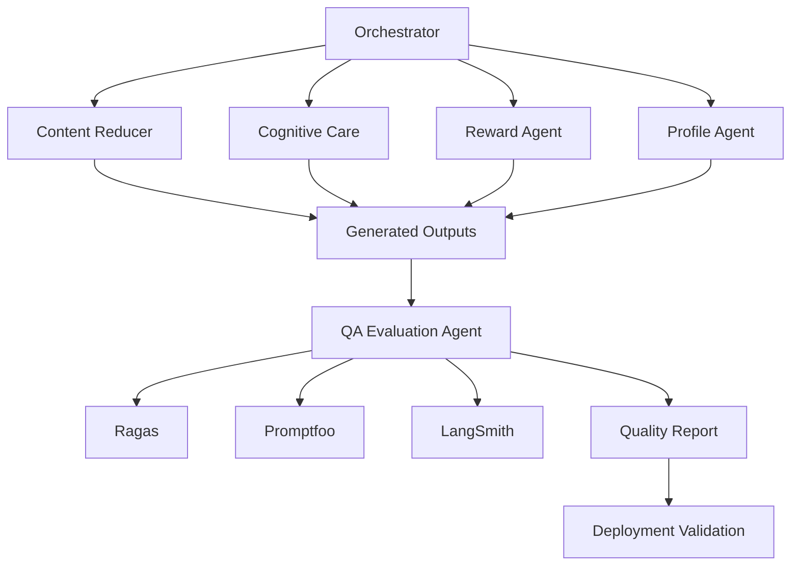
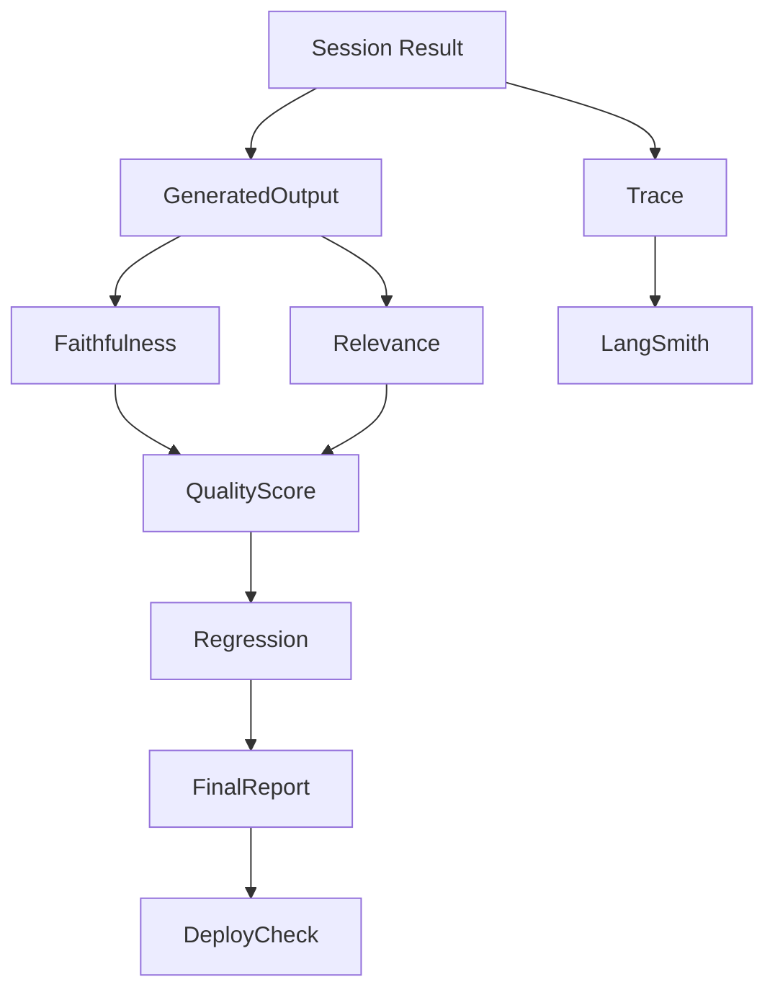

# 1. 시스템 개요 (System Overview)

## 프로젝트명

AI 리터러시 케어 에이전트

## 한 줄 정의

생성 결과의 품질과 시스템 동작을 지속적으로 검증하여 안정적인 문해력 성장 서비스를 보장하는 QA 및 Evaluation 시스템.

> **범위 확장 (2026-07)**: 계획 외 추가 기능인 **크롬 확장(웹페이지 + pdf.js 뷰어)**이 붙으면서
> 5번이 검증해야 할 **표면(surface)이 늘어났다.** 새 입력원(웹 본문·PDF 추출 `content[]`),
> 새 전송방식(REST 이벤트 구동, ADR-001), 새 UI 경로(오버레이 넛지·퀴즈 모달·단어 툴팁)가
> QA 대상에 포함된다. 상세는 본 문서 **§8~§11**에 기술한다.
> 정본: [`docs/EXTENSION_DESIGN.md`](./docs/EXTENSION_DESIGN.md),
> [`docs/EXTENSION_INTEGRATION_FIXES.md`](./docs/EXTENSION_INTEGRATION_FIXES.md).
>
> **⚠️ 의존성 주의(5번의 본질)**: 5번은 **다른 역할(1·2·3·4)과 다른 모델(LLM/에이전트)이
> 만든 산출물을 검증**한다. 따라서 그 산출물이 **아직 완성되지 않았을 수 있다.** 이를 전제로,
> 평가 하네스는 **스텁/목업으로 먼저 독립 구동**하고 실제 모듈이 도착할 때마다 교체·재검증하는
> 구조로 설계한다(§9). 이 원칙이 5번 아키텍처의 핵심 제약이다.

## 서비스 목적

사용자가 글을 읽는 과정에서 생성되는 결과들이

* 원문에 충실한지(Faithfulness)
* 문맥과 관련 있는지(Relevance)
* 코드 수정 후 성능이 저하되지 않았는지(Regression)
* 시스템이 안정적으로 동작하는지(Integration)
* 시연 환경이 재현 가능한지(Deployment)

를 지속적으로 검증한다.

---

## 5번 역할의 핵심 목표

5번 역할은 아래 질문에 답할 수 있는 품질 검증 시스템을 만든다.

* 생성 결과가 원문에 충실한가?
* 퀴즈가 글 내용과 관련 있는가?
* 코드 수정 후 기존 성능이 유지되는가?
* 에이전트 호출 흐름을 추적할 수 있는가?
* 시스템 전체가 정상적으로 동작하는가?
* 시연 환경이 항상 재현 가능한가?
* 배포 전에 오류를 발견할 수 있는가?

---

# 2. 기술 스택 및 선정 이유

| Layer             | Tech           | 선정 이유                      | 5번 역할의 책임 |
| ----------------- | -------------- | -------------------------- | --------- |
| Unit Test         | pytest         | 함수 단위 검증                   | 직접 구현     |
| Integration Test  | pytest         | 전체 흐름 검증                   | 직접 구현     |
| Prompt Evaluation | Ragas          | Faithfulness, Relevance 평가 | 직접 구현     |
| Regression Test   | Promptfoo      | 성능 저하 감지                   | 직접 구현     |
| Trace             | LangSmith      | 에이전트 호출 추적                 | 직접 구현     |
| Logging           | JSON Trace     | 디버깅                        | 직접 구현     |
| Deployment        | Docker         | 시연 환경 재현                   | 직접 구현     |
| CI                | GitHub Actions | 자동 테스트                     | 선택        |

---

# 3. 시스템 아키텍처 다이어그램

## 전체 구조



## 5번 역할 중심 구조



---

# 4. 디렉토리 구조

```text
ai-literacy-care-agent/

ARCHITECTURE.md
DELIVERY_PLAN.md

backend/

  evaluation/

    __init__.py

    ragas_eval.py
    promptfoo_eval.py
    langsmith_trace.py

    quality_report.py
    regression.py
    metrics.py

  tests/

    unit/

      test_score.py
      test_router.py
      test_profile.py

    integration/

      test_e2e.py
      test_full_pipeline.py

    smoke/

      test_demo_flow.py

golden_dataset/

docs/

reports/
```

---

# 5. 핵심 데이터 흐름

```text
Generated Output

↓

Ragas Evaluation

↓

Promptfoo Regression

↓

Integration Test

↓

Quality Report

↓

Deployment Validation

↓

Demo Ready
```

---

# 6. 최종 산출물

* Golden Dataset
* Unit Test Suite
* Integration Test Suite
* Smoke Test
* Ragas Evaluation Pipeline
* Promptfoo Regression Pipeline
* LangSmith Trace System
* Quality Report
* Deployment Checklist

---

# 7. 결론


```text
1. Golden Dataset
2. Test Suite
3. Ragas Evaluation Pipeline
4. Promptfoo Regression Pipeline
5. LangSmith Trace System
6. Quality Report
7. Deployment Validation
```

---

# 8. 확장(크롬) QA 표면 — 추가 검증 대상

> 확장이 붙으며 **코어(이벤트→개입→점수)는 그대로**지만, 그 코어에 도달하는 **입력원·전송·UI가
> 늘었다.** 5번은 이 늘어난 경로가 기존 품질 기준을 깨지 않는지 검증한다. EXTENSION_DESIGN §9~§13.

## 8-1. 새 입력원 — 웹/PDF `content[]` 인입 검증

| 검증 항목 | 내용 | 기준 |
|---|---|---|
| 세션 시작 계약 | `POST /api/session/start`가 `content[]`(camelCase)를 수용, 응답 필드(`sessionId`/`simplifiedText`/`terms`/`difficultyScore`) | 스키마 정합, 빈/비문자 content → 422 |
| 웹=PDF 정규화 동등성 | Readability(웹)와 pdf.js(PDF)가 **동일한 `content[]` 형태**로 정규화되는지 | 같은 원문 → 같은 chunks/terms 산출 |
| PDF 텍스트 추출 품질 | pdf.js `getTextContent()` → 문단 재구성(줄 병합·하이픈 `-\n`·머리말/꼬리말 제거) 정확도 | 골든 PDF 대비 문단 복원율 |
| 익명 userId 수용 | `userId` 미제공 시 `anonymous` 폴백(ADR-002) | 세션 정상 발급 |

## 8-2. 새 전송방식 — REST 이벤트 구동(ADR-001)

- 기존 가정(WebSocket)이 **REST 이벤트 구동**으로 대체됨. 5번 스모크는 WS가 아니라
  `POST /api/session/{id}/events` → **응답에 실린 개입 명령**을 검증한다.
- idle 넛지: `pause` 이벤트 전송 → 서버 넛지 응답 왕복 검증.
- 이벤트 스키마 정규화 `{ type, timestamp_ms, position(0~1), duration_ms }` 정합.

## 8-3. 새 UI 경로 — 오버레이/뷰어 (E2E·수동)

| 경로 | 검증 |
|---|---|
| 넛지 toast / 집중도 badge | Shadow DOM 렌더, 페이지 CSS와 충돌 없음 |
| 퀴즈 모달 | Hard 개입 시 모달 등장·선택·채점 전송 |
| 단어 뜻 툴팁 | hover→단어 추출→풀이(무료 경로) 표시 |
| PDF 뷰어 | 링크 가로채기(declarativeNetRequest)·파일 피커·스크롤/진행률 |
| CORS | 임의 사이트 + `chrome-extension://` 오리진 fetch 허용 |

## 8-4. 실제 퀴즈 평가 모듈 — 3번이 소비 (핵심 인계물)

- 현재 `qa_eval_client.run_qa_eval_agent`는 **no-op 스텁**이고, 3번 `/result`는 **목업 퀴즈
  점수(85점)**를 쓴다(3_DELIVERY_PLAN M3).
- **5번의 핵심 산출물**: 이 목업을 대체할 **실제 퀴즈 채점/이해도 평가 모듈**. Faithfulness/
  Relevance 기반 문항 품질 + 사용자 응답 채점 → `comprehension_score`로 3번에 반환.
- 인계 계약: `state`(quiz·응답) → `state.comprehension_score` 갱신. 스텁↔real 토글로 안전망 유지.

---

# 9. 의존성·완성도 전략 (다른 모델이 미완일 때)

> **문제**: 5번은 남의 산출물을 검증하는데, 그 산출물(1·2·3·4번, 그리고 실제 LLM/에이전트)이
> **7/10까지 완성 안 될 수도** 있다. QA가 남의 일정에 인질이 되면 안 된다.

## 9-1. 3-레이어 분리로 인질화 방지

```text
[Layer A] 5번 자체 자산 — 남의 완성도와 무관
   Golden Dataset · pytest 구조 · Ragas/Promptfoo 하네스 · Quality Report 포맷
        │  (지금 바로 구축 가능)
        ▼
[Layer B] 스텁/목업 대상 검증 — 지금 존재하는 것으로 구동
   backend/app/agents/stubs/* + config.py 토글 → 코어 흐름·계약·회귀를 스텁으로 먼저 green
        │  (실제 모듈 도착 시 교체)
        ▼
[Layer C] 실제 모듈 통합 검증 — 도착하는 대로 슬롯인
   real/cognitive_care_service · 2번 실제 요약 · 5번 실제 퀴즈 · 확장 실왕복
```

- **Layer A·B는 다른 모델 완성과 무관하게 7/10까지 완성**한다(5번 단독 진행 가능).
- **Layer C는 "도착하면 교체"** — 각 모듈이 stub→real로 바뀔 때 동일 골든셋으로 재검증.

## 9-2. 미완 모듈에 대한 컨틴전시(fallback) 규칙

| 상황 | 대응 |
|---|---|
| 2번 실제 요약 미도착 | 스텁 content_reducer로 파이프라인 green 유지 + "실 모듈 미검증" 리포트에 명시 |
| 5번 실제 퀴즈 미완 | no-op/목업(85) 경로로 데모 안전망 + 실 채점은 도착 시 교체 |
| 실제 LLM 호출 불가(비용/키) | Ragas judge를 무료/오프라인 경로로(§10). 정성 평가는 골든 기대값 대비 휴리스틱 |
| 확장 UI(4번) 미완 | 백엔드 계약 레벨(REST 왕복)만 자동 검증, UI는 수동 체크리스트로 분리 |

- **원칙**: 미검증 항목은 **숨기지 않고 Quality Report에 "unverified"로 노출**한다(정직 원칙).

## 9-3. 기존 89개 테스트 활용

- `backend/app/tests/`의 89개 테스트(1·3번 작성)는 5번의 **회귀 안전망 기반**으로 채택·확장한다.
  중복 재작성하지 않고, 확장 표면(§8)에 대한 테스트만 5번이 **추가**한다(`test_extension_session.py` 확장 등).

---

# 10. 비용 0 평가 전략 (라이선스·과금)

> EXTENSION_DESIGN §11 "비용 0 원칙"과 정합. **평가 때문에 새 과금을 만들지 않는다.**

| 도구 | 기본 동작 | 비용 0 대응 |
|---|---|---|
| **Ragas** | LLM judge(기본 OpenAI) 필요 → 유료 | 데모는 **골든 기대값 대비 오프라인 휴리스틱**(키워드/포함율)으로 대체하거나, 무료/로컬 judge로 한정 실행 |
| **Promptfoo** | 로컬 실행 가능 | 프롬프트 v1↔v2 회귀는 스텁 응답 대비로 무료 구동 |
| **LangSmith** | 클라우드 추적(무료 티어 있음) | 무료 티어 한정 or 로컬 **JSON Trace**로 대체(아키텍처 §2에 이미 명시) |

- **결론**: 심사/데모 경로는 **무료·오프라인으로 돌아가는 평가**를 기본값으로 한다. 유료 judge는
  선택(키 있으면)이며, 없으면 휴리스틱·골든 대비로 자동 폴백한다.

---

# 11. 확장 포함 최종 디렉토리(목표)

```text
ai-literacy-care-agent/

  backend/
    evaluation/                 (신규 — 아직 미생성)
      ragas_eval.py             faithfulness/relevance (무료 폴백 포함)
      promptfoo_eval.py         회귀
      langsmith_trace.py        추적(무료 티어/JSON 폴백)
      quality_report.py         unverified 항목 노출 포함
      regression.py · metrics.py
      quiz_eval.py              ★ 실제 퀴즈 채점 → 3번 comprehension_score 인계(§8-4)

    app/tests/                  (기존 89개 — 회귀 기반으로 채택)
      test_extension_session.py 확장 인입 계약 (5번이 §8-1로 확장)
      test_pdf_extraction.py    ★ pdf.js 문단 재구성 품질(신규)
      test_rest_event_flow.py   ★ REST 이벤트 구동 스모크(신규)

  golden_dataset/               (신규 — 웹/PDF 입력 골든 포함)
  reports/                      (신규 — Quality Report 산출물)
```
