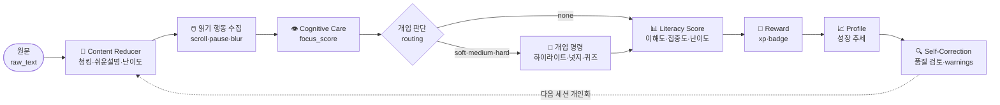

<div align="center">

# 🧠 AI 리터러시 케어 에이전트 — Agent Core & Orchestration

**읽기 행동과 이해도를 측정·개입·추적하는 폐루프 멀티 에이전트 시스템**

2026 AI·SW중심대학 디지털 경진대회 · SW부문 · 팀 **AllDayHappyDay**
**1번 역할 — 에이전트 코어 / 오케스트레이션 기술리드 (이소희)**


</div>

---

> ### 💡 한 줄 정의
> **GPT는 텍스트를 처리하고, 우리는 사람의 성장을 관리한다.**
>
> 일반 AI 도구는 글을 요약·설명할 뿐, 사용자가 *실제로 읽었는지 · 이해했는지 ·
> 시간이 지나며 나아지는지*는 추적하지 않는다. 이 시스템은
> **측정 → 개입 → 점수화 → 추적 → 개인화** 를 반복하는 성장 관리 엔진이다.

---

## 🔄 핵심 폐루프 (Closed Loop)



이 흐름 전체가 **1번 역할의 책임**이다. 팀원의 서브 에이전트(2~5번)는 이 폐루프에
*끼워 넣는* 방식으로 연결된다.

---

## ✨ 무엇이 다른가

| | 일반 요약 도구 | **이 시스템** |
|---|---|---|
| 텍스트 처리 | ✅ | ✅ |
| 읽기 **행동** 측정 | ❌ | ✅ focus/engagement |
| 집중 저하 시 **실시간 개입** | ❌ | ✅ 하이라이트·넛지·퀴즈 |
| **재현 가능한** 이해도 점수 | ❌ | ✅ 코드 기반 Literacy Score |
| **성장 추세** 추적·개인화 | ❌ | ✅ profile trend |
| 결과 **자가 검증** | ❌ | ✅ self-correction warnings |

---

## 🧩 코어 설계 하이라이트

- **📐 Shared State 단일 소스** — 모든 에이전트가 `ReadingSessionState` 하나를 읽고 쓴다. 팀원은 이 스키마만 보고 병렬 개발.
- **🧮 재현 가능한 Score Engine** — LLM이 아닌 순수 함수로 점수 계산. 같은 입력 → 항상 같은 출력 + `score_breakdown`으로 근거 설명.
- **🔌 Stub ↔ Real 토글** — 실제 팀원 모듈을 환경변수로 교체. real 미준비 시 stub으로 안전 폴백 → **데모는 절대 안 끊긴다.**
- **📋 런타임 계약 검증** — 실제 모듈 출력이 계약(필수 필드·점수 범위)을 어기면 즉시 `ContractError`.
- **🛟 단계별 Fallback** — 어떤 에이전트가 실패해도 중립값으로 흐름 유지 + `trace`에 기록.
- **🔍 Self-Correction** — 빈 출력·비정상 점수·fallback 발생을 감지해 `warnings`로 남김 (발표용 "검증 가능한 시스템" 근거).

---

## 📊 Literacy Score

```text
literacy_score =
    comprehension_score × 0.50      # 퀴즈 정답률
  + engagement_score    × 0.35      # 집중도(focus)
  + difficulty_score    × 0.15      # 글 난이도 보정
  − cross_validation_penalty        # 비정상 읽기 감점 (탭이탈·속독 등, 최대 20)
```
→ `0~100` clamp, NaN 방어, 근거는 `score_breakdown`. 자세히는 [`docs/SCORE_FORMULA.md`](docs/SCORE_FORMULA.md).

---

## 🚀 빠른 시작

```bash
# 이 폴더 안에서 실행
pip install -r requirements.txt

# 단위 테스트 (73 passing)
python -m pytest

# M1 데모 흐름만 빠르게
python -m pytest backend/app/tests/test_m1_demo_smoke.py

# API 서버
uvicorn backend.app.main:app --reload
```

**API 엔드포인트**
`POST /api/reading-sessions/start` · `/{id}/events` · `/{id}/quiz` · `/{id}/finish` · `GET /{id}/result`

---

## 🗂️ 폴더 구조

```
.
├─ ARCHITECTURE.md              # 아키텍처 (무엇을/어떤 구조로)
├─ DELIVERY_PLAN.md             # 구현 순서·완료 기준 (언제/어디까지)
├─ requirements.txt
├─ backend/app/
│  ├─ main.py                   # FastAPI 진입점
│  ├─ api/reading_session.py    # 프론트 ↔ 오케스트레이터 API
│  ├─ orchestrator/             # ★ 코어
│  │  ├─ state.py               #   Shared State 스키마 (SSOT)
│  │  ├─ graph.py               #   에이전트 실행 흐름
│  │  ├─ routing.py             #   집중도 기반 개입
│  │  ├─ score.py               #   Literacy Score (순수 함수)
│  │  ├─ quiz.py                #   퀴즈 정규화
│  │  ├─ self_correction.py     #   결과 품질 검토
│  │  ├─ contracts.py           #   계약 검증
│  │  └─ errors.py              #   실패 fallback
│  ├─ agents/
│  │  ├─ *_client.py            #   stub/real 토글 어댑터
│  │  ├─ config.py              #   전환 로직
│  │  └─ stubs/                 #   더미 에이전트
│  ├─ demo/m1_scenario.py       # 결정론적 M1 데모
│  └─ tests/                    # 73 tests
└─ docs/
   ├─ API_CONTRACT.md           # ★ 팀원용 입출력 JSON 계약
   ├─ SHARED_STATE.md           # 필드별 소유권 표
   ├─ SCORE_FORMULA.md          # 점수식
   ├─ INTEGRATION_CHECKLIST.md  # stub→real 교체 가이드
   ├─ TIMESERIES_DESIGN.md      # 성장 추세 설계
   └─ DEMO_SCENARIO.md          # 데모 시나리오
```

---

## 👥 팀원이 먼저 볼 곳

| 역할 | 시작 지점 |
|---|---|
| **2번** 콘텐츠/RAG | [`docs/API_CONTRACT.md`](docs/API_CONTRACT.md) §1 · `state.py` chunks/terms |
| **3번** 백엔드/실시간 | [`docs/API_CONTRACT.md`](docs/API_CONTRACT.md) §2·§7 · `state.py` reading_events |
| **4번** 프론트 | [`docs/API_CONTRACT.md`](docs/API_CONTRACT.md) §6 (최종 응답·intervention) |
| **5번** QA | [`docs/API_CONTRACT.md`](docs/API_CONTRACT.md) §5 · `state.py` trace/warnings |

> 실제 모듈 연결은 [`docs/INTEGRATION_CHECKLIST.md`](docs/INTEGRATION_CHECKLIST.md) 참고.

---

## ✅ 진행 상태

**M0 — 코어 베이스** · **M1 — 핵심 폐루프 데모**
- [x] 폴더·패키지 골격 / `ReadingSessionState` 스키마
- [x] stub 에이전트 + orchestrator E2E
- [x] 집중도 기반 개입 라우팅 · quiz 반영 · Literacy Score v1
- [x] M1 데모 데이터 + smoke test 고정
- [x] 단계별 fallback · trace
- [x] Self-Correction (품질 warnings)
- [x] Stub↔Real 토글 + 런타임 계약 검증 (M2 통합 준비)
- [x] 단위 테스트 **73 passing**

**다음** · M2 실제 팀원 모듈 통합 · 성장 추세 시계열 구현

---

<div align="center">
<sub>측정 → 개입 → 점수 → 추적 → 개인화 · 끊기지 않는 폐루프</sub>
</div>
