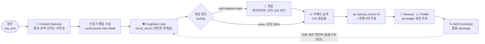

<div align="center">

# 🧠 AI 리터러시 케어 에이전트 — Agent Core & Orchestration

**읽기 행동과 이해도를 측정·개입·추적·개인화하는 폐루프 오케스트레이션 코어**

2026 AI·SW중심대학 디지털 경진대회 · SW부문 · 팀 **AllDayHappyDay**
**① 역할 — 에이전트 코어 / 오케스트레이션 기술리드 (이소희)**


</div>

---

> ### 💡 한 줄 정의
> **GPT는 텍스트를 처리하고, 우리는 사람의 성장을 관리한다.**
>
> 일반 AI 도구는 글을 요약·설명할 뿐, 사용자가 *실제로 읽었는지 · 이해했는지 · 시간이 지나며 나아지는지*는 추적하지 않는다.
> 이 코어는 **측정 → 개입 → 실측 → 점수화 → 추적 → 개인화** 를 하나의 닫힌 고리로 돌리는 성장 관리 엔진이다.

---

## 🔄 핵심 폐루프 (Closed Loop)



이 흐름 전체가 **①번의 책임**이다. 팀원의 서브 에이전트(②③④⑤)는 이 폐루프에 *끼워 넣는* 방식으로 연결된다.

---

## ✨ 무엇이 다른가

| | 일반 요약 도구 | **이 시스템** |
|---|---|---|
| 텍스트 처리 | ✅ | ✅ |
| 읽기 **행동** 측정 | ❌ | ✅ focus / engagement (이벤트 기반) |
| 집중 저하 시 **실시간 개입** | ❌ | ✅ 하이라이트·넛지·O/X 퀴즈 |
| 이해도 **실측** | ❌ | ✅ O/X 정답률 (집중 잘해도 측정 보장) |
| **재현 가능한** 점수 | ❌ | ✅ 순수 함수 Literacy Score v2 + 근거 |
| **개인화** | ❌ | ✅ 난이도별 개인 읽기 속도 학습 (rolling) |
| 결과 **자가 검증** | ❌ | ✅ self-correction · QA faithfulness |

---

## 🧩 코어 설계 하이라이트

- **📐 Shared State 단일 소스** — 모든 에이전트가 `ReadingSessionState` 하나를 읽고 쓴다. 팀원은 이 스키마만 보고 병렬 개발.
- **🧮 재현 가능한 Score Engine** — LLM이 아닌 순수 함수. 같은 입력 → 항상 같은 출력 + `score_breakdown` 근거.
- **🔌 Stub ↔ Real 토글** — 실제 팀원 모듈을 환경변수로 교체. real 미준비 시 stub 폴백 → **데모는 절대 안 끊긴다.**
- **📋 런타임 계약 검증** — 실제 모듈 출력이 계약(필수 필드·점수 범위)을 어기면 즉시 `ContractError`.
- **🛟 단계별 Fallback** — 어떤 에이전트가 실패해도 중립값으로 흐름 유지 + `trace` 기록.
- **🔍 Self-Correction** — 빈 출력·비정상 점수·fallback 발생을 감지해 `warnings`로 남김 ("검증 가능한 시스템").

---

## 🏆 Signature — 이 코어의 세 가지 자랑

### 1️⃣ 근거 있는 Literacy Score v2
정답률 하나로 뭉개지 않고, **"이해했는가 × 얼마나 어려운 글이었는가"** 까지 반영한다.
```text
Literacy = 이해도 × 0.45  +  집중도 × 0.30  +  도전성취 × 0.25  −  교차검증 감점
  도전성취 = 이해율 × 글난이도(0.6·난이도 + 0.4·비이독성)   ← ②번 난이도·이독성 결합
```
*쉬운 글 완독 < 어려운 글 이해.* 상수 difficulty 보정을 폐기하고 **이해도로 게이팅한 도전성취**로 승급.

### 2️⃣ O/X 이해도 폐루프
집중을 너무 잘해서 개입이 안 떠도, **본문 ~90% 지점에서 O/X 퀴즈로 측정 보장**(pick_quiz 트리거 A: 집중하락 / B: 측정보장). 서버 채점(정답 미노출) → `quiz_answers`로 이해도를 **실측**. 집중 잘하는 사람의 이해도가 상수로 박제되던 문제를 해결.

### 3️⃣ 난이도-인지 개인화 스크롤 임계값
온보딩에서 개인의 쉬운/어려운 지문 읽기 속도를 측정 → **난이도별 개인 읽기 속도 직선**을 세우고, 지금 글 난이도에 맞춰 스키밍 기준을 조정. 세션이 쌓일수록 EWMA로 **자동 보정(rolling)**.
> 같은 사람이라도 어려운 글(0.95)과 쉬운 글(1.20)의 기준이 달라진다. → [`docs/PERSONALIZED_FOCUS_CALIBRATION.md`](docs/PERSONALIZED_FOCUS_CALIBRATION.md)

---

## 🧬 문해 5대 지표 & 글 프로필

`score.py`가 세션마다 산출 (전부 실측 파생):

| 지표 | 파생 |
|---|---|
| **이해도** | O/X 퀴즈 정답률 |
| **집중 유지** | Focus Score |
| **정독 충실도** | 본문 기준 완독률(§4 dwell 게이트) |
| **난이도 도전력** | 이해도 × ②번 난이도 |
| **읽기 안정성** | 100 − 감점(②번 이독성 보정) |

+ **글 프로필** — 이 글의 `readability`/`difficulty` + 라벨. 4번 레이더·게이지에 그대로 전달.

---

## 🌐 크롬 확장 (웹 + PDF)

읽는 곳이 우리 앱이 아니어도 케어한다. `extension/`의 **shared 모듈**(tracker·overlay·session_client·reading_progress)을 웹과 PDF 뷰어가 공용으로 쓴다.
- **본문 기준 진행률(§4)** — 페이지 높이가 아니라 *본문 문단이 실제로 화면에 머문 비율*(IntersectionObserver + dwell 게이트)로 정독을 측정.
- **O/X 오버레이** — Shadow DOM 카드로 페이지 CSS와 격리, 웹·PDF 동일 렌더.

---

## 🚀 빠른 시작

```bash
pip install -r requirements.txt

python -m pytest                    # 단위·통합 테스트 (117 passing)
python -m pytest backend/app/tests/test_m1_demo_smoke.py   # 데모 흐름만

uvicorn backend.app.main:app --reload
#   chrome://extensions → 개발자 모드 → extension/ 로드 (웹·PDF 케어)
```

**API 엔드포인트** (프론트/확장 공용)
```
POST /api/reading-sessions/start · /{id}/events · /{id}/quiz/submit · /{id}/finish · GET /{id}/result
POST /api/session/start · /{id}/events · /{id}/quiz/submit · GET /{id}/result   # 확장 alias
```

---

## 🗂️ 폴더 구조

```
.
├─ ARCHITECTURE.md · DELIVERY_PLAN.md · requirements.txt
├─ backend/app/
│  ├─ main.py                     # FastAPI 진입점 (CORS·라우터)
│  ├─ api/
│  │  ├─ reading_session.py       #   프론트 ↔ 오케스트레이터 API
│  │  ├─ extension_session.py     #   크롬 확장 인입 alias
│  │  └─ frontend_contract.py     #   내부 state → 프론트 계약(intervention·result)
│  ├─ orchestrator/               # ★ 코어
│  │  ├─ state.py                 #   Shared State 스키마 (SSOT)
│  │  ├─ graph.py                 #   에이전트 실행 흐름(7단계)
│  │  ├─ routing.py               #   집중도 기반 개입 판정
│  │  ├─ score.py                 #   Literacy Score v2 · 5대 지표 · 글 프로필
│  │  ├─ quiz.py                  #   O/X prebuild·pick·submit 배선
│  │  ├─ self_correction.py       #   결과 품질 검토(warnings)
│  │  ├─ contracts.py · errors.py #   계약 검증 · 실패 fallback
│  ├─ agents/
│  │  ├─ *_client.py              #   stub/real 토글 어댑터
│  │  ├─ real/                    #   ②③ vendored 실모듈 + quiz_service
│  │  └─ stubs/ · config.py
│  └─ tests/                      # 117 tests
├─ extension/                     # ★ 크롬 확장 (웹 + PDF)
│  ├─ manifest.json · content/ · pdf/ · popup/ · background/
│  └─ shared/  tracker · overlay · session_client · reading_progress
└─ docs/
   ├─ API_CONTRACT.md · SHARED_STATE.md · SCORE_FORMULA.md
   ├─ PERSONALIZED_FOCUS_CALIBRATION.md      # 난이도-인지 개인화 설계
   ├─ FEEDBACK_TO_ROLE3_OX_QUIZ.md · ..._QUIZ_GROWTH_REVIEW.md
   ├─ FEEDBACK_TO_ROLE5_QA_REVIEW.md
   └─ HANDOVER_TO_ROLE3_DB_MIGRATION.md
```

---

## 👥 팀원이 먼저 볼 곳

| 역할 | 시작 지점 |
|---|---|
| **②** 콘텐츠/RAG | [`docs/API_CONTRACT.md`](docs/API_CONTRACT.md) · `state.py` chunks/terms/summary/난이도·이독성 |
| **③** 백엔드/실시간 | [`docs/API_CONTRACT.md`](docs/API_CONTRACT.md) · O/X: `FEEDBACK_TO_ROLE3_OX_QUIZ.md` · 개인화: `PERSONALIZED_FOCUS_CALIBRATION.md` |
| **④** 프론트 | `frontend_contract.py` (intervention·result·literacyDomains·textProfile) |
| **⑤** QA | `FEEDBACK_TO_ROLE5_QA_REVIEW.md` · `state.py` trace/warnings |

---

## ✅ 진행 상태

- [x] Shared State · orchestrator E2E · stub↔real 토글 · 계약 검증 · fallback · self-correction
- [x] **Literacy Score v2** (이해도·집중·도전성취, ②번 난이도·이독성 결합)
- [x] **문해 5대 지표** + 글 프로필(레이더/게이지)
- [x] **O/X 이해도 퀴즈 폐루프** (prebuild·pick(A/B)·서버채점·실측)
- [x] **크롬 확장(웹+PDF)** · 본문 기준 진행률(§4) · O/X 오버레이
- [x] **난이도-인지 개인화** 스크롤 임계값 + rolling 학습
- [x] QA faithfulness 통합 · 단위/통합 테스트 **117 passing**

---

<div align="center">
<sub>측정 → 개입 → 실측 → 점수 → 추적 → 개인화 · 끊기지 않는 폐루프</sub>
</div>
