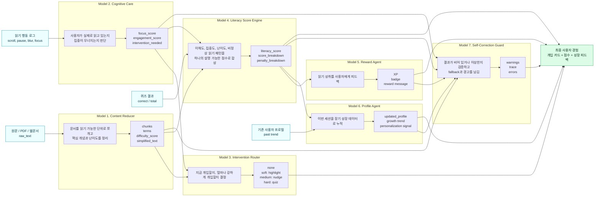
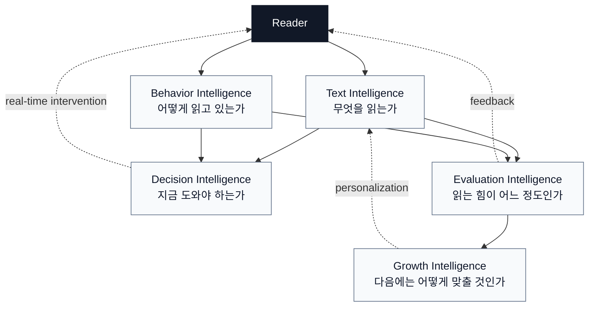
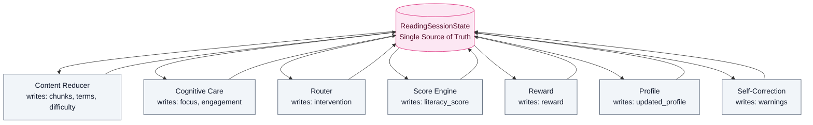
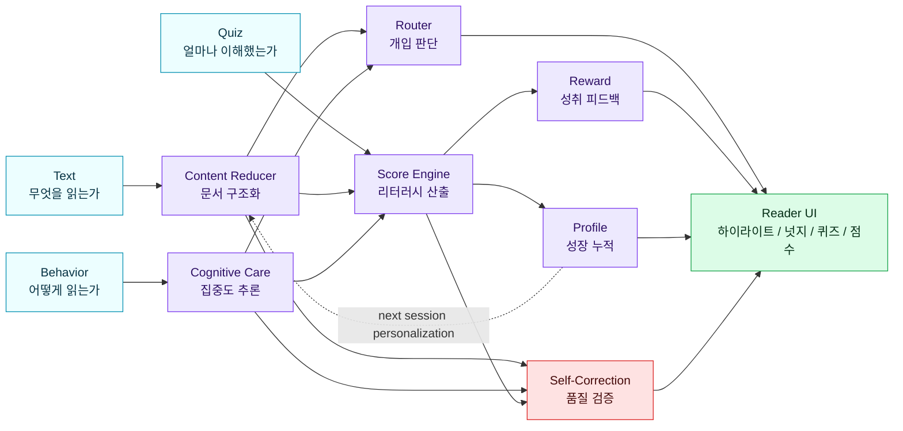

# AI Literacy Care Agent - Agent Role Architecture

> **하나의 글을 여러 지능이 나누어 읽고, 사용자의 읽는 힘을 다시 사용자에게 돌려주는 구조**

---

## 1. Agent Role Map

---

## 2. The Core Idea

**이 프로젝트는 단일 챗봇이 아니라, 문서 이해 모델·행동 분석 모델·개입 판단 모델·점수화 모델·성장 관리 모델이 하나의 읽기 세션 상태를 공유하는 멀티 에이전트 구조다.**

---

## 3. Agent Responsibility Table

| Agent | 한 줄 역할 | 입력 | 판단 | 출력 |
|---|---|---|---|---|
| Content Reducer | 글을 읽기 가능한 학습 단위로 바꾸는 문서 분석가 | `raw_text` | 핵심 문단, 어려운 용어, 문서 난이도 | `chunks`, `terms`, `difficulty_score`, `simplified_text` |
| Cognitive Care | 사용자의 읽기 상태를 감지하는 집중도 관찰자 | `reading_events` | 빠른 스크롤, 이탈, 멈춤, 체류 패턴 | `focus_score`, `engagement_score`, `intervention_needed` |
| Intervention Router | 개입 타이밍과 강도를 정하는 지휘자 | `focus_score`, `chunks` | 그냥 둘지, 하이라이트할지, 넛지할지, 퀴즈를 낼지 | `intervention` |
| Literacy Score Engine | 읽기 능력을 설명 가능한 점수로 계산하는 평가자 | `quiz_result`, `focus_score`, `difficulty_score`, `reading_events` | 이해도 50%, 집중도 35%, 난이도 15%, 이상 행동 패널티 | `literacy_score`, `score_breakdown` |
| Reward Agent | 읽기 성취를 동기부여로 바꾸는 피드백 담당 | `literacy_score`, session result | 보상 수준, 배지, XP | `reward` |
| Profile Agent | 세션 결과를 장기 성장으로 누적하는 개인화 담당 | `profile`, `literacy_score`, `score_breakdown` | 성장 추세, 취약 지점, 다음 세션 힌트 | `updated_profile` |
| Self-Correction Guard | 시스템 결과를 검증하는 안전장치 | final state, `trace`, `errors` | 빈 출력, 점수 범위 오류, fallback 발생, 퀴즈 누락 | `warnings`, `trace`, `errors` |

---

## 4. Shared State as the Agent Bus

모든 에이전트는 독립된 결과물을 따로 흩뿌리지 않고, 하나의 `ReadingSessionState`를 읽고 갱신한다. 그래서 최종 결과는 단순 응답이 아니라 **왜 그런 개입이 나왔는지, 어떤 점수 근거가 있는지, 어디서 fallback이 났는지까지 설명 가능한 세션 기록**이 된다.

---

## 5. Role-Centric Pipeline

---

## 6. Current Implementation Status

| Role | Current Status | Main File |
|---|---|---|
| Content Reducer | stub/real toggle, Gemini bridge path prepared | `backend/app/agents/content_reducer_client.py` |
| Cognitive Care | real scoring service connected through adapter | `backend/app/agents/cognitive_care_client.py` |
| Intervention Router | deterministic orchestrator logic implemented | `backend/app/orchestrator/routing.py` |
| Literacy Score Engine | deterministic scoring formula implemented | `backend/app/orchestrator/score.py` |
| Reward Agent | stub adapter prepared | `backend/app/agents/reward_client.py` |
| Profile Agent | stub adapter prepared | `backend/app/agents/literacy_profile_client.py` |
| QA / Evaluation | no-op adapter exists; self-correction guard implemented in orchestrator | `backend/app/agents/qa_eval_client.py`, `backend/app/orchestrator/self_correction.py` |

---

## 7. Presentation Sentence

**이 아키텍처의 핵심은 “글을 요약하는 AI”가 아니라, 문서 분석·읽기 행동 감지·실시간 개입·이해도 평가·성장 추적을 각 전문 에이전트가 나누어 수행하는 읽기 능력 관리 시스템이라는 점이다.**
