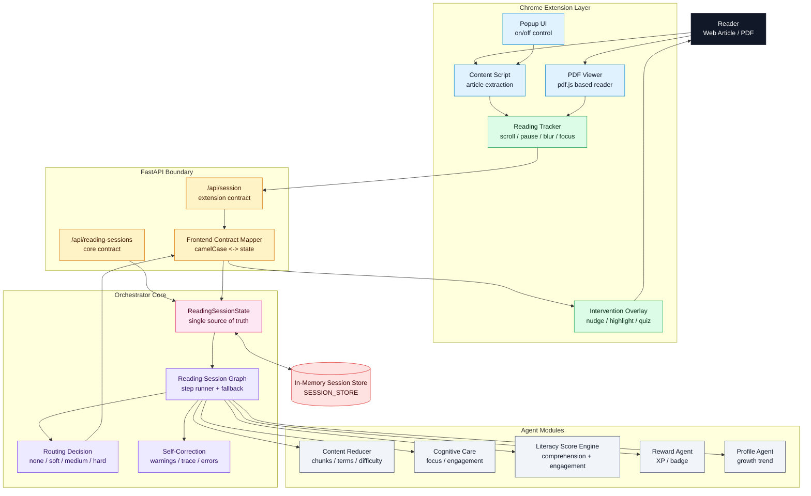
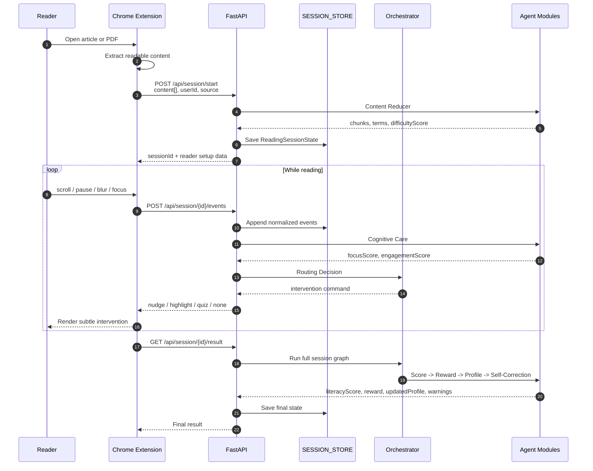
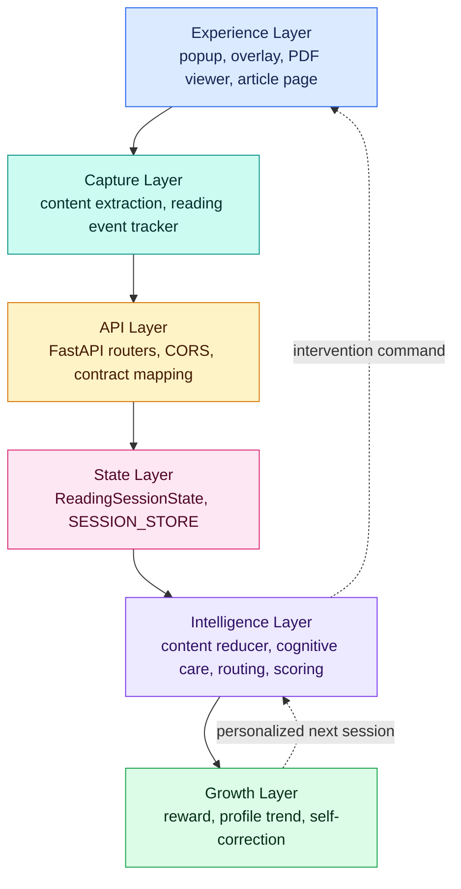
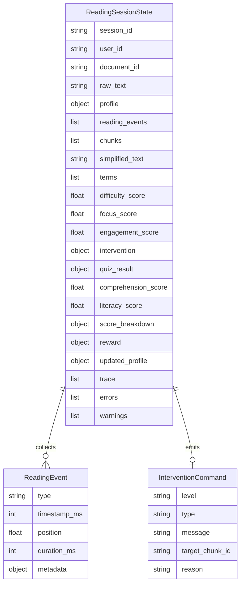

# AI Literacy Care Agent Architecture

> **AI가 글을 대신 읽어주는 시대, 사람의 읽는 힘을 측정하고 회복시키는 Closed-Loop Care System**

---

## 1. System Big Picture

---

## 2. Runtime Flow

---

## 3. Orchestrator Pipeline

```mermaid
flowchart LR
    Raw["raw_text<br/>profile<br/>reading_events"]:::input
    Reducer["1. Content Reducer<br/>chunking, terms, difficulty"]:::step
    Cognitive["2. Cognitive Care<br/>focus, engagement"]:::step
    Route["3. Routing Decision<br/>intervention level"]:::step
    Score["4. Score Engine<br/>literacy score"]:::step
    Reward["5. Reward<br/>XP, badge"]:::step
    Profile["6. Profile Update<br/>growth trend"]:::step
    Review["7. Self-Correction<br/>warnings, trace"]:::step
    Result["final result<br/>score, profile, trace"]:::output

    Raw --> Reducer --> Cognitive --> Route --> Score --> Reward --> Profile --> Review --> Result

    classDef input fill:#ecfeff,color:#083344,stroke:#0891b2;
    classDef step fill:#f8fafc,color:#0f172a,stroke:#64748b;
    classDef output fill:#dcfce7,color:#052e16,stroke:#16a34a;
```

The pipeline is intentionally state-first. Every module reads and writes the same `ReadingSessionState`, so the system can explain what happened through `trace`, recover with fallback values through `errors`, and surface quality issues through `warnings`.

---

## 4. Layered Architecture

---

## 5. Key Modules

| Area | Path | Responsibility |
|---|---|---|
| App entry | `backend/app/main.py` | FastAPI app, CORS, router mounting, `.env` loading |
| Extension API | `backend/app/api/extension_session.py` | Browser extension contract, camelCase payloads, intervention/result mapping |
| Core API | `backend/app/api/reading_session.py` | Internal reading session lifecycle: start, events, quiz, finish, result |
| State model | `backend/app/orchestrator/state.py` | Shared typed state used by all agents |
| Flow runner | `backend/app/orchestrator/graph.py` | Ordered agent execution, fallback handling, trace logging |
| Routing | `backend/app/orchestrator/routing.py` | Decides whether and how strongly to intervene |
| Score | `backend/app/orchestrator/score.py` | Calculates reproducible literacy score and score breakdown |
| Extension shell | `extension/manifest.json` | Chrome MV3 extension permissions, popup, content scripts |
| Shared extension logic | `extension/shared/` | Tracker, overlay, session client reused by article/PDF flows |
| PDF reader | `extension/pdf/` | Local PDF viewer powered by bundled pdf.js |

---

## 6. Data Contract Snapshot

---

## 7. One-Line Architecture Summary

**브라우저에서 읽기 행동을 수집하고, FastAPI 오케스트레이터가 이해도와 집중도를 계산해 실시간 개입과 성장 추적까지 되돌려주는 폐루프 AI 리터러시 케어 구조.**
