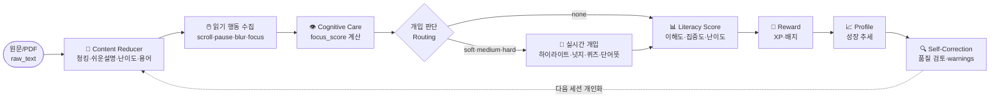
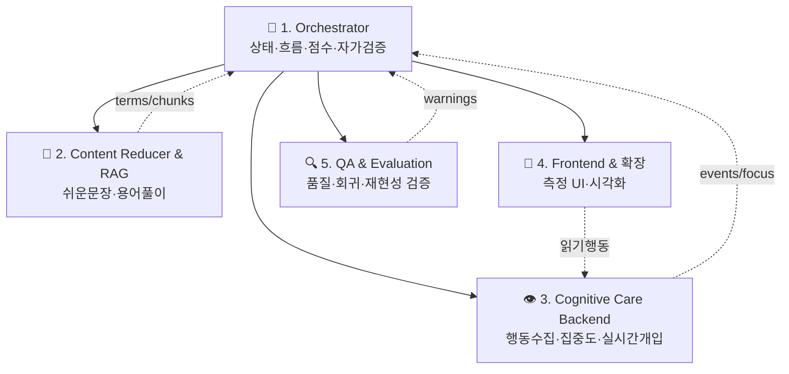
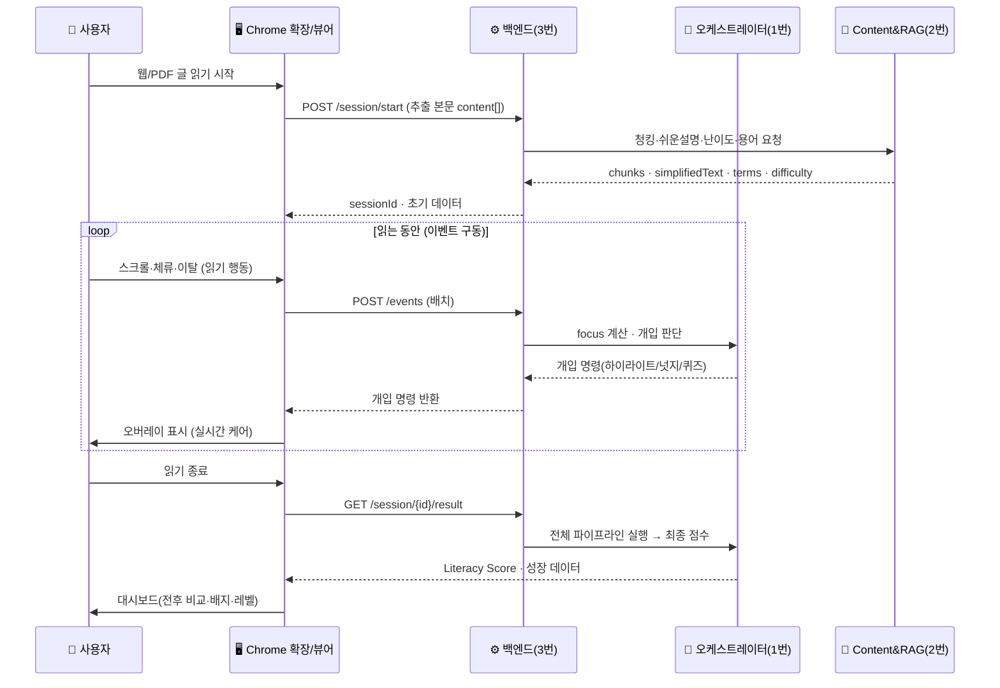
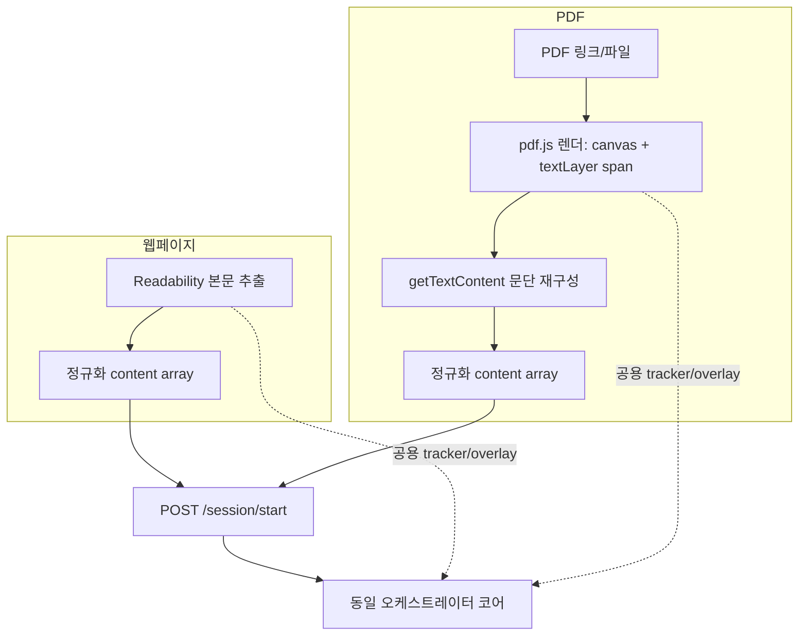
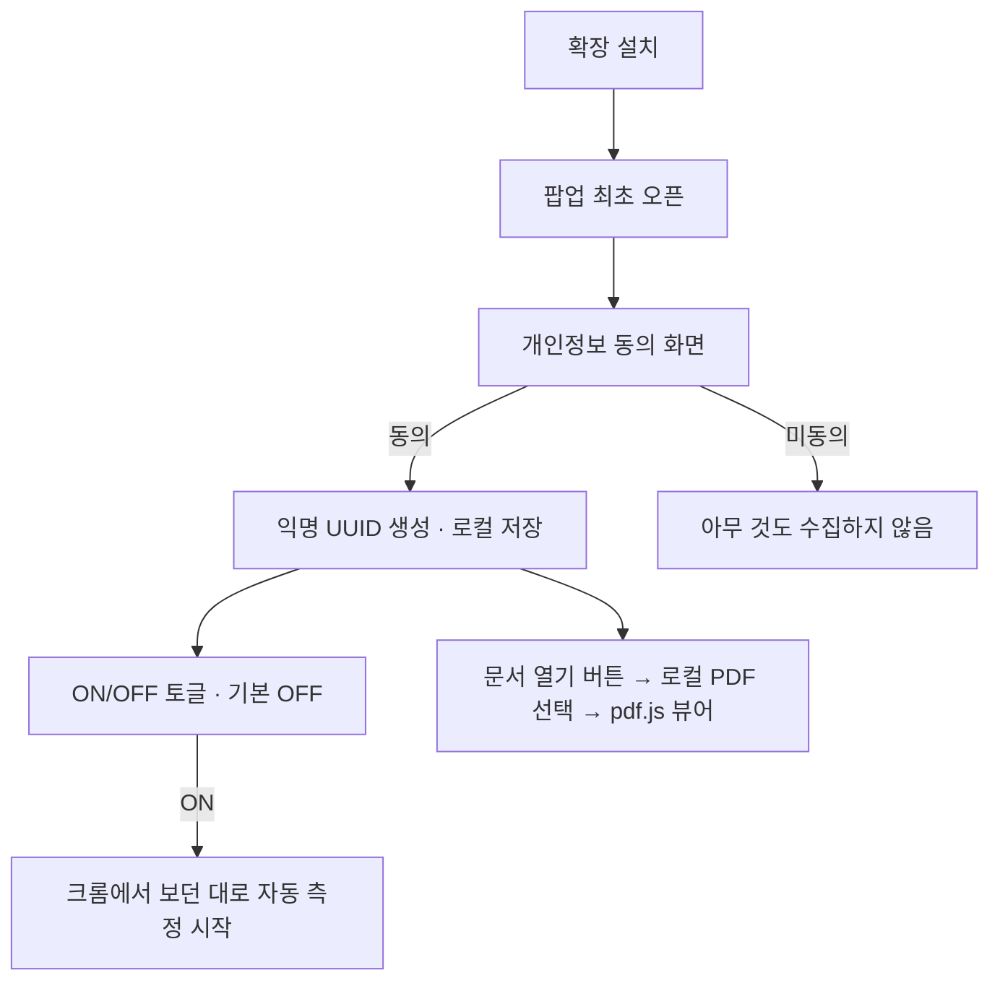

<div align="center">

# 🧠 AI 리터러시 케어 에이전트
### *AI Literacy Care Agent*

**읽기 행동과 이해도를 실시간으로 측정·개입·추적하는 폐루프(Closed-Loop) 멀티 에이전트 시스템**

2026 AI·SW중심대학 디지털 경진대회 · SW부문 · 팀 **AllDayHappyDay**

</div>

> ### 💡 한 줄 정의
> **"GPT는 텍스트를 처리하고, 우리는 사람의 성장을 관리한다."**
>
> 일반 AI 도구는 글을 *요약·설명*할 뿐이다. 사용자가 **실제로 읽었는지 · 이해했는지 ·
> 시간이 지나며 나아지는지**는 아무도 추적하지 않는다.
> 본 시스템은 **측정 → 개입 → 점수화 → 추적 → 개인화**를 끊김 없이 반복하는 *성장 관리 엔진*이다.

---

# 예선 산출물 – 아이디어 기획서

## 1. 주제 제안 배경

### 1-1. 해결하려는 문제 — "AI 시대에 오히려 무너지는 문해력"

생성형 AI가 일상이 되면서, 사람들이 **긴 글을 스스로 읽고 이해하는 능력(리터러시)**은 빠르게 약화되고 있다.
문제의 본질은 "정보가 없어서"가 아니라 **읽는 과정 자체가 관리되지 않아서**다.

| 관찰되는 현상 | 근본 원인 |
|---|---|
| 글을 **끝까지 읽지 않고** AI 요약만 소비 | 읽기 행동을 아무도 측정·피드백하지 않음 |
| 어려운 문단에서 **집중이 끊겨도** 방치 | 실시간으로 개입해 주는 도구가 없음 |
| "읽었다"와 "이해했다"를 **혼동** | 이해도를 객관적으로 확인할 장치가 없음 |
| AI 설명을 그대로 믿음 (**환각 위험**) | 출처 없는 생성 결과를 검증하지 않음 |
| 실력이 **느는지 줄는지** 본인도 모름 | 성장 추세를 누적·추적하지 않음 |

> **핵심 통찰**: 기존 AI 도구는 *"글"을 처리*하지만, 정작 필요한 것은 *"읽는 사람"을 돌보는 것*이다.
> 우리는 텍스트가 아니라 **읽기 행동과 인지 상태**를 다룬다.

### 1-2. 대상 사용자

- **1차 사용자**: 디지털 환경에서 학습·업무 문서를 읽는 **대학생·직장인** (논문·리포트·기술 문서·뉴스)
- **2차 사용자(확장)**: 문해력 발달기의 **청소년**, 재교육이 필요한 **성인 학습자**, 정보 취약 계층
- **사용 맥락**: 브라우저에서 웹 아티클이나 **PDF 논문**을 읽는 모든 순간 (별도 앱 실행·업로드 불필요)

### 1-3. 왜 "AI Agent 기반 SW"여야 하는가

이 문제는 단일 기능(요약 버튼 하나)으로 풀리지 않는다. **여러 판단이 실시간으로 협업**해야 한다.

| 필요한 판단 | 담당 에이전트 | 왜 Agent인가 |
|---|---|---|
| 지금 이 문단이 **얼마나 어려운가** | Content Reducer | 문서 난이도·구조를 맥락적으로 분석 |
| 사용자가 **집중하고 있는가** | Cognitive Care | 스크롤·체류·이탈 행동을 지속 해석 |
| **개입할까, 말까 / 어떻게** | Orchestrator(Routing) | 상태에 따라 자율적으로 개입 수준 결정 |
| 이 설명이 **사실인가(환각 아닌가)** | RAG + QA | 신뢰 출처 검색·품질 자가검증 |
| 이 사람은 **성장하고 있는가** | Profile | 세션을 넘어 추세를 누적·개인화 |

→ **입력(읽기 행동) → 맥락 이해(집중·난이도) → 자율적 추론(개입 판단) → 실행(넛지·퀴즈)** 이라는
정확히 **AI Agent의 정의에 부합하는 자율 협업 구조**가 요구된다. 단순 규칙 기반 스크립트로는
"언제·어떻게·무엇을" 개입할지의 맥락적 판단을 감당할 수 없다.

---

## 2. AI Agent 기능 및 구조 기획

### 2-1. 시스템 철학 — 하나의 끊기지 않는 폐루프



> 이 루프는 **한 방향으로 흐르고 다시 자기 자신에게 돌아온다.** 각 세션의 결과가 다음 세션의
> 난이도·개입 강도를 조정한다. "측정 없는 개입"도, "개입 없는 측정"도 아닌 **완결된 관리 사이클**이다.

### 2-2. 멀티 에이전트 구조 (6개 역할)



| # | 에이전트 | 핵심 책임 | 입력 → 출력 |
|---|---|---|---|
| **1** | **Orchestrator** | 공유 상태(SSOT) 관리, 에이전트 실행 순서, **재현 가능한 점수 계산**, 자가검증 | 세션 상태 → 최종 Literacy Score·개입 명령 |
| **2** | **Content Reducer & RAG** | 가독성 분석·의미 청킹·**쉬운 문장 재구성**·**환각 없는 용어풀이** | 원문 → 청크·쉬운설명·난이도·용어 |
| **3** | **Cognitive Care Backend** | 읽기 행동 이벤트 수집·**집중도(focus) 계산**·실시간 개입 반환 | 행동 이벤트 → focus_score·개입 명령 |
| **4** | **Frontend & Chrome 확장** | 실제 읽기 측정 UI, 넛지·퀴즈·단어뜻 오버레이, **성장 대시보드 시각화** | 상태 → 화면·차트 |
| **5** | **QA & Evaluation** | Faithfulness·회귀·통합·재현성 검증, 품질 리포트 | 산출물 → 품질 지표·경고 |

### 2-3. 입력·데이터·맥락 이해·개입 흐름

**① 사용자 입력 (측정)** — 별도 조작 없이 "읽기만 하면" 수집된다.
- 스크롤 속도/위치(진행률), 문단 체류 시간(dwell), 탭 이탈(blur)·복귀(focus), 무동작(idle), 퀴즈 응답

**② 데이터 (신뢰 출처 기반)**
- **용어 사전(RAG)**: 표준국어대사전·TTA 정보통신용어사전 등 **신뢰 출처** 기반 용어집 → *생성이 아닌 검색*으로 환각 원천 차단
- **행동 버퍼**: Redis(실시간) → PostgreSQL(영구) → 성장 추세 누적

**③ 맥락 이해 (추론)**
- 문단 난이도 × 집중도 조합으로 "지금 개입이 필요한가"를 판단
- 집중도 구간별 개입 라우팅:

```text
focus_score ≥ 75          → none    (개입 없음, 점수만 실시간 갱신)
50 ≤ focus_score < 75      → soft    (핵심 문장 하이라이트)
30 ≤ focus_score < 50      → medium  (넛지 메시지: "잠시 멈춰 다시 읽어볼까요?")
focus_score < 30          → hard    (즉석 이해도 퀴즈)
```

**④ 제안·실행 (개입)**
- 화면 위 **넛지 배너**, **단어 뜻 툴팁**(hover), **즉석 퀴즈 모달**, **스마트 하이라이트**
- 모든 개입은 **행동 반응형**(사용자 행동에 대한 반응) — REST 이벤트 구동으로 즉시 왕복

### 2-4. 재현 가능한 Literacy Score (차별화 핵심)

점수를 **LLM에게 맡기지 않는다.** 같은 입력이면 항상 같은 출력을 내는 **순수 함수**로 계산하고,
근거(`score_breakdown`)를 함께 남긴다.

```text
literacy_score =
    comprehension_score × 0.50      # 이해도 (퀴즈 정답률 × 100)
  + engagement_score    × 0.35      # 집중도 (focus_score)
  + difficulty_score    × 0.15      # 글 난이도 보정
  − cross_validation_penalty        # 비정상 읽기 감점 (탭이탈·속독·무동작, 최대 20)
→ 0~100 clamp, NaN 방어, 근거를 score_breakdown으로 설명
```

> **왜 중요한가**: "AI가 매긴 점수"는 재현·설명이 안 되지만, 우리 점수는 **누구나 검증 가능**하다.
> 이것이 "신뢰할 수 있는 평가"라는 심사 방어의 근거다.

### 2-5. 기술 요소 요약

| 레이어 | 기술 |
|---|---|
| **오케스트레이션/백엔드** | Python 3.13, FastAPI, 순수 함수 Score Engine, 계약 검증(ContractError) |
| **실시간/저장** | Redis(행동 버퍼·TTL), PostgreSQL(영구·성장 추세) |
| **콘텐츠/RAG** | 신뢰 출처 용어집, Claude(난이도 기반 Sonnet/Haiku 라우팅), 임베딩 유사도 검색 |
| **프론트/확장** | React 19 · TypeScript · Vite · Zustand · Recharts, **Chrome 확장(Manifest V3)**, **pdf.js** |
| **품질** | pytest(단위·통합·스모크), 재현 가능한 결정론적 데모, Faithfulness 검증 |

---

## 3. 기대효과

### 3-1. 사용자에게 제공하는 변화

| Before (일반 AI 도구) | After (AI 리터러시 케어) |
|---|---|
| 요약만 읽고 원문은 건너뜀 | **끝까지 읽도록** 실시간으로 케어받음 |
| 집중이 끊겨도 방치 | 집중 저하 순간 **부드러운 개입**(넛지·퀴즈) |
| "읽었다"고 착각 | **이해도 점수**로 객관적 확인 |
| 출처 없는 AI 설명 신뢰 | **신뢰 출처 기반** 용어풀이(환각 없음) |
| 내 실력 변화를 모름 | **성장 그래프**로 추세 확인·동기 부여 |

### 3-2. 측정 가능한 지표 (KPI)

| 지표 | 정의 | 기대 방향 |
|---|---|---|
| **완독률(Completion Rate)** | 세션 내 최대 스크롤 도달 위치 | ↑ (개입으로 이탈 감소) |
| **집중도(Focus Score)** | 행동 기반 집중 유지율 0~100 | ↑ |
| **이해도(Comprehension)** | 즉석 퀴즈 정답률 | ↑ |
| **Literacy Score 추세** | 세션 누적 성장 곡선 | 우상향 |
| **개입 반응률** | 넛지·퀴즈 후 집중 회복 비율 | ↑ |

> **데모 검증(결정론적)**: 동일 입력에 대해 `focus_score 39.0 → intervention medium(nudge) →
> literacy_score 55.6 → badge needs_support → trend declining`이 **항상 동일하게 재현**된다.
> "그럴듯한 데모"가 아니라 **검증 가능한 시스템**임을 증명한다.

### 3-3. 활용 상황

- **교육**: 학생이 논문·교재를 읽을 때 이해도 확인·개입 → 자기주도 학습 보조
- **기업 교육/온보딩**: 사내 문서 학습 완료·이해를 정량 추적
- **공공/정보 접근성**: 정책 문서·약관 등 어려운 글의 문해 지원

---

<div align="center">

# 예선 산출물 – 최종 산출물

</div>

## 1. 최종 산출물 개요

### 1-1. 목적과 핵심 가치

**AI 리터러시 케어 에이전트**는 사용자가 브라우저에서 읽는 **모든 글(웹 + PDF)**에 대해
**파일 업로드 없이** 읽기 행동을 측정하고, 집중이 떨어지는 순간 실시간으로 개입하며,
이해도와 성장을 **재현 가능한 점수**로 추적하는 폐루프 멀티 에이전트 시스템이다.

| 핵심 사용자 가치 | 구현 방식 |
|---|---|
| **무설치·무업로드 측정** | Chrome 확장이 켜져 있으면 "보던 대로" 자동 측정 |
| **웹과 PDF 모두 지원** | pdf.js 자체 뷰어로 PDF도 웹페이지처럼 측정·개입 |
| **실시간 케어** | 집중 저하 시 하이라이트·넛지·퀴즈·단어뜻 오버레이 |
| **신뢰할 수 있는 평가** | LLM이 아닌 순수 함수 Literacy Score + 근거 |
| **환각 없는 설명** | 신뢰 출처 RAG 용어풀이 (검색 기반) |
| **성장 추적** | 세션 누적 대시보드·배지·레벨 |
| **비용 0 · 프라이버시** | 익명 UUID·로컬 PDF 처리·서버 저장 최소화 |

### 1-2. 대표 화면

> `<<데모 실행 화면 필요: 읽기 화면(좌측 본문 + 우측 실시간 케어 제어판)>>`
>
> `<<데모 실행 화면 필요: 집중 저하 시 넛지 배너 + 즉석 퀴즈 모달 등장 장면>>`
>
> `<<데모 실행 화면 필요: 성장 대시보드(Literacy Score 전후 비교 그래프 + 배지·레벨)>>`
>
> `<<데모 실행 화면 필요: PDF(pdf.js 뷰어)에서 단어 hover 시 용어 뜻 툴팁이 뜨는 장면>>`

### 1-3. 산출물 구성

```
AI 리터러시 케어 에이전트
├─ 🧭 오케스트레이터/백엔드   폐루프 코어 · 점수 엔진 · 실시간 개입 API
├─ 📑 Content & RAG          쉬운 문장 재구성 · 신뢰 출처 용어풀이
├─ 🖥️ Chrome 확장 (주력)     웹·PDF 읽기 측정 + 오버레이 개입 + 팝업 온보딩
├─ 🌐 웹 앱 (무설치 데모)     확장 미설치 심사용 읽기 화면 + 공용 대시보드
└─ 🔍 QA/Evaluation          재현성·품질·회귀 검증
```

---

## 2. AI Agent 작동 구조

### 2-1. 전체 데이터 흐름 (입력 → 실행)



### 2-2. 맥락 이해와 추론 (핵심 판단 엔진)

- **집중도 추론**: 비정상 스크롤(속독·찍기), 잦은 이탈(blur), 무동작(idle)을 감점 요인으로 focus_score 계산
- **개입 라우팅**: focus_score 구간(75/50/30)에 따라 개입 수준을 **자율 결정**
- **점수 추론**: 이해도·집중도·난이도를 가중합, 비정상 읽기를 교차검증 감점 → 설명 가능한 최종 점수
- **자가 검증(Self-Correction)**: 빈 출력·비정상 점수·fallback 발생을 감지해 `warnings`로 기록

### 2-3. 확장(웹 + PDF) 인입 구조



> **설계 우아함**: 크롬 기본 PDF뷰어(PDFium)는 글자·좌표 접근이 불가하지만, **pdf.js**가 PDF를
> "일반 웹페이지"로 되돌려 렌더한다. 그 결과 **웹과 PDF가 완전히 동일한 측정·개입 코드를 재사용**한다.
> 사용자 경험은 "PDF 링크 클릭 → 열림"으로 기본 뷰어와 동일하다(자동 전환).

### 2-4. 주요 기술 요소

| 요소 | 기술 / 방식 | 비고 |
|---|---|---|
| 실시간 전송 | **REST 이벤트 구동**(배치 flush → 응답 개입) | 개입이 행동 반응형이라 WS 불필요·저비용 |
| 행동 버퍼 | Redis (List + TTL) | 세션 종료 시 PostgreSQL로 flush |
| 영구 저장/추세 | PostgreSQL | 성장 곡선 누적 |
| 콘텐츠 재구성 | Claude — **난이도 기반 모델 라우팅**(고난도=Sonnet, 경량=Haiku) | 비용/품질 균형 |
| 용어풀이(RAG) | 신뢰 출처 용어집 **검색**(생성 아님) | 환각 원천 차단 |
| PDF 렌더 | pdf.js (Apache-2.0, 자체 번들) | 외부 CDN 불필요, 비용 0 |
| 상태 관리 | 단일 Shared State(`ReadingSessionState`) | 팀 병렬 개발의 단일 소스 |

---

## 3. 핵심 기능 설명 (사용자 관점)

### 3-1. 무설치 실시간 읽기 측정
- **입력**: 사용자가 웹/PDF를 그냥 읽음 (스크롤·체류·이탈)
- **출력**: 집중도·진행률이 우측 제어판에 **실시간** 표시
- 별도 조작·업로드 없음. 확장 ON이면 "보던 대로" 백그라운드 측정.

### 3-2. 집중 저하 시 3단계 실시간 개입
- **입력**: 집중도 하락 감지
- **출력**: 단계별 개입 — **하이라이트(soft) → 넛지 배너(medium) → 즉석 퀴즈(hard)**
- 회복하면 개입이 자동으로 사라짐 (과잉 개입 방지).

> `<<데모 실행 화면 필요: 3단계 개입이 순차적으로 뜨는 장면(soft/medium/hard)>>`

### 3-3. 환각 없는 단어 뜻 툴팁
- **입력**: 어려운 단어에 마우스 hover (웹·PDF 공통)
- **출력**: 신뢰 출처 기반 뜻 툴팁 즉시 표시
- 생성이 아닌 **검색** 결과라 사실과 어긋나지 않음.

### 3-4. 즉석 이해도 퀴즈
- **입력**: 집중 급락(hard) 또는 문단 완독
- **출력**: 방금 읽은 문단 기반 4지선다 퀴즈 → 정답률이 이해도 점수에 반영

### 3-5. 재현 가능한 Literacy Score & 성장 대시보드
- **입력**: 세션 종료
- **출력**: 이해도·집중도·난이도 가중합 최종 점수 + **케어 전/후 비교 그래프** + 배지·레벨·XP
- 점수는 **설명 가능**(score_breakdown)하고 **항상 재현**된다.

> `<<데모 실행 화면 필요: 대시보드 전체(요약 지표 카드 + LiteracyScoreChart 라인 그래프)>>`

### 3-6. 결과 자가 검증 (신뢰성)
- **입력**: 파이프라인 산출물
- **출력**: 빈 출력·비정상 점수·fallback을 감지한 `warnings` — "검증 가능한 시스템"의 근거

---

## 4. 사용자 이용 흐름

### 4-1. 첫 실행 온보딩 (확장 팝업, 최초 1회)



- **로그인 없음**: 설치 시 만든 **익명 UUID**로 프로필 누적 (마찰 0·PII 없음)
- **로컬 PDF**: 파일을 서버에 올리지 않고 브라우저에서 직접 렌더 (프라이버시)

### 4-2. 읽기 세션 (핵심 경험)

```text
글/PDF 열기
  └ "읽을 만한 글" 자동 판정 → 세션 시작
      └ 읽는 동안: 집중도·진행률 실시간 측정
          └ 집중 저하 → soft/medium/hard 개입
          └ 어려운 단어 hover → 뜻 툴팁
          └ 퀴즈 응답 → 이해도 반영
      └ 탭 이탈/닫기 → 세션 종료 → 최종 점수 계산
          └ 대시보드에 성장 기록 반영
```

> `<<데모 실행 화면 필요: 온보딩 팝업(동의 → 토글 → 문서 열기) 3단계 화면>>`

### 4-3. 예외 상황 대응 (끊기지 않는 데모)

| 상황 | 대응 |
|---|---|
| 확장 미설치(심사) | **웹 읽기 화면**을 무설치 폴백으로 제공 |
| 특정 모듈 미준비 | **Stub↔Real 토글**로 안전 폴백 → 데모는 절대 안 끊김 |
| 어떤 에이전트 실패 | 중립값 fallback + `trace` 기록으로 흐름 유지 |
| 스캔(이미지) PDF | 글자 레이어 있는 PDF 우선 지원(OCR은 후속) |
| 페이지 CSS 충돌 | Shadow DOM 격리로 오버레이 안전 표시 |

---

## 5. 실용성 및 확장 가능성

### 5-1. 실제 사용 환경 · 반복 사용 가치
- **일상 밀착**: 브라우저에서 글을 읽는 모든 순간에 동작 → 별도 습관 형성 불필요
- **반복 가치**: 세션이 쌓일수록 성장 곡선·개인화가 정교해져 **재방문 동기**가 커짐
- **논문 읽기**: pdf.js 뷰어로 학술 PDF를 웹처럼 케어 → 대학·연구 현장의 핵심 시나리오

### 5-2. 보안 · 신뢰성 · 프라이버시
- **비용 0 원칙**: 외부 유료 API·유료 호스팅 없이 동작 (pdf.js·용어집·로컬 처리)
- **프라이버시**: 익명 UUID(로그인 없음), **로컬 PDF 처리**(서버 업로드 없음), 동의 전 무수집
- **정직 원칙**: "화면 상시 감시 아님 · 카메라/EEG 없음 · 크롬 밖 앱은 보지 않음"을 명시 고지
- **신뢰성**: 재현 가능한 점수 + 계약 검증 + 자가 검증(warnings) + 회귀 테스트(QA)

### 5-3. 향후 확장

| 방향 | 내용 |
|---|---|
| **네이티브 데스크톱 에이전트** | 크롬 밖 다른 뷰어·모든 앱 창까지 측정 확장(별도 트랙) |
| **스캔 PDF OCR** | Tesseract.js(무료·로컬)로 이미지 PDF 지원 |
| **기기 간 동기화** | 구글 OAuth(선택) 도입 시 프로필 영속 |
| **도메인 특화 용어집** | 의료·법률·금융 등 분야별 신뢰 출처 확장 |
| **교육기관 대시보드** | 교사/관리자용 반(班) 단위 문해력 추이 리포트 |
| **접근성 적용** | 정책 문서·약관 등 "어려운 공공 텍스트" 문해 지원 |

> **한 줄 요약**: 브라우저에서 시작해 데스크톱·교육·공공으로 자연스럽게 확장되는,
> **"읽는 사람을 돌보는"** 범용 리터러시 인프라.

---

# 부록 – 출처

### 직접 제작한 자료
- 시스템 아키텍처·폐루프 구조도·시퀀스 다이어그램 (본 문서 내 Mermaid, 팀 자체 제작)
- Literacy Score 계산식 및 `score_breakdown` 설계 (팀 자체 설계)
- 신뢰 출처 용어집(`term_dictionary.json`) 큐레이션 (출처 표기 포함, 아래 참조)
- Chrome 확장(Manifest V3)·pdf.js 뷰어 통합 설계
- 결정론적 데모 시나리오 및 pytest 테스트 스위트
- `<<데모 실행 화면 캡처 이미지들 — 팀이 삽입 필요>>`

### 외부 데이터 · 용어 출처 (RAG 용어풀이 근거)
- **표준국어대사전** (국립국어원)
- **정보통신용어사전** (한국정보통신기술협회, TTA)

### 라이브러리 · 프레임워크 · 모델
| 자원 | 용도 | 라이선스/비고 |
|---|---|---|
| FastAPI, Uvicorn | 백엔드 API 서버 | MIT |
| Redis | 실시간 행동 버퍼 | BSD |
| PostgreSQL, SQLAlchemy | 영구 저장·성장 추세 | PostgreSQL License / MIT |
| React, TypeScript, Vite | 프론트엔드 | MIT |
| Zustand | 상태 관리 | MIT |
| Recharts | Literacy Score 시각화 | MIT |
| **pdf.js** (Mozilla) | PDF 자체 렌더(canvas+textLayer) | **Apache-2.0 · 무료 · 자체 번들** |
| Anthropic Claude (Sonnet/Haiku) | 문장 재구성(난이도 기반 라우팅) | 상용 API(선택·stub 폴백 가능) |
| sentence-transformers (ko-sroberta) | 용어 임베딩 유사도 검색 | Apache-2.0 |
| pytest | 테스트·품질 검증 | MIT |
| (후속) Tesseract.js | 스캔 PDF OCR | Apache-2.0 · 무료 |

### 참고 개념
- Flesch–Kincaid 가독성 지수(한국어 보정 적용) — 난이도 산출 참고
- 넛지(Nudge) 이론 — 부드러운 개입 설계 참고

---

<div align="center">
<sub><b>측정 → 개입 → 점수 → 추적 → 개인화</b> · 끊기지 않는 폐루프<br/>
AI 리터러시 케어 에이전트 · 팀 AllDayHappyDay</sub>
</div>
