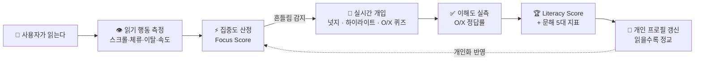
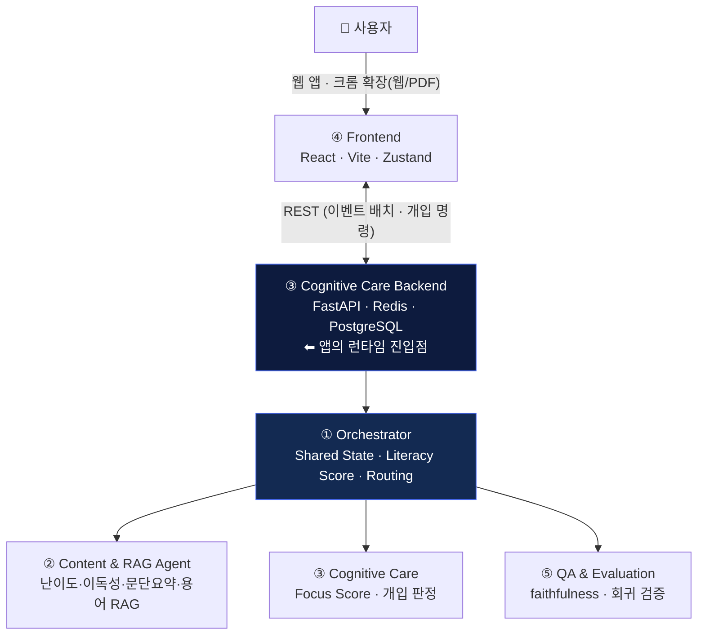

<div align="center">

# 🧠📖 AI 리터러시 케어 에이전트

### 읽는 순간을 **실시간으로 이해**하고, 집중이 흔들리면 **곁에서 붙잡아주는** — 폐루프 독서 파트너

<br/>


<br/>

> **"쉽게 바꿔주는" 도구는 많습니다. 우리는 반대로 갑니다.**
> 원문을 떠먹여 주는 대신, **스스로 읽어내는 문해 근력**이 붙도록 곁에서 케어합니다.

*2026 AI/SW 경진대회 출품작 · 5-Agent 멀티에이전트 시스템*

</div>

---

## ✨ 왜 이 프로젝트는 "뭔가 다른가"

대부분의 독서 보조 서비스는 **글을 쉽게 바꿔주고 끝**입니다. 우리는 **읽는 행동 자체를 실시간으로 측정**하고, 그 순간에 개입하고, **정말 이해했는지 실측**해서, **읽을수록 더 똑똑해지는 개인 프로필**을 만듭니다.

|  | 보통의 서비스 | **AI 리터러시 케어** |
|---|---|---|
| 📊 이해도 | 마지막에 퀴즈 한 번 | **읽는 내내 행동으로 실시간 추정 + O/X로 실측** |
| 🤝 개입 | 없음 / 정적 | **집중 하락 순간 넛지·하이라이트·퀴즈로 실시간 케어** |
| 🏆 점수 | "정답률" 하나 | **이해도·집중·도전성취를 결합한 근거 있는 Literacy Score** |
| 🎯 개인화 | 고정 규칙 | **난이도별 개인 읽기 속도 학습 — 읽을수록 정교해짐** |
| 🌐 사용처 | 자사 앱 안에서만 | **크롬 확장으로 웹·PDF 어디서 읽든 케어** |

---

## 🎬 한 컷으로 보는 폐루프 (Closed Loop)



> **핵심**: 측정 → 개입 → 재측정 → 점수 → 개인화가 **하나의 닫힌 고리**로 돕니다. "한 번 보여주고 끝"이 아니라, 읽는 동안 계속 함께합니다.

---

## 🏛️ 아키텍처 — 5개의 에이전트가 하나의 폐루프로



<div align="center">

**런타임은 ③번 백엔드** — 단일 호스트로 ①②번 코드를 함께 돌리고, ④번 프론트를 빌드해 서빙합니다.

</div>

---

## 🚀 핵심 기능

<table>
<tr>
<td width="50%" valign="top">

### 👁️ 실시간 읽기 행동 측정
스크롤 속도·단락 체류(dwell)·탭 이탈(blur)·무동작(pause)을 이벤트로 수집해 **"지금 얼마나 몰입해 읽는지"** 를 최근 이벤트 창 기준으로 산정.

### 🤝 폐루프 실시간 개입
집중이 흔들리면 **넛지 → 하이라이트 → O/X 퀴즈**로 단계적 케어. 그냥 알림이 아니라 *"방금 읽은 걸 확인해볼까요?"* 로 다시 붙잡습니다.

### ✅ 이해도를 "실측"
집중을 너무 잘해서 개입이 안 떠도, **본문을 다 읽은 시점에 O/X 퀴즈로 측정 보장**. 집중 잘하는 사람의 이해도가 상수로 박제되던 문제를 해결.

</td>
<td width="50%" valign="top">

### 🏆 근거 있는 Literacy Score
정답률 하나가 아니라 **이해도·집중도·도전성취**를 결합. 어려운 글을 이해할수록 높게 평가.

### 🧬 문해 5대 지표 + 글 프로필
이해도·집중 유지·정독 충실도·**난이도 도전력**·**읽기 안정성**을 레이더로. 글 자체의 **이독성/난이도** 프로필도 함께.

### 🎯 난이도-인지 개인화
온보딩에서 개인 읽기 속도를 측정 → **글이 어려울수록 더 촘촘히** 스키밍을 감지 → **읽을수록 내 속도에 맞춰 정교**해짐.

</td>
</tr>
</table>

---

## 🧮 근거 있는 Literacy Score

정답률 하나로 뭉개지 않고, **"이해했는가 × 얼마나 어려운 글이었는가"** 까지 반영합니다.

```
Literacy = 이해도 × 0.45  +  집중도 × 0.30  +  도전성취 × 0.25  −  교차검증 감점

  도전성취 = 이해율 × 글난이도(0.6·난이도 + 0.4·비이독성)
```

- **이해도** — O/X 퀴즈 정답률 실측 (없으면 완독률 프록시)
- **집중도** — 이벤트 기반 Focus Score (스키밍·이탈·무동작 감점)
- **도전성취** — *쉬운 글 완독 < 어려운 글 이해.* 2번의 **난이도·이독성**을 함께 반영
- **교차검증 감점** — 비정상 읽기 패턴(위조 방지)

> 각 점수가 **왜 그렇게 나왔는지** `score_breakdown`으로 설명 가능 — "검증 가능한 시스템".

---

## 🎯 난이도-인지 개인화 (Signature Feature)

<div align="center">

**고정 임계값 하나로 모두를 재던 걸, "이 사람 · 이 난이도 글" 2축으로 폅니다.**

</div>

온보딩에서 쉬운/어려운 지문의 편안한 스크롤 속도를 측정해 **개인 "난이도별 읽기 속도 직선"** 을 세우고, 지금 읽는 글의 난이도에 맞춰 스키밍 기준을 조정합니다. 세션이 쌓일수록 EWMA로 **자동 보정(rolling)**.

| 사용자 | 글 난이도 | 고정 방식 | **개인화** |
|---|:---:|:---:|:---:|
| 느긋한 독자 | 어려움(80) | 1.5 | **0.95** |
| 〃 (같은 사람!) | 쉬움(20) | 1.5 | **1.20** |
| 빠른 독자 (5세션 학습) | 어려움(80) | 1.5 | **0.98** |

> 같은 사람이라도 **글 난이도에 따라 기준이 달라지고**, 사람마다도 다릅니다. → `1. Agent Core & Orchestration/docs/PERSONALIZED_FOCUS_CALIBRATION.md`

---

## 🧩 멀티에이전트 & 폴더 구조

폴더 = 역할. 백엔드(③)가 런타임이며, ①②는 **vendoring**으로 함께 돕니다.

```
AI-literacy-care-Agent/
├── 1. Agent Core & Orchestration/   # ① Shared State · Literacy Score · Routing · 크롬 확장
├── 2. Content & RAG Agent/          # ② 난이도·이독성·문단요약·용어 RAG·퀴즈 생성
├── 3. Cognitive Care Backend/       # ③ FastAPI·Redis·PostgreSQL·Focus 엔진 (런타임 진입점)
├── 5. QA &Evaluation Agent/         # ⑤ 평가·품질 리포트·골든셋·회귀
├── apps/web/                        # ④ 프론트엔드 (React·Vite·TS)
├── ARCHITECTURE.md · REPO_STRUCTURE.md · DELIVERY_PLAN.md
└── Dockerfile · requirements.txt
```

| 역할 | 폴더 | 책임 |
|:---:|---|---|
| **①** | `1. Agent Core & Orchestration` | 공유 상태·오케스트레이션 흐름·Literacy Score·라우팅·**크롬 확장** |
| **②** | `2. Content & RAG Agent` | 이독성/난이도(독립변수)·문단 요약·신뢰 출처 용어풀이·퀴즈 |
| **③** | `3. Cognitive Care Backend` | **런타임** — FastAPI·DB·Redis·집중도 엔진·O/X 퀴즈 채점 |
| **④** | `apps/web` | 읽기 화면·넛지/퀴즈 UI·성장 대시보드·온보딩 |
| **⑤** | `5. QA &Evaluation Agent` | faithfulness·relevance 평가·품질 리포트·골든셋 회귀 |

---

## 🛠️ 기술 스택

**Backend** · FastAPI · SQLAlchemy 2.0(async) · PostgreSQL / SQLite(fallback) · Redis · Pydantic v2 · Uvicorn
**Frontend** · React 18 · Vite · TypeScript · Zustand · Recharts · Framer Motion · pdf.js
**Extension** · Chrome Manifest V3 (웹 + 자체 PDF 뷰어, Shadow DOM 오버레이)
**AI/LLM** · SnowChat(Gemini 2.5 Flash) — 요약·퀴즈·처방전, 키 없으면 결정론 폴백
**Quality** · pytest · faithfulness/relevance 휴리스틱 평가 · 골든셋

---

## ⚡ 빠른 시작

```bash
# 1) 백엔드 (런타임 = ③번)
cd "3. Cognitive Care Backend"
pip install -r ../requirements.txt
uvicorn backend.app.main:app --host 127.0.0.1 --port 8000
#   → 최초/스키마 변경 후: curl -X POST http://localhost:8000/api/session/reset

# 2) 프론트엔드 (④번)
cd apps/web
npm install && npm run dev

# 3) 크롬 확장 (①번 · 선택)
#   chrome://extensions → 개발자 모드 → "1. Agent Core & Orchestration/extension" 로드
```

---

## 🧪 품질 · "검증 가능한 시스템"

- **회귀 테스트** — 오케스트레이터/점수 엔진 단위·통합 테스트 (`pytest`)
- **QA 평가** — 요약·용어의 faithfulness, 퀴즈 relevance를 세션마다 산출해 결과에 노출
- **정직한 폴백** — LLM 키가 없어도 결정론 폴백으로 **데모가 절대 끊기지 않음**
- **재현성** — 같은 입력 → 같은 점수(결정론 산식), `score_breakdown`으로 근거 설명

---

## 👥 팀 & 역할

| 역할 | 담당 | 한 줄 |
|:---:|:---|:---|
| ① Orchestration | 오케스트레이션/점수 엔진 기술리드 | 공유 상태·Literacy Score·라우팅·확장·개인화 |
| ② Content & RAG | 콘텐츠/RAG | 이독성·난이도·요약·용어 신뢰성 |
| ③ Cognitive Care Backend | 백엔드/인프라 | FastAPI·DB·Redis·집중도·런타임 |
| ④ Frontend | 프론트엔드/UX | 읽기 경험·개입 UI·성장 대시보드 |
| ⑤ QA & Evaluation | 품질/평가 | faithfulness·회귀·골든셋 |

---

<div align="center">

### 📚 우리는 글을 대신 읽어주지 않습니다. **더 잘 읽게 만듭니다.**

<sub>세부 설계 문서는 각 역할 폴더의 <code>docs/</code>, 그리고 루트 <code>ARCHITECTURE.md</code> · <code>REPO_STRUCTURE.md</code> 참고</sub>

</div>
